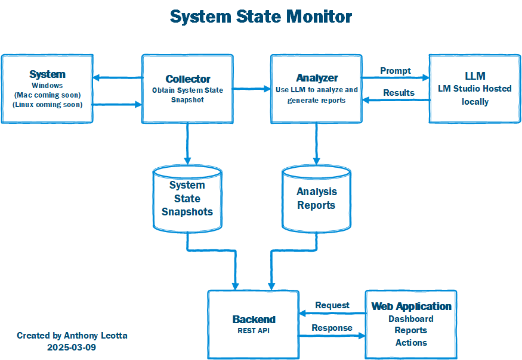

# System State Monitor and Analyzer

A comprehensive tool suite for monitoring, tracking, and analyzing Windows system state over time.

## Overview

This project consists of two main components:

1. **System State Monitor**: A PowerShell-based collection tool that captures detailed Windows system information into structured snapshots
2. **System State Analyzer**: A Python-based analysis tool that leverages large language models to provide insights and recommendations based on the collected data

## Features



### System State Monitor (Collection)

- Collects detailed system information:
  - PATH environment variable (with validity checks)
  - Installed programs and Windows features
  - Startup programs and scheduled tasks
  - Running services
  - Disk space usage
  - Processor and memory usage
  - Network configurations and active connections
  - Installed fonts
  - Environment variables
  - Important registry settings
  - Windows update history
  - Device drivers
  - Python installations and virtual environments
  - Installed browsers and their extensions/add-ons
- Saves snapshots as JSON files with timestamps
- Compares snapshots to show what's changed

### System State Analyzer (Analysis)

- Provides in-depth analysis of collected system snapshots using large language models
- Identifies issues, security risks, and optimization opportunities
- Generates specific recommendations for system improvement
- Specialized analyzers for different system components:
  - Installed programs analysis (security risks, bloatware detection)
  - Network configuration assessment (security and performance)
  - Disk space optimization recommendations
  - Startup program assessment (boot time impact, security concerns)
  - Environment variable configuration checks
  - Performance bottleneck identification
  - And more...
- Outputs structured JSON reports for both individual sections and the complete system
- Supports integration with various LLMs through LM Studio

## Directory Structure

```
system-monitor/
├── collector/                # PowerShell collection functionality
│   ├── Collector.ps1           # Main collection script
│   ├── Collectors/            # Data collection modules
│   │   ├── PathCollector.ps1        # PATH variable collection
│   │   ├── ProgramCollector.ps1     # Installed programs collection
│   │   └── ... (other collectors)   # Various system component collectors
│   └── Utils/                 # Utility functions
│       ├── SummaryUtil.ps1        # Summary generation functions
│       ├── ComparisonUtil.ps1     # Comparison functions
│       └── ... (other utilities)  # Additional utility functions
│
├── analyzer/                # Python analysis functionality
│   ├── main.py                # Main entry point for analysis
│   ├── analyzer.py            # Core analysis functionality
│   ├── config.py              # Configuration management
│   ├── data_loader.py         # Snapshot data loading
│   ├── models/                # LLM integration
│   │   └── lm_studio_client.py  # Client for LM Studio API
│   ├── prompts/               # Prompt generation and processing
│   │   ├── analyzers/            # Specialized analyzers
│   │   │   ├── installed_programs_analyzer.py  # Programs analyzer
│   │   │   ├── network_analyzer.py            # Network analyzer
│   │   │   └── ... (other analyzers)          # Various component analyzers
│   │   ├── base_section_analyzer.py     # Base analyzer class
│   │   └── section_analyzers_registry.py  # Registry for analyzers
│   └── utils/                # Utility functions
│       ├── json_helper.py       # JSON processing utilities
│       └── logging_setup.py     # Logging configuration
```

## Usage

### Taking a System Snapshot (Collection)

```powershell
# Navigate to the collector directory
cd system-monitor/collector

# Basic usage - saves snapshot to the script directory
./Collector.ps1

# Save to a specific directory (positional parameter)
./Collector.ps1 "C:\Snapshots"

# Save to a specific directory (named parameter)
./Collector.ps1 -OutputPath "C:\Snapshots"

# Add a description to the snapshot folder name
./Collector.ps1 "C:\Snapshots" -Description "After software install"

# Take a snapshot and compare with the most recent previous snapshot
./Collector.ps1 -CompareWithLatest
```

### Analyzing a System Snapshot (Analysis)

```bash
# Basic usage - analyze a snapshot and print summary to console
python analyzer/main.py /path/to/snapshot

# Save analysis results to a specific file
python analyzer/main.py /path/to/snapshot --output analysis_results.json

# Save detailed section analyses to a directory
python analyzer/main.py /path/to/snapshot --output-dir /path/to/output/directory

# Specify a particular LLM model to use
python analyzer/main.py /path/to/snapshot --model gemma-2-9b-it

# Clean the output directory before analysis
python analyzer/main.py /path/to/snapshot --output-dir /path/to/output/directory --clean

# Analyze only specific sections
python analyzer/main.py /path/to/snapshot --focus InstalledPrograms Network DiskSpace

# Example with multiple options
python analyzer/main.py /path/to/snapshot --model gemma-2-9b-it --output-dir /path/to/analysis --clean
```

### Comparing Snapshots (Collection)

```powershell
# Navigate to the collector directory
cd system-monitor/collector

# First, dot-source the script to load the comparison function
. ./Collector.ps1

# Compare two snapshots (all available common sections)
Compare-SystemStates -BaselinePath "SystemState_2025-03-08_10-00-00" -CurrentPath "SystemState_2025-03-08_12-00-00"

# Compare only specific sections
Compare-SystemStates -BaselinePath "SystemState_2025-03-08_10-00-00" -CurrentPath "SystemState_2025-03-08_12-00-00" -Sections "Path","InstalledPrograms","Network"
```

### Analyzer Configuration Options

The analyzer supports multiple configuration methods:

1. **Command-line arguments:**

   ```bash
   python analyzer/main.py /path/to/snapshot --server-url http://localhost:1234/v1 --model llama3-8b-instruct
   ```

2. **Environment variables (.env file):**

   ```
   # .env file
   LLM_SERVER_URL=http://localhost:1234/v1
   LLM_MODEL=gemma-2-9b-it
   LLM_MAX_TOKENS=4096
   LLM_TEMPERATURE=0.7
   ```

3. **Configuration file:**

   ```bash
   # Create or update config file
   python analyzer/main.py --save-config --server-url http://localhost:1234/v1 --model gemma-2-9b-it

   # Use saved config
   python analyzer/main.py /path/to/snapshot --use-config
   ```

## Installation

### System State Monitor (PowerShell)

1. Download or clone this repository
2. Ensure all files maintain their relative directory structure
3. Run from PowerShell with appropriate execution policy:
   ```powershell
   Set-ExecutionPolicy -ExecutionPolicy RemoteSigned -Scope CurrentUser
   ```

### System State Analyzer (Python)

1. Ensure Python 3.8+ is installed
2. Install required dependencies:
   ```bash
   pip install requests python-dotenv
   ```
3. Set up LM Studio:
   - Download and install [LM Studio](https://lmstudio.ai/)
   - Open LM Studio and download a suitable model (e.g., Gemma 2 9B Instruct, Llama 3 8B Instruct)
   - Start the local server in LM Studio
4. Create a `.env` file in the analyzer directory with your configuration:
   ```
   LLM_SERVER_URL=http://localhost:1234/v1
   LLM_MODEL=gemma-2-9b-it
   ```

## Use Cases

- Track system changes before and after software installations
- Monitor system health over time
- Identify unwanted system modifications
- Document your system configuration
- Troubleshoot performance issues
- Get AI-powered recommendations for system optimizations
- Detect potential security vulnerabilities in your configuration
- Identify unnecessary startup programs slowing down boot time
- Find bloatware and unnecessary software

## Requirements

- **System State Monitor**:
  - Windows PowerShell 5.1 or PowerShell Core 6.0+
  - Windows operating system
- **System State Analyzer**:
  - Python 3.8+
  - LM Studio with compatible large language models
  - Windows, macOS, or Linux (for the analyzer component)

## Note on LLM Usage

The System State Analyzer uses large language models through LM Studio to analyze system data. These models provide valuable insights but may occasionally generate incorrect information. Always review recommendations before implementation, especially for critical systems.

## RUn Analyzer

- D:\system-monitor\section-analysis

```bash
python analyzer/main.py /d/snapshots/SystemState_2025-03-09_01-13-36 --model gemma-2-9b-it --output-dir /d/system-monitor/section-analysis --clean
```

```
ls /d/Snapshots/SystemState_2025-03-09_01-13-36
Browsers.json     Fonts.json              Network.json              RegistrySettings.json  summary.txt
DiskSpace.json    index.json              Path.json                 RunningServices.json   System.json
Drivers.json      InstalledPrograms.json  PerformanceData.json      ScheduledTasks.json    WindowsFeatures.json
Environment.json  metadata.json           PythonInstallations.json  StartupPrograms.json   WindowsUpdates.json
(.venv)
tony@IANCURTIS MINGW64 /d/dev/system-monitor (add-gui)
$ python analyzer/main.py /d/Snapshots/SystemState_2025-03-09_01-13-36 --model gemma-2-9b-it --output-dir /d/system-monitor/section-analysis --clean
2025-03-09 01:37:24 - INFO - Loaded configuration from ./.env
2025-03-09 01:37:24 - INFO - Loaded configuration from ./.env
2025-03-09 01:37:24 - INFO - Removed existing output directory: D:\system-monitor\section-analysis\SystemState_2025-03-09_01-13-36
2025-03-09 01:37:24 - INFO - Section analyses will be saved to: D:\system-monitor\section-analysis\SystemState_2025-03-09_01-13-36
2025-03-09 01:37:24 - INFO - Loading snapshot data from D:/Snapshots/SystemState_2025-03-09_01-13-36
2025-03-09 01:37:24 - WARNING - Section file not found: D:\Snapshots\SystemState_2025-03-09_01-13-36\SystemState_2025-03-09_01-13-36
2025-03-09 01:37:24 - WARNING - Section file not found: D:\Snapshots\SystemState_2025-03-09_01-13-36\2025-03-09T06:13:36.184Z
2025-03-09 01:37:24 - ERROR - Error loading section description: [Errno 13] Permission denied: 'D:\\Snapshots\\SystemState_2025-03-09_01-13-36'
2025-03-09 01:37:24 - ERROR - Error occurred: Failed to load snapshot data: unsupported operand type(s) for /: 'WindowsPath' and 'list'

Run with --show-traceback or --debug for detailed error information
(.venv)
```
