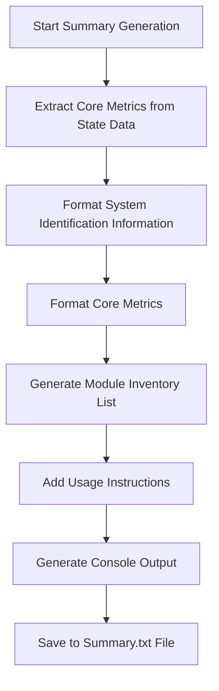
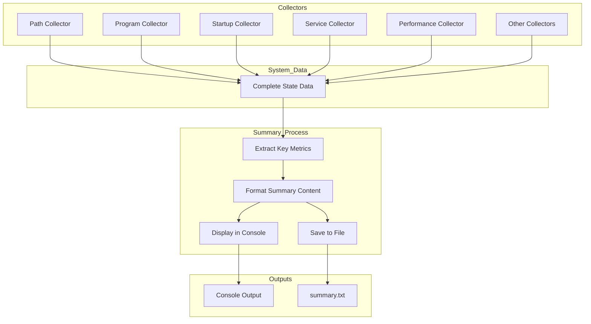

# 2. Summary

## Description

The Summary module provides a concise overview of the system state snapshot, presenting key metrics and statistics about the collected data in an easily digestible format. Unlike the detailed JSON files that contain comprehensive data for each collection area, the Summary presents the most significant information in a human-readable plain text format. It serves as a quick reference point for understanding the system's overall configuration and state, highlighting the most relevant aspects that administrators, support personnel, and analysts typically need to assess first.

The summary generation is performed by the `SummaryUtil.ps1` script's `Get-SystemSummary` and `Show-SystemSummary` functions, which extract and format core metrics from the various collector modules. The summary both displays this information in the console during collection and saves it to a dedicated text file for future reference.

## File Generated

- **Filename**: `summary.txt`
- **Location**: Within the timestamped snapshot directory (e.g., `SystemState_yyyy-MM-dd_HH-mm-ss/summary.txt`)
- **Format**: Plain text (UTF-8 encoded)
- **Typical Size**: 1KB - 3KB (relatively small, focused on essential information)

## Content Format

The summary is formatted as a plain text document with clear section headers and a consistent structure:

```
SYSTEM STATE SNAPSHOT SUMMARY
============================
Date/Time: 2025-03-10 15:30:45
Computer: HOSTNAME
User: Username

CORE METRICS:
- PATH entries: 42 (Invalid: 3)
- Installed programs: 156
- Startup programs: 12
- Running services: 87
- Processor usage: 8.45%
- Memory usage: 37.8% (6.05GB of 16.00GB)

COLLECTED DATA MODULES:
- Browsers
- DiskSpace
- Drivers
- Environment
- Fonts
- InstalledPrograms
- Network
- Path
- PerformanceData
- PythonInstallations
- RegistrySettings
- RunningServices
- ScheduledTasks
- StartupPrograms
- WindowsFeatures
- WindowsUpdates

To compare with other snapshots:
1. First, dot-source the script:
   . .\SystemMonitor.ps1

2. Then run the comparison:
   Compare-SystemStates -BaselinePath "path\to\earlier\snapshot" -CurrentPath "SystemState_2025-03-10_15-30-45"
```

## Key Information Captured

### System Identification
- **Timestamp**: When the snapshot was created
- **Computer Name**: The name of the system being analyzed
- **Username**: The account under which the collection was performed

### Core Metrics
The summary extracts and presents key statistics from across the various collection modules:

1. **PATH Configuration**:
   - Total number of PATH entries
   - Count of invalid or non-existent paths

2. **Software and Autostart Items**:
   - Count of installed programs
   - Number of startup programs

3. **System Services**:
   - Count of currently running services

4. **Resource Utilization**:
   - Current processor usage percentage
   - Memory usage (percentage and absolute values)
   - Available and total memory

### Data Module Inventory
- List of all data modules successfully collected in the snapshot
- Provides a quick way to confirm collection completeness

### Usage Instructions
- Reminder on how to use the comparison functionality
- Basic command examples for comparing snapshots

## Generation Process

The summary information is generated through the following process:



### Data Sources
The summary draws information from multiple collection modules:

- **System Information**: Basic system identification data
- **Path Collector**: PATH entry statistics
- **Program Collector**: Installed software counts
- **Startup Collector**: Autostart program counts
- **Service Collector**: Running service counts
- **Performance Collector**: CPU and memory utilization metrics
- **Directory Enumeration**: List of successfully collected modules

## Utility for Users

The summary file serves several important purposes:

1. **Quick Assessment**: Enables rapid understanding of system configuration without parsing complex JSON files
2. **Snapshot Identification**: Provides clear identification of when and where the snapshot was taken
3. **Validation**: Confirms that all expected data modules were successfully collected
4. **State Overview**: Presents the most significant metrics that define the system's state
5. **Command Reference**: Reminds users how to perform comparisons with the collected data

## Implementation Details

The Summary module is implemented through two primary functions:

### 1. Get-SystemSummary
This function extracts key metrics from the collected state data:
```powershell
function Get-SystemSummary {
    [CmdletBinding()]
    param(
        [Parameter(Mandatory=$true)]
        [hashtable]$StateData
    )
    
    $summary = @{
        PathCount = $StateData.Path.Count
        InvalidPathCount = ($StateData.Path | Where-Object { -not $_.Exists }).Count
        ProgramCount = $StateData.InstalledPrograms.Count
        StartupCount = $StateData.StartupPrograms.Count
        ServiceCount = $StateData.RunningServices.Count
        ProcessorUsage = $StateData.PerformanceData.ProcessorUsage
        MemoryUsage = $StateData.PerformanceData.Memory.PercentUsed
        MemoryUsedGB = $StateData.PerformanceData.Memory.UsedGB
        MemoryTotalGB = $StateData.PerformanceData.Memory.TotalGB
    }
    
    return $summary
}
```

### 2. Show-SystemSummary
This function formats the summary data for display and saves it to a file:
```powershell
function Show-SystemSummary {
    [CmdletBinding()]
    param(
        [Parameter(Mandatory=$true)]
        [hashtable]$Summary,
        
        [Parameter(Mandatory=$true)]
        [string]$OutputPath
    )
    
    # Create content for both display and file
    $summaryContent = @"
SYSTEM STATE SNAPSHOT SUMMARY
============================
Date/Time: $(Get-Date)
Computer: $($env:COMPUTERNAME)
User: $($env:USERNAME)

CORE METRICS:
- PATH entries: $($Summary.PathCount) (Invalid: $($Summary.InvalidPathCount))
- Installed programs: $($Summary.ProgramCount)
- Startup programs: $($Summary.StartupCount)
- Running services: $($Summary.ServiceCount)
- Processor usage: $($Summary.ProcessorUsage)%
- Memory usage: $($Summary.MemoryUsage)% ($($Summary.MemoryUsedGB)GB of $($Summary.MemoryTotalGB)GB)

COLLECTED DATA MODULES:
"@
    
    # Add collected modules to the summary
    Get-ChildItem -Path (Split-Path -Parent $OutputPath) -Filter "*.json" | 
        Where-Object { $_.Name -ne "metadata.json" -and $_.Name -ne "index.json" } |
        ForEach-Object {
            $summaryContent += "- $($_.BaseName)`n"
        }
    
    # Add usage instructions
    $summaryContent += @"

To compare with other snapshots:
1. First, dot-source the script:
   . .\SystemMonitor.ps1

2. Then run the comparison:
   Compare-SystemStates -BaselinePath "path\to\earlier\snapshot" -CurrentPath "$OutputPath"
"@
    
    # Save to file and display summary
    $summaryContent | Out-File -FilePath $OutputPath -Encoding utf8
    
    # Display key information in console
    Write-Host "`nSummary:" -ForegroundColor Cyan
    Write-Host "- PATH entries: $($Summary.PathCount) (Invalid: $($Summary.InvalidPathCount))" -ForegroundColor White
    Write-Host "- Installed programs: $($Summary.ProgramCount)" -ForegroundColor White
    Write-Host "- Startup programs: $($Summary.StartupCount)" -ForegroundColor White
    Write-Host "- Running services: $($Summary.ServiceCount)" -ForegroundColor White
    Write-Host "- Processor usage: $($Summary.ProcessorUsage)%" -ForegroundColor White
    Write-Host "- Memory usage: $($Summary.MemoryUsage)% ($($Summary.MemoryUsedGB)GB of $($Summary.MemoryTotalGB)GB)" -ForegroundColor White
    
    Write-Host "`nSummary file saved to: $OutputPath" -ForegroundColor Green
}
```

## Suggested Improvements

1. **Health Indicators**: Add color-coded or symbolic indicators for metrics that may indicate problems (high memory usage, many invalid paths, etc.)

2. **Category Grouping**: Organize the metrics into logical categories (hardware, software, security, etc.)

3. **Historical Context**: Include trend indicators for metrics that have changed significantly from previous snapshots

4. **System Rating**: Implement a simple scoring system to rate the overall health and configuration of the system

5. **Customization Options**: Allow users to specify which metrics to highlight in the summary

6. **Critical Issues Section**: Add a dedicated section that highlights potential problems identified during collection

7. **Component Versions**: Include version information for key system components and software

## Future Enhancements

### Rich Text Format Option
Implement an option to generate the summary in RTF format, enabling better formatting, highlighting, and readability in compatible viewers.

### Executive Summary Generation
Create a higher-level executive summary with fewer technical details but more contextual information about the system's purpose and status.

### HTML Report Option
Develop an HTML output option with interactive elements, expandable sections, and visual presentation of key metrics.

### Summary Comparison View
Implement a specialized comparison view that shows summary metrics side-by-side for two or more snapshots.

### Automatic Recommendation Engine
Develop intelligence to automatically suggest optimizations or fixes based on the collected metrics.

### Dashboard Integration
Create integrations with common monitoring dashboards to display summary information alongside real-time metrics.

## Diagram: Summary Information Flow



## Related Functionality

The Summary module is closely related to these other components:

- **Index Module**: Works alongside the summary to provide structure to the snapshot
- **Metadata Module**: Shares some of the basic system identification information
- **Comparison Utilities**: Referenced in the summary as the next step for analysis
- **Main Collector**: Orchestrates the summary generation as part of the collection process
- **All Collector Modules**: Provides the source data from which summary metrics are derived
