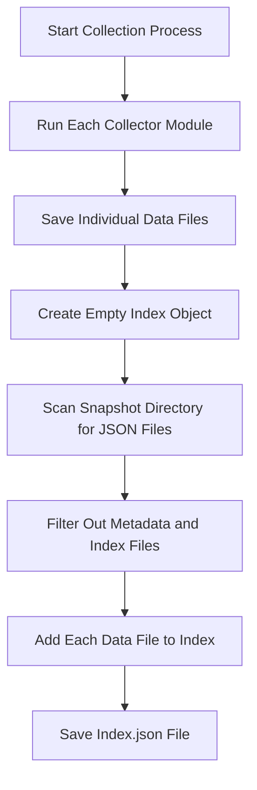

# 3. Index

## Description

The Index module provides a structured catalog of all data files contained within a system state snapshot. It serves as a navigation aid and file manifest, listing each collector output file available in the snapshot directory. While primarily designed for programmatic access by tools that process snapshot data, the index also helps human users understand the scope and completeness of the collected information. The index enables scripts, comparison tools, and analysis utilities to quickly identify what data is available without needing to scan the directory contents directly.

The index generation is performed automatically by the main `Collector.ps1` script during the snapshot creation process. After all collectors have completed their work and saved their data, the script identifies which data files were successfully generated and creates a comprehensive index that maps collector names to their corresponding file names.

## File Generated

- **Filename**: `index.json`
- **Location**: Within the timestamped snapshot directory (e.g., `SystemState_yyyy-MM-dd_HH-mm-ss/index.json`)
- **Format**: UTF-8 encoded JSON without BOM (Byte Order Mark)
- **Typical Size**: 1KB - 2KB (relatively small, containing only file references)

## Schema

```json
{
  "Path": "Path.json",
  "InstalledPrograms": "InstalledPrograms.json",
  "StartupPrograms": "StartupPrograms.json",
  "RunningServices": "RunningServices.json",
  "DiskSpace": "DiskSpace.json",
  "PerformanceData": "PerformanceData.json",
  "Network": "Network.json",
  "Environment": "Environment.json",
  "Fonts": "Fonts.json",
  "RegistrySettings": "RegistrySettings.json",
  "WindowsFeatures": "WindowsFeatures.json",
  "WindowsUpdates": "WindowsUpdates.json",
  "Drivers": "Drivers.json",
  "ScheduledTasks": "ScheduledTasks.json",
  "PythonInstallations": "PythonInstallations.json",
  "Browsers": "Browsers.json"
}
```

### Schema Details

The index file uses a simple key-value structure:

| Field | Type | Description |
|-------|------|-------------|
| *CollectorName* | string | The name of a collector module |
| *FileName* | string | The corresponding JSON file containing that collector's data |

Unlike other data files in the system state snapshot, the index does not contain the standard timestamp and computer name header fields. Instead, it uses a simplified format optimized for quick lookups.

## JSON Schema Definition

```json
{
  "$schema": "http://json-schema.org/draft-07/schema#",
  "title": "System State Collector - Index",
  "description": "Schema for the index of available data files in a system state snapshot",
  "type": "object",
  "additionalProperties": {
    "type": "string",
    "description": "Filename containing the data for the collector module",
    "pattern": "^[A-Za-z0-9]+\\.json$"
  },
  "examples": [
    {
      "Path": "Path.json",
      "InstalledPrograms": "InstalledPrograms.json",
      "RunningServices": "RunningServices.json"
    }
  ]
}
```

## Key Information Captured

### Available Collectors
The index provides a complete listing of which collector modules successfully generated data files in the snapshot. Each key in the JSON object represents a collector module that completed its operation and produced output data.

### File Mapping
The index establishes a mapping between logical collector names (e.g., "InstalledPrograms") and their corresponding physical file names (e.g., "InstalledPrograms.json"). This mapping enables tools to locate specific data files without needing to know the exact file naming conventions.

### Collection Completeness
By examining the index, users and tools can quickly determine which collectors were able to successfully gather data. This helps identify potential gaps in the snapshot or collectors that may have encountered issues during execution.

### Snapshot Structure
The index provides insight into the overall structure and organization of the snapshot, serving as a table of contents for the collected data.

## Generation Process

The index is generated through the following process:



The key code responsible for generating the index is contained within the main `Collector.ps1` script:

```powershell
# Create index of available reports
$reportIndex = @{}

# Helper function to save a section to its own file
function Save-SectionToFile {
    param (
        [string]$SectionName,
        $SectionData,
        [string]$FolderPath
    )
    
    if ($null -ne $SectionData -and $SectionData -ne '') {
        $sectionPath = Join-Path -Path $FolderPath -ChildPath "$SectionName.json"
        $sectionObject = @{
            Timestamp = $systemState.Timestamp
            ComputerName = $systemState.ComputerName
            Data = $SectionData
        }
        $jsonContent = $sectionObject | ConvertTo-Json -Depth 10
        Write-JsonWithoutBOM -Path $sectionPath -JsonContent $jsonContent
        return $true
    }
    return $false
}

# Save each section
$systemState.Keys | Where-Object { $_ -notin @('Timestamp', 'ComputerName', 'UserName', 'OSVersion') } | ForEach-Object {
    $sectionName = $_
    $saved = Save-SectionToFile -SectionName $sectionName -SectionData $systemState[$sectionName] -FolderPath $snapshotFolder
    if ($saved) {
        $reportIndex[$sectionName] = "$sectionName.json"
    }
}

# Save the report index
$indexPath = Join-Path -Path $snapshotFolder -ChildPath "index.json"
$jsonContent = $reportIndex | ConvertTo-Json
Write-JsonWithoutBOM -Path $indexPath -JsonContent $jsonContent
```

## Use Cases

The index file serves several important purposes within the System State Collector framework:

### 1. Programmatic Data Access
When tools or scripts need to access specific data from a snapshot, they can first consult the index to determine if the required data file exists and get its exact filename.

### 2. Snapshot Validation
Validation tools can use the index to verify that a snapshot contains all expected collector data files, ensuring completeness.

### 3. Comparison Preparation
When preparing to compare two snapshots, the comparison utility can examine both indexes to determine which data sections can be meaningfully compared.

### 4. Cross-Reference Navigation
Tools that analyze relationships between different system components can use the index to navigate between related data files.

### 5. Collection Troubleshooting
If certain collector modules fail to produce output, the absence of their entries in the index helps identify where the collection process encountered issues.

## Implementation Context

The index file is created by the main `Collector.ps1` script after all individual collector modules have completed their work. The script:

1. Maintains a temporary index structure (`$reportIndex`) during the collection process
2. Updates this structure as each collector module successfully saves its data
3. Converts the completed index to JSON format
4. Saves it to the snapshot directory using the `Write-JsonWithoutBOM` function to ensure proper encoding

## Suggested Improvements

1. **Collector Versions**: Include version information for each collector module to help track which version of a collector generated each data file.

2. **Timestamps**: Add individual timestamps for when each data file was created to provide more granular timing information.

3. **Success Status**: Include status codes or flags indicating whether collectors completed successfully or encountered non-fatal issues.

4. **File Sizes**: Add file size information to help users anticipate processing requirements when working with large snapshots.

5. **Data Summaries**: Include brief summaries or key metrics from each collector to enable quick assessment without opening individual files.

6. **Priority Classifications**: Assign priority levels or categories to different collectors to help users focus on the most relevant data.

7. **Dependency Information**: Document relationships between collectors to show which data files may depend on others.

## Future Enhancements

### Hierarchical Organization
Implement a more structured organization that groups related collectors into logical categories, making navigation easier for complex snapshots.

### Metadata Integration
Enhance the index with additional metadata that provides context about the snapshot as a whole, not just the individual collector outputs.

### Cross-Snapshot References
Develop capabilities to reference related data in other snapshots, enabling navigation across a series of historical snapshots.

### Content Hashing
Add cryptographic hashes for each data file to verify integrity and detect unauthorized modifications.

### Collection Statistics
Include performance statistics about the collection process, such as execution time and resource usage for each collector.

### Collection Configuration Reference
Add references to the configuration settings used for each collector, documenting how the data was gathered.

## Diagram: Index Relationship to Collector Files

```mermaid
graph TD
    subgraph Snapshot_Directory["SystemState_yyyy-MM-dd_HH-mm-ss/"]
        Index["index.json"]
        Metadata["metadata.json"]
        Summary["summary.txt"]
        
        PathData["Path.json"]
        ProgramsData["InstalledPrograms.json"]
        ServicesData["RunningServices.json"]
        DiskData["DiskSpace.json"]
        NetworkData["Network.json"]
        EnvironmentData["Environment.json"]
        
        OtherFiles["Other Collector Files..."]
    end
    
    subgraph Index_Content["Index Content"]
        PathRef["Path: Path.json"]
        ProgramsRef["InstalledPrograms: InstalledPrograms.json"]
        ServicesRef["RunningServices: RunningServices.json"]
        DiskRef["DiskSpace: DiskSpace.json"]
        NetworkRef["Network: Network.json"]
        EnvironmentRef["Environment: Environment.json"]
        
        OtherRefs["Other References..."]
    end
    
    Index --> Index_Content
    
    PathRef -.-> PathData
    ProgramsRef -.-> ProgramsData
    ServicesRef -.-> ServicesData
    DiskRef -.-> DiskData
    NetworkRef -.-> NetworkData
    EnvironmentRef -.-> EnvironmentData
    OtherRefs -.-> OtherFiles
    
    subgraph Tools["Snapshot Processing Tools"]
        ComparisonTool["Comparison Utility"]
        AnalysisTool["Analysis Scripts"]
        ViewerTool["Snapshot Viewer"]
    end
    
    Index_Content --> ComparisonTool
    Index_Content --> AnalysisTool
    Index_Content --> ViewerTool
```



## Related Components

The Index module is closely related to these other components of the System State Collector:

- **Main Collector Script**: Creates the index as part of the collection process
- **All Collector Modules**: Generate the data files referenced in the index
- **Comparison Utilities**: Use the index to identify comparable data sets
- **Metadata Module**: Complements the index with system identification information
- **Summary Module**: Provides a human-readable overview while the index serves automation needs
