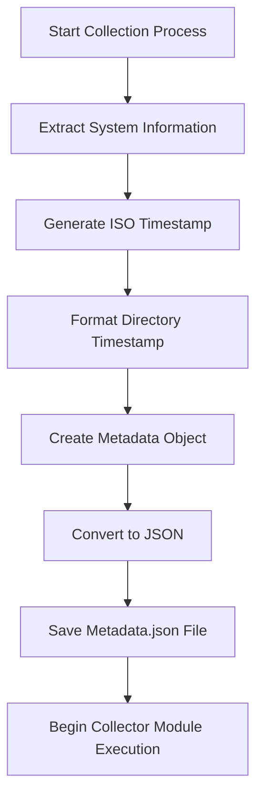
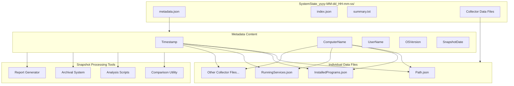

# 4. Metadata

## Description

The Metadata module captures essential identification and contextual information about a system state snapshot. While the individual collector modules gather specific configuration data, the metadata provides the critical context that identifies when and where the snapshot was taken and under what conditions. This information serves as the foundation for snapshot organization, identification, and validation. The metadata acts as a snapshot's "fingerprint," enabling proper categorization, searchability, and reference in documentation and analysis.

The metadata generation is performed automatically by the main `Collector.ps1` script at the beginning of the snapshot creation process. It extracts core system information and timestamps, creating a standardized reference point for the snapshot as a whole. This data is saved early in the collection process to ensure it's available even if later collector modules encounter issues.

## File Generated

- **Filename**: `metadata.json`
- **Location**: Within the timestamped snapshot directory (e.g., `SystemState_yyyy-MM-dd_HH-mm-ss/metadata.json`)
- **Format**: UTF-8 encoded JSON without BOM (Byte Order Mark)
- **Typical Size**: < 1KB (very small, containing only essential identification data)

## Schema

```json
{
  "Timestamp": "2025-03-10T15:30:45.0000000Z",
  "ComputerName": "HOSTNAME",
  "UserName": "Username",
  "OSVersion": "Microsoft Windows NT 10.0.19045.0",
  "SnapshotDate": "2025-03-10_15-30-45"
}
```

### Schema Details

| Field | Type | Description |
|-------|------|-------------|
| Timestamp | string | ISO 8601 format timestamp when the snapshot was created |
| ComputerName | string | Name of the computer from which data was collected |
| UserName | string | User account under which the collector was executed |
| OSVersion | string | Operating system version string from the environment |
| SnapshotDate | string | Formatted date and time used in the snapshot directory name |

## JSON Schema Definition

```json
{
  "$schema": "http://json-schema.org/draft-07/schema#",
  "title": "System State Collector - Metadata",
  "description": "Schema for the metadata about a system state snapshot",
  "type": "object",
  "required": ["Timestamp", "ComputerName", "UserName", "OSVersion", "SnapshotDate"],
  "properties": {
    "Timestamp": {
      "type": "string",
      "format": "date-time",
      "description": "ISO 8601 format timestamp when the snapshot was created"
    },
    "ComputerName": {
      "type": "string",
      "description": "Name of the computer from which data was collected"
    },
    "UserName": {
      "type": "string",
      "description": "User account under which the collector was executed"
    },
    "OSVersion": {
      "type": "string",
      "description": "Operating system version string from the environment"
    },
    "SnapshotDate": {
      "type": "string",
      "description": "Formatted date and time used in the snapshot directory name",
      "pattern": "^\\d{4}-\\d{2}-\\d{2}_\\d{2}-\\d{2}-\\d{2}$"
    }
  }
}
```

## Key Information Captured

### Temporal Context
The metadata establishes precisely when the snapshot was created, which is critical for:
- Chronological organization of multiple snapshots
- Correlating system state with observed issues or changes
- Establishing a timeline when comparing multiple snapshots
- Determining the age and potential relevance of historical snapshot data

### System Identification
The metadata clearly identifies which system was captured in the snapshot:
- Computer name provides the primary system identifier
- OS version indicates the Windows release and build number
- Username shows under which security context the collection was performed

### Snapshot Identification
The SnapshotDate field provides a standardized, filesystem-friendly identifier that:
- Matches the containing directory name
- Can be easily parsed for chronological sorting
- Enables consistent reference in documentation and reports

### Collection Context
The combined metadata fields provide essential context about how and when the data was collected:
- Whether the collector was run with administrative privileges (inferred from username)
- The exact environment where the collection occurred
- The precise moment in time represented by the snapshot

## Generation Process

The metadata is generated through the following process:



The key code responsible for generating the metadata is contained within the main `Collector.ps1` script:

```powershell
# Initialize the data structure
$systemState = @{
    Timestamp = (Get-Date).ToString('o')  # ISO 8601 format
    ComputerName = $env:COMPUTERNAME
    UserName = $env:USERNAME
    OSVersion = [System.Environment]::OSVersion.VersionString
}

# Create a timestamped folder for this snapshot
$timestamp = Get-Date -Format 'yyyy-MM-dd_HH-mm-ss'
$snapshotFolder = Join-Path -Path $OutputPath -ChildPath "SystemState_$timestamp"

if (-not (Test-Path -Path $snapshotFolder)) {
    New-Item -ItemType Directory -Path $snapshotFolder -Force | Out-Null
    Write-Host "Created snapshot directory: $snapshotFolder" -ForegroundColor Green
}

# Save metadata file
$metadataPath = Join-Path -Path $snapshotFolder -ChildPath "metadata.json"
$metadata = @{
    Timestamp = $systemState.Timestamp
    ComputerName = $systemState.ComputerName
    UserName = $systemState.UserName
    OSVersion = $systemState.OSVersion
    SnapshotDate = $timestamp
}
$jsonContent = $metadata | ConvertTo-Json
Write-JsonWithoutBOM -Path $metadataPath -JsonContent $jsonContent
```

## Use Cases

The metadata file serves several important purposes within the System State Collector framework:

### 1. Snapshot Identification
When managing multiple snapshots, the metadata provides the essential information needed to identify and select the appropriate snapshot for analysis or comparison.

### 2. Collection Validation
The metadata helps validate that a snapshot was collected with the appropriate permissions and context for its intended use.

### 3. Documentation Reference
When documenting system states or changes, the metadata provides the authoritative reference information about when and where the snapshot was taken.

### 4. Snapshot Organization
Management and archival tools can use the metadata to properly catalog and organize snapshots by system, date, or other criteria.

### 5. Report Generation
Reporting tools use the metadata to accurately label and timestamp reports generated from the snapshot data.

## Implementation Context

The metadata file is one of the first files created by the main `Collector.ps1` script, before any individual collector modules are executed. This ensures that even if a collector encounters an error, the basic snapshot identification information is preserved. The script:

1. Extracts system information from environment variables and .NET methods
2. Formats timestamps in both ISO 8601 (for precise machine parsing) and filesystem-friendly formats
3. Creates the metadata structure with all required fields
4. Saves it to the snapshot directory using the `Write-JsonWithoutBOM` function to ensure proper encoding

## Suggested Improvements

1. **Collection Parameters**: Include information about parameters or options used when running the collector script, documenting how the snapshot was configured.

2. **Administrative Status**: Explicitly flag whether the collection was performed with administrative privileges, which affects what data could be collected.

3. **Script Version**: Add version information for the collector script itself to help track which collector version generated the snapshot.

4. **Extended System Information**: Include additional system details like hardware identifiers, domain membership, or IP address for more robust system identification.

5. **Collection Duration**: Record how long the collection process took, which can be useful for planning and optimization.

6. **Collector Source**: Include information about where the collector script was executed from (local, remote, deployment system, etc.).

7. **Purpose Tag**: Add an optional field for the purpose or reason the snapshot was taken (e.g., "pre-upgrade baseline," "troubleshooting," "compliance check").

## Future Enhancements

### Digital Signatures
Implement cryptographic signing of the metadata to verify authenticity and prevent tampering with snapshot information.

### Extended Hardware Identification
Add hardware-based identifiers like motherboard serial numbers or TPM identifiers to provide a more robust system fingerprint that persists across OS reinstalls or computer name changes.

### Collection Context Recording
Enhance the metadata with additional environmental context, such as network connectivity state, system uptime, or active user sessions.

### Snapshot Tags and Categories
Implement a tagging system within the metadata to support categorization, filtering, and organization of snapshots in a management system.

### Automated Lifecycle Tracking
Add information to support automated management of snapshot lifecycles, including retention policies, archival status, or related snapshot references.

### Multi-System Collection Context
For snapshots taken as part of a larger collection effort, include context about the collection batch, related systems, or orchestration details.

## Diagram: Metadata Relationship to Other Components



## Related Components

The Metadata module is closely related to these other components of the System State Collector:

- **Main Collector Script**: Creates the metadata as one of its first actions
- **Index Module**: Works alongside metadata to organize the snapshot structure
- **Summary Module**: Uses metadata information in the human-readable summary
- **Comparison Utilities**: Rely on metadata to identify and label snapshots being compared
- **All Collector Modules**: Inherit timestamp and system identification from the metadata
