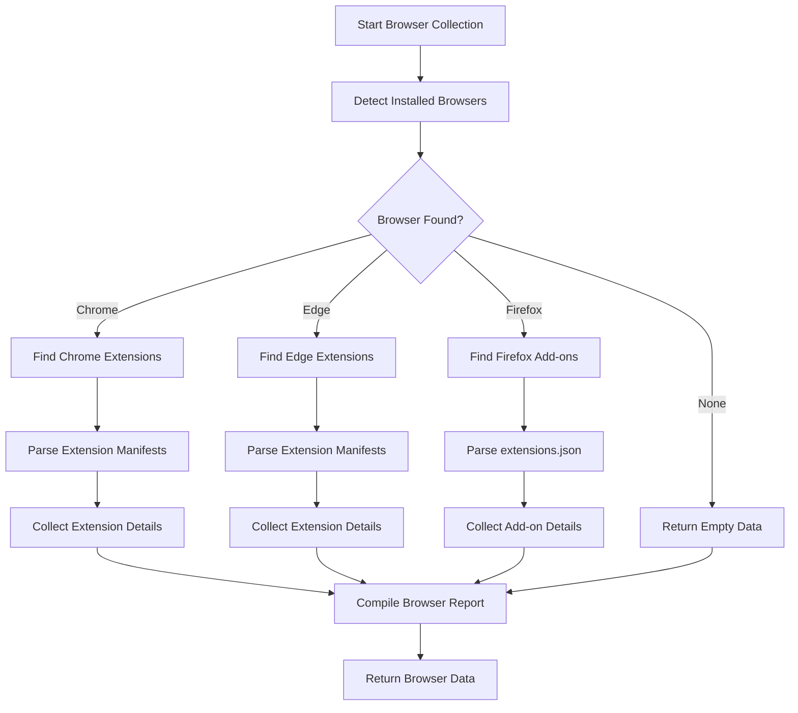
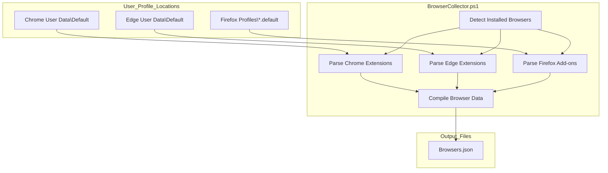

# 5. Browsers

## Description

The Browsers module collects comprehensive information about web browsers installed on the system, including their versions, installation paths, and extensions/add-ons. This data is valuable for:

- Tracking browser installations and updates
- Auditing browser extensions for security and compliance
- Troubleshooting browser-related issues
- Documenting the browsing environment across systems

The collection is performed by the `BrowserCollector.ps1` script, which detects common browsers (Chrome, Firefox, Edge) and enumerates their extensions by examining browser-specific storage locations.

## File Generated

- **Filename**: `Browsers.json`
- **Location**: Within the timestamped snapshot directory (e.g., `SystemState_yyyy-MM-dd_HH-mm-ss/Browsers.json`)
- **Format**: UTF-8 encoded JSON without BOM (Byte Order Mark)
- **Typical Size**: 10KB - 5MB (varies based on the number of installed browsers and extensions)

## Schema

```json
{
  "Timestamp": "2025-03-10T15:30:45.0000000Z",
  "ComputerName": "HOSTNAME",
  "Data": {
    "InstalledBrowsers": [
      {
        "Name": "Google Chrome",
        "Path": "C:\\Program Files\\Google\\Chrome\\Application\\chrome.exe",
        "Version": "122.0.6261.112"
      },
      {
        "Name": "Microsoft Edge",
        "Path": "C:\\Program Files (x86)\\Microsoft\\Edge\\Application\\msedge.exe",
        "Version": "121.0.2277.128"
      },
      {
        "Name": "Mozilla Firefox",
        "Path": "C:\\Program Files\\Mozilla Firefox\\firefox.exe",
        "Version": "123.0.1"
      }
    ],
    "ChromeExtensions": [
      {
        "ID": "aapbdbdomjkkjkaonfhkkikfgjllcleb",
        "Name": "Google Translate",
        "Version": "2.0.13",
        "Description": "View translations easily as you browse the web..."
      }
    ],
    "EdgeExtensions": [
      {
        "ID": "jmjflgjpcpepeafmmgdpfkogkghcpiha",
        "Name": "Microsoft Editor",
        "Version": "1.0.7.1",
        "Description": "Grammar checking and writing suggestions..."
      }
    ],
    "FirefoxAddons": [
      {
        "ID": "uBlock0@raymondhill.net",
        "Name": "uBlock Origin",
        "Version": "1.46.0",
        "Description": "Finally, an efficient blocker...",
        "Active": true
      }
    ]
  }
}
```

### Schema Details

#### Root Object

| Field        | Type   | Description                                           |
| ------------ | ------ | ----------------------------------------------------- |
| Timestamp    | string | ISO 8601 format timestamp when the data was collected |
| ComputerName | string | Name of the computer from which data was collected    |
| Data         | object | Container for all browser-related data                |

#### InstalledBrowsers Array

| Field   | Type   | Description                                 |
| ------- | ------ | ------------------------------------------- |
| Name    | string | Name of the browser (e.g., "Google Chrome") |
| Path    | string | Full path to the browser executable         |
| Version | string | Version number of the browser               |

#### ChromeExtensions & EdgeExtensions Arrays

| Field       | Type   | Description                                           |
| ----------- | ------ | ----------------------------------------------------- |
| ID          | string | Unique identifier for the extension                   |
| Name        | string | Display name of the extension (may be localized)      |
| Version     | string | Version number of the extension                       |
| Description | string | Short description of the extension (may be truncated) |

#### FirefoxAddons Array

| Field       | Type    | Description                                        |
| ----------- | ------- | -------------------------------------------------- |
| ID          | string  | Unique identifier for the add-on                   |
| Name        | string  | Display name of the add-on                         |
| Version     | string  | Version number of the add-on                       |
| Description | string  | Short description of the add-on (may be truncated) |
| Active      | boolean | Whether the add-on is currently enabled            |

## Key Information Captured

### Browser Detection

- Identifies installed browsers from major vendors (Chrome, Firefox, Edge)
- Records their installation paths and version information
- Limited to standard installation locations (system and user directories)

### Extension Analysis

- Chrome: Examines the `Extensions` directory in user profile
- Edge: Similar to Chrome, examines the Edge-specific extensions directory
- Firefox: Parses the `extensions.json` file in the Firefox profile
- For each extension, extracts:
  - Unique identifier
  - Display name (handles localized names)
  - Version information
  - Brief description (truncated to avoid excessive data)

### Limitations

- Only detects browsers in standard installation locations
- May not identify portable browser installations
- Limited to the three major browsers (Chrome, Firefox, Edge)
- Extension descriptions are truncated to 50 characters
- Cannot access detailed extension settings or usage statistics
- Firefox add-on detection requires a Firefox profile to exist

## Collection Process

The browser data collection follows this process:



## Suggested Improvements

1. **Additional Browsers**: Extend detection to include other browsers:

   - Opera
   - Brave
   - Vivaldi
   - Safari (for cross-platform compatibility)

2. **Enhanced Extension Information**:

   - Include full descriptions rather than truncated text
   - Add extension permissions information for security auditing
   - Include last updated date for extensions
   - Flag potentially unsafe extensions

3. **Browser Settings Capture**:

   - Record important security settings (e.g., cookie policies, JavaScript settings)
   - Capture proxy configuration information
   - Include default search engine settings

4. **Performance Metrics**:

   - Add cache size information
   - Include browser profile size
   - Record startup impact metrics

5. **Installation Timestamps**:
   - Add browser installation date information
   - Include extension installation dates

## Future Enhancements

### Cross-browser Profile Analysis

Implement deeper profile analysis to compare settings across different browsers, helping identify inconsistent security policies or user experience issues.

### Browser Storage Examination

Add capabilities to analyze browser storage usage, including:

- Local Storage size
- IndexedDB usage
- Cookie storage statistics

### Extension Security Analysis

Integrate with extension reputation databases to flag potentially malicious or vulnerable extensions, providing security insights directly in the collection data.

### Browser Update Check

Add functionality to compare installed browser versions against the latest available releases to identify outdated browsers that may have security vulnerabilities.

### Web Application Inventory

Extend the collection to identify installed Progressive Web Apps (PWAs) and their configurations.

### Schema Versioning

Implement a version field in the schema to facilitate future format changes while maintaining backward compatibility with existing snapshots.

## Diagram: Browser Data Collection Architecture



## Related Collectors

The Browsers module complements these other collectors:

- **InstalledPrograms**: Provides broader context of all installed software
- **StartupPrograms**: May identify browser components configured to auto-start
- **NetworkCollector**: Shows active network connections which may relate to browser activity
- **RegistrySettings**: Contains file type associations that may reference browsers
