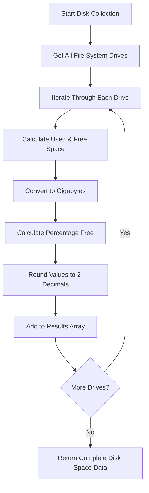
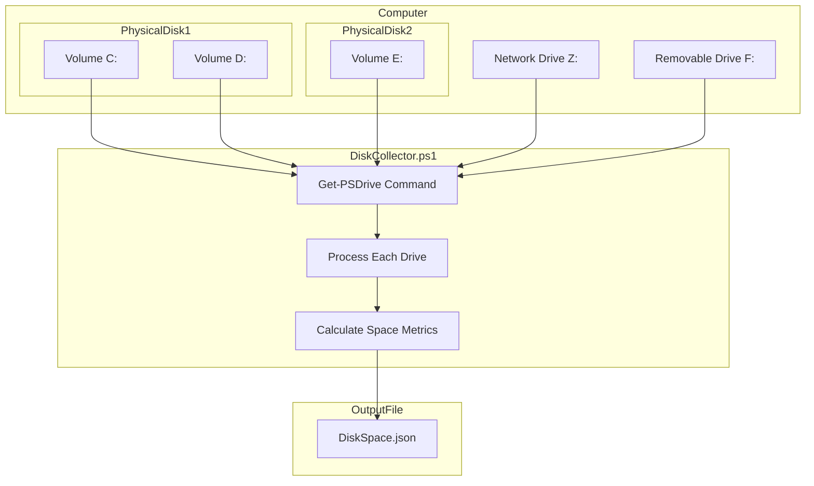

# 6. Disk Space

## Description

The Disk Space module collects detailed information about storage volumes present on the system, including physical drives, network mapped drives, and removable media. It provides critical metrics about disk capacity, usage, and available space. This information is essential for system administration tasks such as capacity planning, troubleshooting disk space issues, and monitoring storage utilization trends over time.

The collection is performed by the `DiskCollector.ps1` script, which leverages PowerShell's `Get-PSDrive` cmdlet to gather information about all file system drives accessible to the system. The collector calculates key metrics such as used space, free space, and usage percentages for each detected drive.

## File Generated

- **Filename**: `DiskSpace.json`
- **Location**: Within the timestamped snapshot directory (e.g., `SystemState_yyyy-MM-dd_HH-mm-ss/DiskSpace.json`)
- **Format**: UTF-8 encoded JSON without BOM (Byte Order Mark)
- **Typical Size**: 1KB - 5KB (varies based on the number of drives in the system)

## Schema

```json
{
  "Timestamp": "2025-03-10T15:30:45.0000000Z",
  "ComputerName": "HOSTNAME",
  "Data": [
    {
      "Name": "C",
      "Root": "C:\\",
      "UsedGB": 223.45,
      "FreeGB": 276.55,
      "TotalGB": 500.00,
      "PercentFree": 55.31
    },
    {
      "Name": "D",
      "Root": "D:\\",
      "UsedGB": 1024.76,
      "FreeGB": 975.24,
      "TotalGB": 2000.00,
      "PercentFree": 48.76
    },
    {
      "Name": "E",
      "Root": "E:\\",
      "UsedGB": 0.15,
      "FreeGB": 14.85,
      "TotalGB": 15.00,
      "PercentFree": 99.00
    }
  ]
}
```

### Schema Details

#### Root Object
| Field | Type | Description |
|-------|------|-------------|
| Timestamp | string | ISO 8601 format timestamp when the data was collected |
| ComputerName | string | Name of the computer from which data was collected |
| Data | array | Array of objects containing disk space information for each drive |

#### Drive Object (Elements in the Data Array)
| Field | Type | Description |
|-------|------|-------------|
| Name | string | Drive letter or name identifier |
| Root | string | Root path of the drive (e.g., "C:\\") |
| UsedGB | number | Used space in gigabytes, rounded to 2 decimal places |
| FreeGB | number | Free space in gigabytes, rounded to 2 decimal places |
| TotalGB | number | Total capacity in gigabytes, rounded to 2 decimal places |
| PercentFree | number | Percentage of free space available, rounded to 2 decimal places |

## JSON Schema Definition

```json
{
  "$schema": "http://json-schema.org/draft-07/schema#",
  "title": "System State Collector - Disk Space Data",
  "description": "Schema for disk space data collected by the System State Collector",
  "type": "object",
  "required": ["Timestamp", "ComputerName", "Data"],
  "properties": {
    "Timestamp": {
      "type": "string",
      "format": "date-time",
      "description": "ISO 8601 format timestamp when the data was collected"
    },
    "ComputerName": {
      "type": "string",
      "description": "Name of the computer from which data was collected"
    },
    "Data": {
      "type": "array",
      "description": "Array of disk drive information objects",
      "items": {
        "type": "object",
        "required": ["Name", "Root", "UsedGB", "FreeGB", "TotalGB", "PercentFree"],
        "properties": {
          "Name": {
            "type": "string",
            "description": "Drive letter or name identifier",
            "examples": ["C", "D", "USB_Drive"]
          },
          "Root": {
            "type": "string",
            "description": "Root path of the drive",
            "examples": ["C:\\", "D:\\", "E:\\"]
          },
          "UsedGB": {
            "type": "number",
            "description": "Used space in gigabytes, rounded to 2 decimal places",
            "examples": [223.45]
          },
          "FreeGB": {
            "type": "number",
            "description": "Free space in gigabytes, rounded to 2 decimal places",
            "examples": [276.55]
          },
          "TotalGB": {
            "type": "number",
            "description": "Total capacity in gigabytes, rounded to 2 decimal places",
            "examples": [500.00]
          },
          "PercentFree": {
            "type": "number",
            "description": "Percentage of free space available, rounded to 2 decimal places",
            "examples": [55.31]
          }
        }
      }
    }
  }
}
```

## Key Information Captured

### Drive Space Metrics
- **Total Capacity**: The total size of each drive in gigabytes
- **Used Space**: The amount of space currently in use on each drive
- **Free Space**: The amount of available space on each drive
- **Percent Free**: The percentage of the drive that remains available

### Drive Types Included
- Fixed local disks (C:, D:, etc.)
- Removable drives (USB drives, memory cards)
- Network mapped drives
- Any drive with a filesystem provider accessible through PowerShell

### Calculation Method
The disk space metrics are calculated as follows:
1. The collector gets the `Used` and `Free` values from the `Get-PSDrive` cmdlet
2. Total size is calculated as `Used + Free`
3. Percentage free is calculated as `(Free/Total) * 100`
4. All values are converted to gigabytes and rounded to 2 decimal places for consistency

### Limitations
- Inaccessible drives (due to permissions or connectivity issues) may not be included
- Drives without a filesystem provider are not included (e.g., registry hives)
- The collection does not differentiate between physical disks and logical volumes
- For very large drives, there may be minor rounding errors in the calculated percentages

## Collection Process

The disk space data collection follows this process:



## Suggested Improvements

1. **Physical Disk Information**: Enhance the collector to distinguish between physical disks and logical volumes, providing a clearer picture of the actual hardware configuration.

2. **File System Details**: Include information about the file system type (NTFS, FAT32, exFAT, etc.) for each volume to help identify potential limitations or compatibility issues.

3. **Volume Labels**: Add the user-assigned volume labels to make drive identification easier in reports.

4. **Mount Points**: Include support for mount points, which allow volumes to be mounted to a folder rather than assigned a drive letter.

5. **Drive Type Classification**: Add a field to classify drives as local, removable, network, optical, etc., for better filtering and reporting.

6. **Space Trend Metrics**: Calculate change rates between snapshots to identify drives that are rapidly filling up or being depleted.

7. **Disk Health Indicators**: Incorporate S.M.A.R.T. data or other health metrics to provide early warning of potential drive failures.

## Future Enhancements

### Quota Information
Implement collection of disk quota settings and usage to help monitor user and application storage consumption within quotas.

### File Type Distribution Analysis
Add capability to analyze what types of files are consuming disk space (e.g., documents, media, executables, system files) to help identify opportunities for cleanup.

### Storage Pool Integration
For systems using Windows Storage Spaces or similar technologies, include information about storage pools, virtual disks, and resilience configurations.

### Snapshot and Shadow Copy Details
Include information about volume snapshots, shadow copies, and restore points, which can consume significant disk space but are often overlooked.

### Cloud Storage Integration
Expand the collector to include information about cloud storage solutions connected to the system, such as OneDrive, Google Drive, or Dropbox.

### Historical Trend Analysis
Develop tools to track disk space usage over time, identifying trends and projecting when capacity limits might be reached.

## Diagram: Disk Space Data Hierarchy



## Related Collectors

The Disk Space module complements these other collectors:
- **PerformanceData**: Provides CPU and memory usage context alongside disk space information
- **RegistrySettings**: May contain disk-related configuration settings
- **InstalledPrograms**: Helps identify applications that might be consuming significant disk space
- **Path**: Contains information about executable locations that may reside on different volumes
