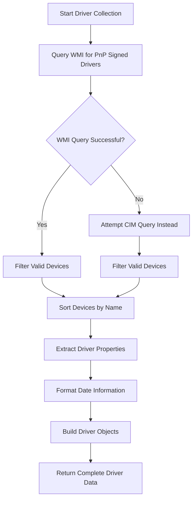
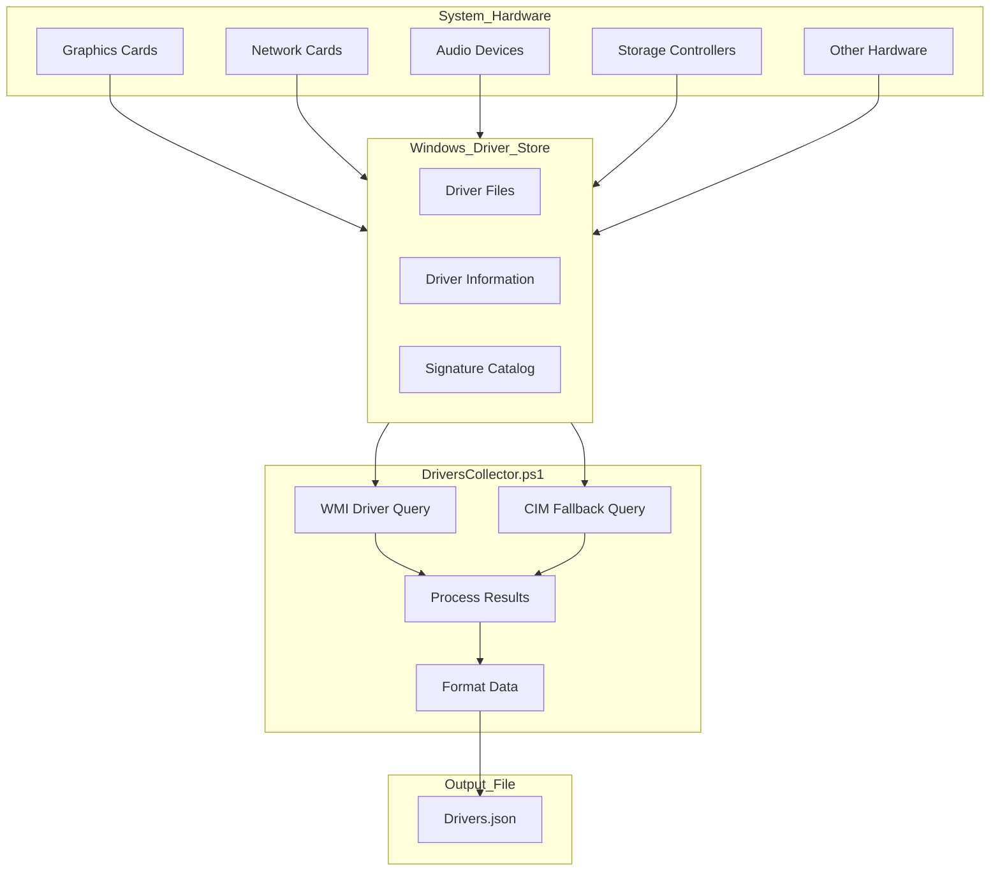

# 7. Drivers

## Description

The Drivers module collects comprehensive information about device drivers installed on the system. Device drivers are critical software components that enable the operating system to communicate with hardware devices. The module captures details such as driver versions, manufacturers, digital signature status, and installation dates. This information is valuable for troubleshooting hardware compatibility issues, ensuring security compliance, and maintaining system stability.

The collection is performed by the `DriversCollector.ps1` script, which uses Windows Management Instrumentation (WMI) to query driver information from the system. The script focuses on signed drivers with valid device associations to provide the most relevant data for system analysis.

## File Generated

- **Filename**: `Drivers.json`
- **Location**: Within the timestamped snapshot directory (e.g., `SystemState_yyyy-MM-dd_HH-mm-ss/Drivers.json`)
- **Format**: UTF-8 encoded JSON without BOM (Byte Order Mark)
- **Typical Size**: 50KB - 500KB (varies based on the number of devices and drivers installed)

## Schema

```json
{
  "Timestamp": "2025-03-10T15:30:45.0000000Z",
  "ComputerName": "HOSTNAME",
  "Data": [
    {
      "DeviceName": "Intel(R) UHD Graphics 620",
      "DeviceClass": "Display",
      "Manufacturer": "Intel Corporation",
      "DriverVersion": "27.20.100.9616",
      "DriverDate": "2024-12-15",
      "DriverProviderName": "Intel Corporation",
      "IsSigned": true,
      "Location": "PCI bus 0, device 2, function 0"
    },
    {
      "DeviceName": "Realtek High Definition Audio",
      "DeviceClass": "MEDIA",
      "Manufacturer": "Realtek Semiconductor Corp.",
      "DriverVersion": "6.0.9285.1",
      "DriverDate": "2024-11-05",
      "DriverProviderName": "Realtek Semiconductor Corp.",
      "IsSigned": true,
      "Location": "PCI bus 0, device 1F, function 3"
    },
    {
      "DeviceName": "Intel(R) Wireless-AC 9560",
      "DeviceClass": "Net",
      "Manufacturer": "Intel Corporation",
      "DriverVersion": "22.230.0.7",
      "DriverDate": "2024-10-20",
      "DriverProviderName": "Intel",
      "IsSigned": true,
      "Location": "PCI bus 3, device 0, function 0"
    }
  ]
}
```

### Schema Details

#### Root Object
| Field | Type | Description |
|-------|------|-------------|
| Timestamp | string | ISO 8601 format timestamp when the data was collected |
| ComputerName | string | Name of the computer from which data was collected |
| Data | array | Array of objects containing driver information for each device |

#### Driver Object (Elements in the Data Array)
| Field | Type | Description |
|-------|------|-------------|
| DeviceName | string | Name of the hardware device using this driver |
| DeviceClass | string | Category of the device (e.g., Display, MEDIA, Net, Storage) |
| Manufacturer | string | Company that manufactured the device |
| DriverVersion | string | Version number of the installed driver |
| DriverDate | string | Date when the driver was released (YYYY-MM-DD format) |
| DriverProviderName | string | Company that provided the driver software |
| IsSigned | boolean | Whether the driver has a valid digital signature |
| Location | string | Physical location of the device on the system |

## JSON Schema Definition

```json
{
  "$schema": "http://json-schema.org/draft-07/schema#",
  "title": "System State Collector - Drivers Data",
  "description": "Schema for device driver data collected by the System State Collector",
  "type": "object",
  "required": ["Timestamp", "ComputerName", "Data"],
  "properties": {
    "Timestamp": {
      "type": "string",
      "format": "date-time",
      "description": "ISO 8601 format timestamp when the data was collected"
    },
    "ComputerName": {
      "type": "string",
      "description": "Name of the computer from which data was collected"
    },
    "Data": {
      "type": "array",
      "description": "Array of device driver information objects",
      "items": {
        "type": "object",
        "required": [
          "DeviceName",
          "DeviceClass",
          "Manufacturer",
          "DriverVersion",
          "DriverDate",
          "DriverProviderName",
          "IsSigned",
          "Location"
        ],
        "properties": {
          "DeviceName": {
            "type": "string",
            "description": "Name of the hardware device using this driver",
            "examples": ["Intel(R) UHD Graphics 620"]
          },
          "DeviceClass": {
            "type": "string",
            "description": "Category of the device",
            "examples": ["Display", "MEDIA", "Net", "Storage"]
          },
          "Manufacturer": {
            "type": "string",
            "description": "Company that manufactured the device",
            "examples": ["Intel Corporation", "Realtek Semiconductor Corp."]
          },
          "DriverVersion": {
            "type": "string",
            "description": "Version number of the installed driver",
            "examples": ["27.20.100.9616", "6.0.9285.1"]
          },
          "DriverDate": {
            "type": "string",
            "description": "Date when the driver was released (YYYY-MM-DD format)",
            "examples": ["2024-12-15"]
          },
          "DriverProviderName": {
            "type": "string",
            "description": "Company that provided the driver software",
            "examples": ["Intel", "Microsoft"]
          },
          "IsSigned": {
            "type": "boolean",
            "description": "Whether the driver has a valid digital signature",
            "examples": [true, false]
          },
          "Location": {
            "type": "string",
            "description": "Physical location of the device on the system",
            "examples": ["PCI bus 0, device 2, function 0"]
          }
        }
      }
    }
  }
}
```

## Key Information Captured

### Driver Details
- **Device Identification**: Names and classes of hardware devices present in the system
- **Driver Versions**: Specific version numbers of installed drivers
- **Manufacturers**: Companies responsible for both hardware devices and driver software
- **Release Dates**: When the driver was published, helping identify outdated drivers
- **Signature Status**: Whether drivers are digitally signed, which is important for security

### Device Classifications
The collector categorizes devices based on their class, which typically includes:
- Display adapters (graphics cards and integrated GPUs)
- Audio devices
- Network interfaces
- Storage controllers
- Input devices (keyboards, mice, etc.)
- Printers and imaging devices
- System devices
- Ports and serial interfaces
- Various other hardware categories

### Security Information
The `IsSigned` field provides important security information. Signed drivers have been verified by a trusted certificate authority, which helps ensure they haven't been tampered with and are from a legitimate source. Unsigned drivers represent a potential security risk.

### Hardware Topology
The `Location` field provides information about where devices are physically connected within the system (e.g., which PCI bus and slot), which can be helpful for troubleshooting hardware conflicts.

### Limitations
- The collector focuses on devices with valid drivers and may not include disconnected or problematic devices
- Some system devices may report generic Microsoft drivers rather than specific manufacturer drivers
- Virtual devices created by software may be included alongside physical hardware
- The collection doesn't include driver file paths or detailed driver configuration settings

## Collection Process

The driver data collection follows this process:



## Suggested Improvements

1. **Driver File Details**: Include the actual file paths of driver files to help with deeper investigations and potentially detect malicious driver replacements.

2. **Driver Status**: Add information about whether drivers are functioning correctly or experiencing issues, which would help identify problematic drivers.

3. **Windows Update Status**: Indicate whether each driver was installed via Windows Update or manually, providing insights into driver management practices.

4. **Digital Signature Details**: Expand signature information to include the certificate authority and signature timestamp, enhancing security validation capabilities.

5. **Driver Dependencies**: Include information about driver dependencies and relationships between drivers, helping understand the driver ecosystem.

6. **Previous Versions**: Track previous driver versions to show update history and potentially help with rollback scenarios.

7. **Driver Size**: Include the size of driver packages to understand their disk footprint.

## Future Enhancements

### Driver Vulnerability Checking
Integrate with databases of known vulnerable drivers to automatically flag drivers with security issues, helping organizations prioritize updates.

### Driver Update Availability
Add functionality to check driver versions against the latest available versions from manufacturers, identifying outdated drivers that should be updated.

### Driver Rollback Information
Include information about available driver rollback options and previous driver versions, aiding troubleshooting and recovery.

### Hardware Compatibility Analysis
Develop capabilities to analyze driver compatibility with the current operating system version and flag potential compatibility issues.

### Performance Impact Assessment
Add functionality to estimate the performance impact of drivers, particularly for components like graphics drivers that can significantly affect system performance.

### Device Health Integration
Integrate with Windows Device Health to provide more comprehensive information about device functionality and reliability.

## Diagram: Driver Collection and Organization



## Related Collectors

The Drivers module complements these other collectors:
- **NetworkCollector**: Provides details on network interfaces that rely on drivers documented in this module
- **WindowsUpdates**: May include driver updates installed through Windows Update
- **RegistrySettings**: Contains registry keys that affect driver loading and configuration
- **Browsers**: Some browser plugins and extensions might install drivers (e.g., for hardware acceleration)
- **PerformanceData**: System performance can be affected by driver efficiency and compatibility
