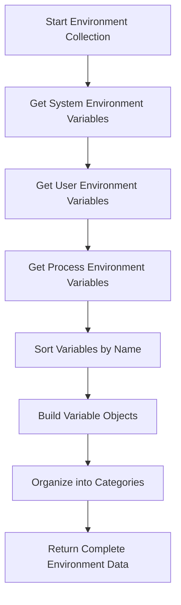
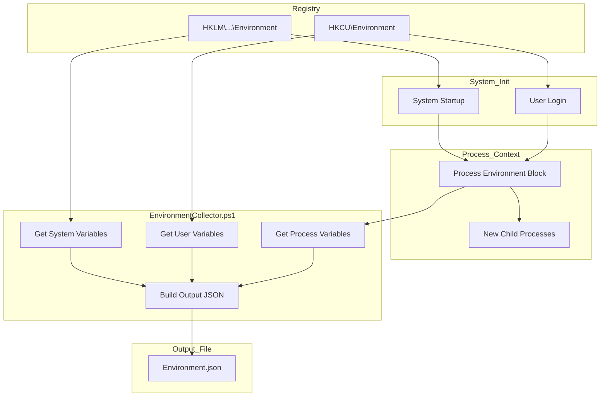
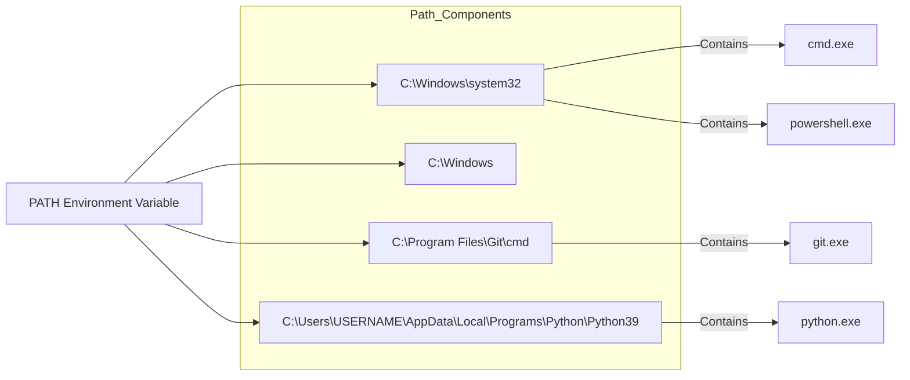

# 8. Environment

## Description

The Environment module collects comprehensive information about environment variables configured on the system. Environment variables are dynamic named values that affect the behavior of processes and applications by providing configuration information. This module captures system-wide, user-specific, and process-level environment variables, providing a complete view of the environment configuration across different scopes.

The collection is performed by the `EnvironmentCollector.ps1` script, which uses PowerShell's built-in environment variable access capabilities to gather variables from different scopes. This information is crucial for troubleshooting application configuration issues, understanding search paths, and documenting the runtime environment of the system.

## File Generated

- **Filename**: `Environment.json`
- **Location**: Within the timestamped snapshot directory (e.g., `SystemState_yyyy-MM-dd_HH-mm-ss/Environment.json`)
- **Format**: UTF-8 encoded JSON without BOM (Byte Order Mark)
- **Typical Size**: 5KB - 50KB (varies based on the number and size of environment variables)

## Schema

```json
{
  "Timestamp": "2025-03-10T15:30:45.0000000Z",
  "ComputerName": "HOSTNAME",
  "Data": {
    "SystemVariables": [
      {
        "Name": "ProgramFiles",
        "Value": "C:\\Program Files"
      },
      {
        "Name": "SystemRoot",
        "Value": "C:\\Windows"
      },
      {
        "Name": "windir",
        "Value": "C:\\Windows"
      }
    ],
    "UserVariables": [
      {
        "Name": "APPDATA",
        "Value": "C:\\Users\\USERNAME\\AppData\\Roaming"
      },
      {
        "Name": "TEMP",
        "Value": "C:\\Users\\USERNAME\\AppData\\Local\\Temp"
      },
      {
        "Name": "HOMEPATH",
        "Value": "\\Users\\USERNAME"
      }
    ],
    "ProcessVariables": [
      {
        "Name": "PSModulePath",
        "Value": "C:\\Users\\USERNAME\\Documents\\WindowsPowerShell\\Modules;C:\\Program Files\\WindowsPowerShell\\Modules;C:\\Windows\\system32\\WindowsPowerShell\\v1.0\\Modules"
      },
      {
        "Name": "PATH",
        "Value": "C:\\Windows\\system32;C:\\Windows;C:\\Windows\\System32\\Wbem;C:\\Windows\\System32\\WindowsPowerShell\\v1.0\\;C:\\Program Files\\PowerShell\\7\\;C:\\Program Files\\Git\\cmd"
      }
    ]
  }
}
```

### Schema Details

#### Root Object
| Field | Type | Description |
|-------|------|-------------|
| Timestamp | string | ISO 8601 format timestamp when the data was collected |
| ComputerName | string | Name of the computer from which data was collected |
| Data | object | Container for environment variable data across different scopes |

#### Data Object
| Field | Type | Description |
|-------|------|-------------|
| SystemVariables | array | Array of environment variables defined at the machine (system) level |
| UserVariables | array | Array of environment variables defined for the current user |
| ProcessVariables | array | Array of environment variables available in the current process context |

#### Variable Object (Elements in each Array)
| Field | Type | Description |
|-------|------|-------------|
| Name | string | Name of the environment variable |
| Value | string | Value of the environment variable |

## JSON Schema Definition

```json
{
  "$schema": "http://json-schema.org/draft-07/schema#",
  "title": "System State Collector - Environment Variables Data",
  "description": "Schema for environment variables data collected by the System State Collector",
  "type": "object",
  "required": ["Timestamp", "ComputerName", "Data"],
  "properties": {
    "Timestamp": {
      "type": "string",
      "format": "date-time",
      "description": "ISO 8601 format timestamp when the data was collected"
    },
    "ComputerName": {
      "type": "string",
      "description": "Name of the computer from which data was collected"
    },
    "Data": {
      "type": "object",
      "description": "Container for environment variable data across different scopes",
      "required": ["SystemVariables", "UserVariables", "ProcessVariables"],
      "properties": {
        "SystemVariables": {
          "type": "array",
          "description": "Array of environment variables defined at the machine (system) level",
          "items": {
            "type": "object",
            "required": ["Name", "Value"],
            "properties": {
              "Name": {
                "type": "string",
                "description": "Name of the environment variable",
                "examples": ["ProgramFiles", "SystemRoot", "windir"]
              },
              "Value": {
                "type": "string",
                "description": "Value of the environment variable",
                "examples": ["C:\\Program Files", "C:\\Windows"]
              }
            }
          }
        },
        "UserVariables": {
          "type": "array",
          "description": "Array of environment variables defined for the current user",
          "items": {
            "type": "object",
            "required": ["Name", "Value"],
            "properties": {
              "Name": {
                "type": "string",
                "description": "Name of the environment variable",
                "examples": ["APPDATA", "TEMP", "HOMEPATH"]
              },
              "Value": {
                "type": "string",
                "description": "Value of the environment variable",
                "examples": ["C:\\Users\\USERNAME\\AppData\\Roaming", "C:\\Users\\USERNAME\\AppData\\Local\\Temp"]
              }
            }
          }
        },
        "ProcessVariables": {
          "type": "array",
          "description": "Array of environment variables available in the current process context",
          "items": {
            "type": "object",
            "required": ["Name", "Value"],
            "properties": {
              "Name": {
                "type": "string",
                "description": "Name of the environment variable",
                "examples": ["PSModulePath", "PATH"]
              },
              "Value": {
                "type": "string",
                "description": "Value of the environment variable",
                "examples": ["C:\\Windows\\system32;C:\\Windows"]
              }
            }
          }
        }
      }
    }
  }
}
```

## Key Information Captured

### Environment Variable Scopes
The module collects environment variables from three distinct scopes:

1. **System Variables**: These are machine-wide settings that apply to all users on the system. They are stored in the registry under `HKLM\SYSTEM\CurrentControlSet\Control\Session Manager\Environment`. Examples include:
   - `ProgramFiles` - Standard installation directory for programs
   - `SystemRoot` - Windows installation directory
   - `ComSpec` - Command processor path
   - `NUMBER_OF_PROCESSORS` - The number of processor cores
   - `OS` - Operating system name

2. **User Variables**: These are settings specific to the currently logged-in user. They are stored in the registry under `HKCU\Environment`. Examples include:
   - `APPDATA` - User's application data directory
   - `USERPROFILE` - User's profile directory
   - `TEMP` and `TMP` - Temporary file directories
   - User-specific `PATH` extensions

3. **Process Variables**: These include the combined set of system and user variables, plus any variables set within the current PowerShell process. These variables reflect what would be available to applications launched by the collector. Examples include:
   - `PSModulePath` - PowerShell module search locations
   - Combined `PATH` variable
   - Variables set by the PowerShell session

### Important Environment Variables
The collection typically includes several critical environment variables that affect system behavior:

- **PATH**: Determines where the system looks for executable files
- **PATHEXT**: Specifies which file extensions are executable
- **TEMP/TMP**: Defines temporary file locations
- **ProgramFiles**: Indicates standard program installation locations
- **PSModulePath**: Controls PowerShell module discovery
- **JAVA_HOME**, **PYTHON_HOME**, etc.: Language-specific configuration

### Security Implications
Environment variables can contain sensitive information, such as:
- API keys or access tokens
- Configuration paths that reveal system structure
- User-specific information

The collector captures this information as-is, so care should be taken when sharing the output files.

### Limitations
- Some environment variables may contain truncated values if they exceed registry size limits
- The collection reflects a point-in-time snapshot and doesn't capture dynamic changes
- Environment variables set through Group Policy may appear without indication of their source
- The process context may differ from that of normal user applications

## Collection Process

The environment variables collection follows this process:



## Suggested Improvements

1. **Variable Source Tracking**: Add information about where each variable is defined (registry path, Group Policy, etc.) to help with troubleshooting and configuration management.

2. **Change History**: Implement tracking of environment variable changes between snapshots to identify modifications that might affect system behavior.

3. **Path Analysis**: Add special handling for PATH-like variables (PATH, PSModulePath, etc.) to break them down into individual components and validate each path's existence.

4. **Sensitive Value Detection**: Implement detection of potentially sensitive information in environment variables, with options to mask or exclude such values from the collection.

5. **Value Expansion**: Show both raw and expanded values for variables that reference other variables (e.g., "%ProgramFiles%\Common Files" would show both the unexpanded string and "C:\Program Files\Common Files").

6. **Variable Usage**: Add information about which applications or components typically use each variable, helping identify the purpose and importance of each setting.

7. **Default Value Comparison**: Compare current values against Windows defaults to highlight customizations.

## Future Enhancements

### Variable Impact Analysis
Develop functionality to analyze the impact of environment variable changes on application behavior, helping predict the effects of configuration changes.

### Environment Optimization
Implement recommendations for environment variable optimizations, such as removing duplicate or unnecessary PATH entries that can slow down application startup.

### Security Auditing
Add capabilities to audit environment variables for security issues, such as insecure PATH configurations that could enable DLL hijacking attacks.

### Cross-System Comparison
Enhance comparison tools to effectively identify environment differences between systems, aiding in troubleshooting configuration-related issues.

### Environment Visualization
Create visual representations of environment variable relationships and dependencies to better understand the configuration ecosystem.

### Configuration Templates
Develop the ability to compare environment configurations against best-practice templates for different types of systems (development workstations, servers, etc.).

## Diagram: Environment Variable Hierarchy



## Diagram: Path Variable Expansion



## Related Collectors

The Environment module complements these other collectors:
- **Path**: Provides detailed analysis of the PATH environment variable specifically
- **PythonInstallations**: May depend on Python-related environment variables like PYTHONPATH
- **RegistrySettings**: Contains the registry sources of environment variables
- **StartupPrograms**: Some startup items might modify environment variables
- **InstalledPrograms**: Installed applications often add to environment variables during installation
