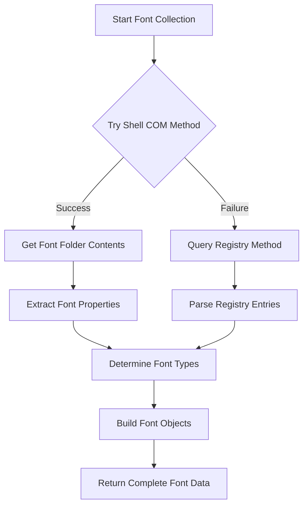
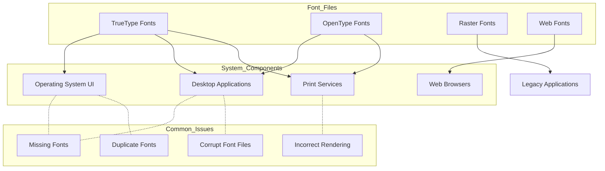

# 9. Fonts

## Description

The Fonts module collects comprehensive information about fonts installed on the Windows system. Font files are essential resources that define the appearance of text in documents, applications, and the operating system interface. This module captures details about each installed font, including its name, file path, type (such as TrueType or OpenType), and modification date. This information is valuable for design professionals, system administrators, and support personnel who need to understand or troubleshoot font-related issues.

The collection is performed by the `FontCollector.ps1` script, which uses Windows Shell COM objects or the Windows Registry to enumerate installed fonts. The collector provides insights into the typography resources available on the system, which can affect application behavior, document rendering, and user interface appearance.

## File Generated

- **Filename**: `Fonts.json`
- **Location**: Within the timestamped snapshot directory (e.g., `SystemState_yyyy-MM-dd_HH-mm-ss/Fonts.json`)
- **Format**: UTF-8 encoded JSON without BOM (Byte Order Mark)
- **Typical Size**: 20KB - 200KB (varies based on the number of installed fonts)

## Schema

```json
{
  "Timestamp": "2025-03-10T15:30:45.0000000Z",
  "ComputerName": "HOSTNAME",
  "Data": [
    {
      "Name": "Arial.ttf",
      "Path": "C:\\Windows\\Fonts\\Arial.ttf",
      "Type": "TrueType",
      "DateModified": "4/22/2023 10:15 AM"
    },
    {
      "Name": "Calibri.ttf",
      "Path": "C:\\Windows\\Fonts\\Calibri.ttf",
      "Type": "TrueType",
      "DateModified": "9/18/2023 3:42 PM"
    },
    {
      "Name": "SegoeUI.ttf",
      "Path": "C:\\Windows\\Fonts\\SegoeUI.ttf",
      "Type": "TrueType",
      "DateModified": "11/2/2023 8:20 AM"
    },
    {
      "Name": "SourceCodePro-Regular.otf",
      "Path": "C:\\Windows\\Fonts\\SourceCodePro-Regular.otf",
      "Type": "OpenType",
      "DateModified": "2/15/2024 2:35 PM"
    },
    {
      "Name": "Consola.ttf",
      "Path": "C:\\Windows\\Fonts\\Consola.ttf",
      "Type": "TrueType",
      "DateModified": "10/26/2023 11:07 AM"
    }
  ]
}
```

### Schema Details

#### Root Object
| Field | Type | Description |
|-------|------|-------------|
| Timestamp | string | ISO 8601 format timestamp when the data was collected |
| ComputerName | string | Name of the computer from which data was collected |
| Data | array | Array of objects containing information about each installed font |

#### Font Object (Elements in the Data Array)
| Field | Type | Description |
|-------|------|-------------|
| Name | string | Filename of the font file |
| Path | string | Full path to the font file location |
| Type | string | Type of font (e.g., "TrueType", "OpenType", "Raster") |
| DateModified | string | Date and time when the font file was last modified |

## JSON Schema Definition

```json
{
  "$schema": "http://json-schema.org/draft-07/schema#",
  "title": "System State Collector - Fonts Data",
  "description": "Schema for font installation data collected by the System State Collector",
  "type": "object",
  "required": ["Timestamp", "ComputerName", "Data"],
  "properties": {
    "Timestamp": {
      "type": "string",
      "format": "date-time",
      "description": "ISO 8601 format timestamp when the data was collected"
    },
    "ComputerName": {
      "type": "string",
      "description": "Name of the computer from which data was collected"
    },
    "Data": {
      "type": "array",
      "description": "Array of objects containing information about each installed font",
      "items": {
        "type": "object",
        "required": ["Name", "Path", "Type"],
        "properties": {
          "Name": {
            "type": "string",
            "description": "Filename of the font file",
            "examples": ["Arial.ttf", "Calibri.ttf"]
          },
          "Path": {
            "type": "string",
            "description": "Full path to the font file location",
            "examples": ["C:\\Windows\\Fonts\\Arial.ttf"]
          },
          "Type": {
            "type": "string",
            "description": "Type of font",
            "enum": ["TrueType", "OpenType", "Raster", "Unknown"],
            "examples": ["TrueType", "OpenType"]
          },
          "DateModified": {
            "type": "string",
            "description": "Date and time when the font file was last modified",
            "examples": ["4/22/2023 10:15 AM"]
          }
        }
      }
    }
  }
}
```

## Key Information Captured

### Font Types
The collector identifies and categorizes fonts based on their file format:

- **TrueType Fonts (.ttf)**: Vector-based font format developed by Apple and Microsoft, widely used for its scalability and screen readability
- **OpenType Fonts (.otf)**: Advanced font format developed by Microsoft and Adobe, supporting extended character sets and typographic features
- **Raster Fonts (.fon)**: Older bitmap font format used primarily for legacy applications and system screens
- **Unknown**: Fonts that don't match the known patterns or can't be identified by file extension

### Font Locations
The collection includes fonts from standard system locations:

- **System Fonts**: Located in `C:\Windows\Fonts` directory, available to all users
- **User Fonts**: Located in user profile folders, only available to specific users
- **Application Fonts**: Some applications install fonts to their own directories

### Font Metadata
For each font, the module attempts to capture:

- **File Information**: Name and path of the font file
- **Type Classification**: Category of font based on file extension
- **Modification Date**: When the font file was last updated, which can help identify recently installed fonts

### Collection Methodology
The font collector uses two approaches, with a fallback mechanism:

1. **Primary Method**: Uses the Windows Shell COM object to access the fonts folder (0x14 special folder)
2. **Secondary Method**: Falls back to querying the Windows Registry under `HKLM:\SOFTWARE\Microsoft\Windows NT\CurrentVersion\Fonts` if the COM approach fails

### Limitations
- **Font Properties**: The collection doesn't include advanced font properties like weight, style, or supported character sets
- **Font Families**: Doesn't group related fonts into families or show their relationships
- **Hidden Fonts**: May not detect fonts that are installed but not registered in standard locations
- **Temporarily Installed Fonts**: Doesn't distinguish between permanently installed and temporarily activated fonts
- **Font Validation**: Doesn't validate if font files are corrupted or contain errors

## Collection Process

The fonts data collection follows this process:



## Suggested Improvements

1. **Font Metadata Enhancement**: Include additional font metadata such as font family, style, weight, and character set support.

2. **Font Grouping**: Group related fonts into families to provide better organization and relationship understanding.

3. **Font Usage Information**: Track which applications or system components are using particular fonts.

4. **Font Validation**: Add basic validation to detect corrupt or problematic font files.

5. **Missing Standard Fonts**: Compare against a list of expected standard Windows fonts to identify missing core fonts.

6. **User vs. System Fonts**: Clearly distinguish between system-wide fonts and user-specific fonts.

7. **Installation Source**: Add information about the origin of each font (Windows default, application installation, user-installed).

## Future Enhancements

### Font Rendering Preview Generation
Implement functionality to generate preview images of fonts with sample text, helping visualize the appearance of installed fonts without opening separate applications.

### Font Dependency Mapping
Create mapping between applications and their required fonts, identifying potential font-related issues before they cause application errors.

### Font Duplication Detection
Add capabilities to detect duplicate fonts or multiple versions of the same font, which could lead to inconsistent text rendering.

### Font Usage Analysis
Develop tools to analyze which fonts are actually being used by the system and applications, helping identify unused fonts that could be removed to save resources.

### Web Font Integration
Expand the collector to identify web fonts being used by browsers and web applications, providing a more complete picture of typography resources.

### Typography Configuration Analysis
Add collection of system typography settings that affect how fonts are rendered, such as ClearType configuration, font smoothing, and DPI scaling settings.

## Diagram: Font Collection Methods

```mermaid
graph TD
    subgraph Windows_Font_System
        FontsFolder[C:\Windows\Fonts]
        FontRegistry[Font Registry Keys]
        FontCache[Font Cache]
    end
    
    subgraph Font_Collection_Methods
        ShellMethod[Shell COM Object Method]
        RegistryMethod[Registry Query Method]
    end
    
    subgraph Font_Types
        TrueType[TrueType Fonts (.ttf)]
        OpenType[OpenType Fonts (.otf)]
        Raster[Raster Fonts (.fon)]
    end
    
    FontsFolder --> ShellMethod
    FontRegistry --> RegistryMethod
    
    ShellMethod --> TrueType
    ShellMethod --> OpenType
    ShellMethod --> Raster
    RegistryMethod --> TrueType
    RegistryMethod --> OpenType
    RegistryMethod --> Raster
    
    subgraph Collector["FontCollector.ps1"]
        PrimaryCollection[Try COM Collection]
        FallbackCollection[Fallback to Registry]
        ProcessResults[Process Font Data]
    end
    
    ShellMethod --> PrimaryCollection
    RegistryMethod --> FallbackCollection
    PrimaryCollection --> ProcessResults
    FallbackCollection --> ProcessResults
```

## Diagram: Font Types and Applications



## Related Collectors

The Fonts module complements these other collectors:
- **InstalledPrograms**: Many applications install their own fonts
- **RegistrySettings**: Contains font registration information
- **WindowsFeatures**: Some Windows features include specific fonts
- **Path**: May include paths to font tools or utilities
- **BrowserCollector**: Web browsers work with both system fonts and web fonts
