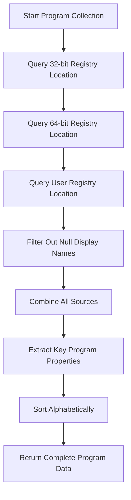
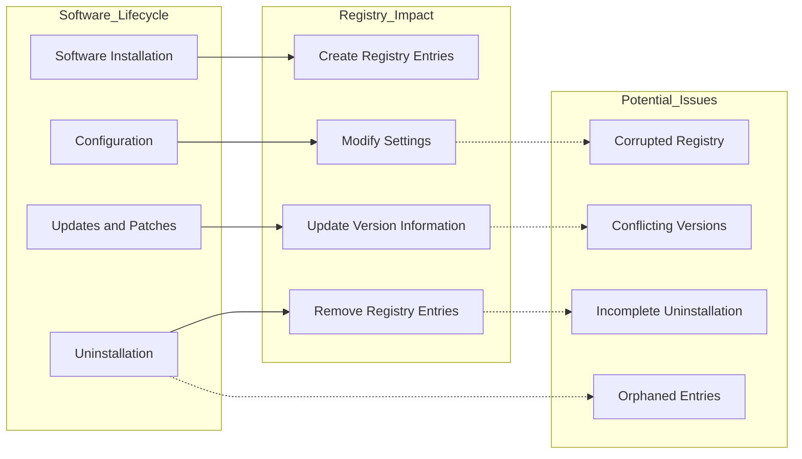

# 10. Installed Programs

## Description

The Installed Programs module collects comprehensive information about software applications installed on the Windows system. This module captures details about programs registered through standard Windows installation mechanisms, including their names, publishers, versions, and installation dates. This information is crucial for software inventory management, license compliance, security assessments, and troubleshooting application conflicts.

The collection is performed by the `ProgramCollector.ps1` script, which queries the Windows Registry to identify installed applications across different registry locations. The collector examines both system-wide installations and user-specific installations to provide a complete picture of the software landscape on the machine.

## File Generated

- **Filename**: `InstalledPrograms.json`
- **Location**: Within the timestamped snapshot directory (e.g., `SystemState_yyyy-MM-dd_HH-mm-ss/InstalledPrograms.json`)
- **Format**: UTF-8 encoded JSON without BOM (Byte Order Mark)
- **Typical Size**: 20KB - 500KB (varies based on the number of installed applications)

## Schema

```json
{
  "Timestamp": "2025-03-10T15:30:45.0000000Z",
  "ComputerName": "HOSTNAME",
  "Data": [
    {
      "Name": "Adobe Acrobat Reader DC",
      "Publisher": "Adobe Inc.",
      "Version": "25.1.0",
      "InstallDate": "20240215"
    },
    {
      "Name": "Google Chrome",
      "Publisher": "Google LLC",
      "Version": "122.0.6261.112",
      "InstallDate": "20240220"
    },
    {
      "Name": "Microsoft 365 Apps for enterprise",
      "Publisher": "Microsoft Corporation",
      "Version": "16.0.16130.20306",
      "InstallDate": "20240120"
    },
    {
      "Name": "Python 3.11.5",
      "Publisher": "Python Software Foundation",
      "Version": "3.11.5150.0",
      "InstallDate": "20240210"
    },
    {
      "Name": "Visual Studio Code",
      "Publisher": "Microsoft Corporation",
      "Version": "1.86.0",
      "InstallDate": "20240202"
    }
  ]
}
```

### Schema Details

#### Root Object
| Field | Type | Description |
|-------|------|-------------|
| Timestamp | string | ISO 8601 format timestamp when the data was collected |
| ComputerName | string | Name of the computer from which data was collected |
| Data | array | Array of objects containing information about each installed program |

#### Program Object (Elements in the Data Array)
| Field | Type | Description |
|-------|------|-------------|
| Name | string | Display name of the installed application |
| Publisher | string | Company or organization that published the software |
| Version | string | Version number of the installed application |
| InstallDate | string | Date when the application was installed (format varies, often YYYYMMDD) |

## JSON Schema Definition

```json
{
  "$schema": "http://json-schema.org/draft-07/schema#",
  "title": "System State Collector - Installed Programs Data",
  "description": "Schema for installed software applications data collected by the System State Collector",
  "type": "object",
  "required": ["Timestamp", "ComputerName", "Data"],
  "properties": {
    "Timestamp": {
      "type": "string",
      "format": "date-time",
      "description": "ISO 8601 format timestamp when the data was collected"
    },
    "ComputerName": {
      "type": "string",
      "description": "Name of the computer from which data was collected"
    },
    "Data": {
      "type": "array",
      "description": "Array of objects containing information about each installed program",
      "items": {
        "type": "object",
        "required": ["Name"],
        "properties": {
          "Name": {
            "type": "string",
            "description": "Display name of the installed application",
            "examples": ["Microsoft 365 Apps for enterprise", "Google Chrome"]
          },
          "Publisher": {
            "type": "string",
            "description": "Company or organization that published the software",
            "examples": ["Microsoft Corporation", "Adobe Inc."]
          },
          "Version": {
            "type": "string",
            "description": "Version number of the installed application",
            "examples": ["16.0.16130.20306", "122.0.6261.112"]
          },
          "InstallDate": {
            "type": "string",
            "description": "Date when the application was installed (format varies, often YYYYMMDD)",
            "examples": ["20240120", "20240215"]
          }
        }
      }
    }
  }
}
```

## Key Information Captured

### Program Details
- **Application Name**: The name users would recognize from Add/Remove Programs or Settings
- **Publisher Information**: The organization that created the software, helping identify legitimate applications
- **Version Data**: Specific version number of installed software, critical for update management and compatibility assessment
- **Installation Date**: When the application was installed, useful for troubleshooting and change management

### Registry Sources
The collector queries multiple registry locations to find installed applications:

1. **System-Wide 32-bit Applications**:
   - Registry Key: `HKLM:\SOFTWARE\WOW6432Node\Microsoft\Windows\CurrentVersion\Uninstall\*`
   - Contains 32-bit applications installed for all users on 64-bit systems

2. **System-Wide 64-bit Applications**:
   - Registry Key: `HKLM:\SOFTWARE\Microsoft\Windows\CurrentVersion\Uninstall\*`
   - Contains 64-bit applications installed for all users

3. **User-Specific Applications**:
   - Registry Key: `HKCU:\SOFTWARE\Microsoft\Windows\CurrentVersion\Uninstall\*`
   - Contains applications installed for the current user only

### Application Types Captured
The collection includes various types of software:

- **Traditional Desktop Applications**: Standard Windows applications installed via installers
- **Microsoft Store Apps**: Applications installed through the Microsoft Store (with registry entries)
- **Major Components and Frameworks**: Runtime environments, development tools, and frameworks
- **System Tools and Utilities**: Administrative and maintenance tools

### Collection Methodology
The program collector specifically:
- Only includes entries with a non-empty DisplayName field
- Combines applications from multiple registry sources
- Normalizes and sorts the data alphabetically by application name
- Extracts key fields while ignoring extraneous registry data

### Limitations
- **Microsoft Store Applications**: Some modern UWP apps may not appear in traditional registry locations
- **Portable Applications**: Software that doesn't use the Windows installer system won't be included
- **Custom Installations**: Applications installed using non-standard methods might be missed
- **Installation Date Format**: The format varies between applications and may be absent for some software
- **Incomplete Data**: Some applications might not provide complete publisher or version information

## Collection Process

The installed programs data collection follows this process:



## Suggested Improvements

1. **Installation Size**: Add information about the disk space used by each application to help with storage management.

2. **Installation Path**: Include the installation directory for each application to help locate program files.

3. **Uninstall Command**: Capture the uninstall string or command that would be used to remove the application.

4. **Update Information**: Add details about available updates or patch status for installed software.

5. **Application Usage**: Include data about when applications were last used or how frequently they're accessed.

6. **Installation Source**: Record where the application was installed from (download URL, installation media, etc.).

7. **Modern Application Support**: Enhance detection of UWP and Microsoft Store applications that might not use traditional registry entries.

## Future Enhancements

### Software License Management
Expand collection to include license information when available, helping with software asset management and compliance.

### Application Categorization
Implement automatic categorization of applications into groups (productivity, development, utilities, etc.) to provide better organization and insights.

### Vulnerability Correlation
Integrate with vulnerability databases to automatically flag installed software versions with known security issues.

### Installation Timeline Visualization
Create visualization tools that display software installation history over time, helping identify patterns or troubleshoot issues after specific installation events.

### Software Dependencies Mapping
Develop functionality to map dependencies between installed applications, showing which programs rely on others to function properly.

### Application Health Assessment
Implement checks for signs of problematic installations, such as incomplete uninstalls, corrupted components, or conflicting applications.

## Diagram: Windows Software Registration Sources

```mermaid
graph TD
    subgraph Windows_Registry
        HKLM64[HKLM:\SOFTWARE\Microsoft\Windows\CurrentVersion\Uninstall]
        HKLM32[HKLM:\SOFTWARE\WOW6432Node\Microsoft\Windows\CurrentVersion\Uninstall]
        HKCU[HKCU:\SOFTWARE\Microsoft\Windows\CurrentVersion\Uninstall]
    end
    
    subgraph Installation_Types
        SystemWide64[64-bit System-Wide]
        SystemWide32[32-bit System-Wide]
        UserSpecific[User-Specific]
    end
    
    HKLM64 --> SystemWide64
    HKLM32 --> SystemWide32
    HKCU --> UserSpecific
    
    subgraph Installer_Technologies
        MSI[Windows Installer (MSI)]
        EXEInstallers[Traditional EXE Installers]
        StoreApps[Microsoft Store]
        ClickOnce[ClickOnce Deployment]
    end
    
    MSI --> HKLM64
    MSI --> HKLM32
    EXEInstallers --> HKLM64
    EXEInstallers --> HKLM32
    EXEInstallers --> HKCU
    StoreApps -.-> HKLM64
    ClickOnce --> HKCU
    
    subgraph Collector["ProgramCollector.ps1"]
        QueryLocations[Query Registry Locations]
        CombineResults[Combine Results]
        FilterEntries[Filter Valid Entries]
        SortResults[Sort by Name]
    end
    
    HKLM64 --> QueryLocations
    HKLM32 --> QueryLocations
    HKCU --> QueryLocations
    QueryLocations --> CombineResults
    CombineResults --> FilterEntries
    FilterEntries --> SortResults
```

## Diagram: Application Management Lifecycle



## Related Collectors

The Installed Programs module complements these other collectors:
- **StartupPrograms**: Shows which installed applications are configured to run at startup
- **RegistrySettings**: Contains additional application configuration data in the registry
- **WindowsFeatures**: Identifies Windows features that may be required by certain applications
- **PythonInstallations**: Provides deeper details on Python environments beyond basic installation data
- **Browsers**: Offers browser-specific information for web applications and extensions
- **DiskSpace**: Helps understand the storage impact of installed applications
