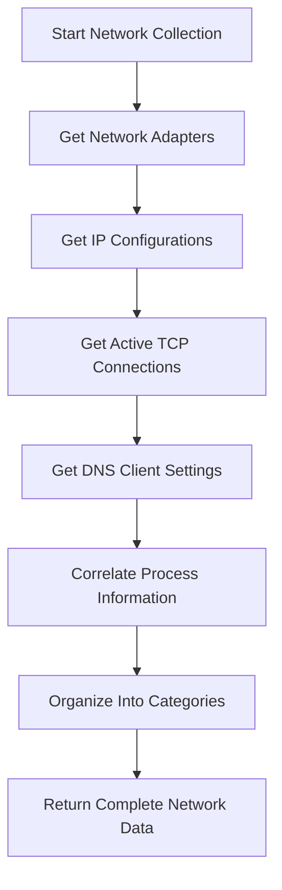
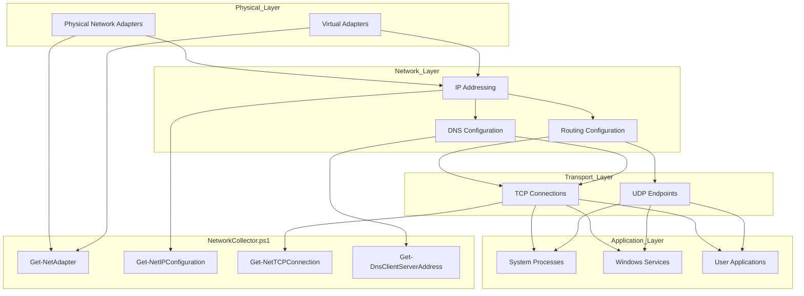
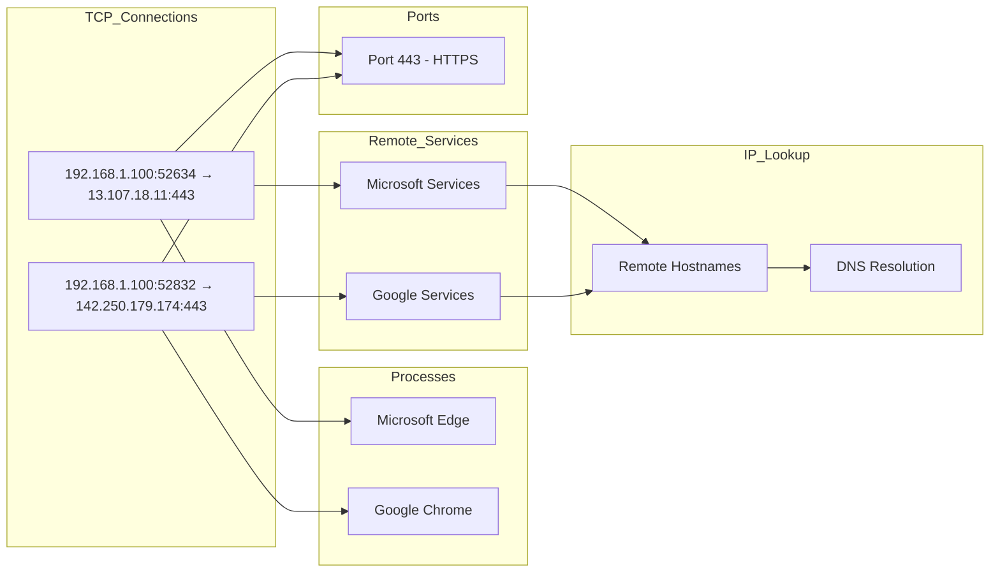

# 11. Network

## Description

The Network module collects comprehensive information about the system's network configuration, interfaces, connections, and DNS settings. This module captures a detailed snapshot of how the system interacts with local and remote networks, providing essential data for network troubleshooting, security analysis, and configuration management. Network information is critical for understanding connectivity issues, identifying potential security concerns, and documenting the system's communication pathways.

The collection is performed by the `NetworkCollector.ps1` script, which leverages PowerShell's networking cmdlets to gather information about network adapters, IP configurations, active connections, and DNS settings. The collector provides a multi-faceted view of the system's network environment, from physical hardware details to active communication sessions.

## File Generated

- **Filename**: `Network.json`
- **Location**: Within the timestamped snapshot directory (e.g., `SystemState_yyyy-MM-dd_HH-mm-ss/Network.json`)
- **Format**: UTF-8 encoded JSON without BOM (Byte Order Mark)
- **Typical Size**: 20KB - 200KB (varies based on the number of adapters and active connections)

## Schema

```json
{
  "Timestamp": "2025-03-10T15:30:45.0000000Z",
  "ComputerName": "HOSTNAME",
  "Data": {
    "Adapters": [
      {
        "Name": "Ethernet",
        "Description": "Intel(R) Ethernet Connection I219-V",
        "Status": "Up",
        "MacAddress": "00-11-22-33-44-55",
        "LinkSpeed": "1 Gbps",
        "MediaType": "802.3"
      },
      {
        "Name": "Wi-Fi",
        "Description": "Intel(R) Wireless-AC 9560",
        "Status": "Up",
        "MacAddress": "AA-BB-CC-DD-EE-FF",
        "LinkSpeed": "866.7 Mbps",
        "MediaType": "Native 802.11"
      }
    ],
    "IPConfiguration": [
      {
        "InterfaceAlias": "Ethernet",
        "IPv4Address": "192.168.1.100",
        "IPv4Gateway": "192.168.1.1",
        "DNSServers": [
          "192.168.1.1",
          "8.8.8.8"
        ]
      },
      {
        "InterfaceAlias": "Wi-Fi",
        "IPv4Address": "192.168.2.105",
        "IPv4Gateway": "192.168.2.1",
        "DNSServers": [
          "192.168.2.1",
          "8.8.4.4"
        ]
      }
    ],
    "ActiveConnections": [
      {
        "LocalAddress": "192.168.1.100:52634",
        "RemoteAddress": "13.107.18.11:443",
        "State": "Established",
        "Process": "msedge",
        "PID": 4256
      },
      {
        "LocalAddress": "192.168.1.100:52832",
        "RemoteAddress": "142.250.179.174:443",
        "State": "Established",
        "Process": "chrome",
        "PID": 3848
      }
    ],
    "DNSSettings": [
      {
        "InterfaceAlias": "Ethernet",
        "InterfaceIndex": 4,
        "ServerAddresses": [
          "192.168.1.1",
          "8.8.8.8"
        ]
      },
      {
        "InterfaceAlias": "Wi-Fi",
        "InterfaceIndex": 7,
        "ServerAddresses": [
          "192.168.2.1",
          "8.8.4.4"
        ]
      }
    ]
  }
}
```

### Schema Details

#### Root Object
| Field | Type | Description |
|-------|------|-------------|
| Timestamp | string | ISO 8601 format timestamp when the data was collected |
| ComputerName | string | Name of the computer from which data was collected |
| Data | object | Container for all network-related data categories |

#### Data Object
| Field | Type | Description |
|-------|------|-------------|
| Adapters | array | Array of network adapters and their properties |
| IPConfiguration | array | IP addressing configuration for each network interface |
| ActiveConnections | array | Currently established network connections |
| DNSSettings | array | DNS server configuration for each interface |

#### Adapters Array Elements
| Field | Type | Description |
|-------|------|-------------|
| Name | string | Friendly name of the network adapter |
| Description | string | Detailed description of the hardware |
| Status | string | Current operational status (Up, Down, etc.) |
| MacAddress | string | Physical/MAC address of the adapter |
| LinkSpeed | string | Current connection speed |
| MediaType | string | Type of network media (802.3, 802.11, etc.) |

#### IPConfiguration Array Elements
| Field | Type | Description |
|-------|------|-------------|
| InterfaceAlias | string | Friendly name of the network interface |
| IPv4Address | string | Current IPv4 address assigned to the interface |
| IPv4Gateway | string | Default gateway for the interface |
| DNSServers | array | List of DNS servers configured for this interface |

#### ActiveConnections Array Elements
| Field | Type | Description |
|-------|------|-------------|
| LocalAddress | string | Local IP address and port for the connection |
| RemoteAddress | string | Remote IP address and port for the connection |
| State | string | Current connection state |
| Process | string | Name of the process that owns the connection |
| PID | number | Process ID of the owning process |

#### DNSSettings Array Elements
| Field | Type | Description |
|-------|------|-------------|
| InterfaceAlias | string | Friendly name of the network interface |
| InterfaceIndex | number | Numeric index of the interface |
| ServerAddresses | array | List of DNS server addresses configured |

## JSON Schema Definition

```json
{
  "$schema": "http://json-schema.org/draft-07/schema#",
  "title": "System State Collector - Network Data",
  "description": "Schema for network configuration and connection data collected by the System State Collector",
  "type": "object",
  "required": ["Timestamp", "ComputerName", "Data"],
  "properties": {
    "Timestamp": {
      "type": "string",
      "format": "date-time",
      "description": "ISO 8601 format timestamp when the data was collected"
    },
    "ComputerName": {
      "type": "string",
      "description": "Name of the computer from which data was collected"
    },
    "Data": {
      "type": "object",
      "description": "Container for all network-related data categories",
      "required": ["Adapters", "IPConfiguration", "ActiveConnections", "DNSSettings"],
      "properties": {
        "Adapters": {
          "type": "array",
          "description": "Array of network adapters and their properties",
          "items": {
            "type": "object",
            "required": ["Name", "Description", "Status", "MacAddress", "LinkSpeed", "MediaType"],
            "properties": {
              "Name": {
                "type": "string",
                "description": "Friendly name of the network adapter",
                "examples": ["Ethernet", "Wi-Fi"]
              },
              "Description": {
                "type": "string",
                "description": "Detailed description of the hardware",
                "examples": ["Intel(R) Ethernet Connection I219-V"]
              },
              "Status": {
                "type": "string",
                "description": "Current operational status",
                "examples": ["Up", "Down"]
              },
              "MacAddress": {
                "type": "string",
                "description": "Physical/MAC address of the adapter",
                "examples": ["00-11-22-33-44-55"]
              },
              "LinkSpeed": {
                "type": "string",
                "description": "Current connection speed",
                "examples": ["1 Gbps", "866.7 Mbps"]
              },
              "MediaType": {
                "type": "string",
                "description": "Type of network media",
                "examples": ["802.3", "Native 802.11"]
              }
            }
          }
        },
        "IPConfiguration": {
          "type": "array",
          "description": "IP addressing configuration for each network interface",
          "items": {
            "type": "object",
            "required": ["InterfaceAlias", "IPv4Address", "IPv4Gateway", "DNSServers"],
            "properties": {
              "InterfaceAlias": {
                "type": "string",
                "description": "Friendly name of the network interface",
                "examples": ["Ethernet", "Wi-Fi"]
              },
              "IPv4Address": {
                "type": "string",
                "description": "Current IPv4 address assigned to the interface",
                "examples": ["192.168.1.100"]
              },
              "IPv4Gateway": {
                "type": "string",
                "description": "Default gateway for the interface",
                "examples": ["192.168.1.1"]
              },
              "DNSServers": {
                "type": "array",
                "description": "List of DNS servers configured for this interface",
                "items": {
                  "type": "string",
                  "examples": ["192.168.1.1", "8.8.8.8"]
                }
              }
            }
          }
        },
        "ActiveConnections": {
          "type": "array",
          "description": "Currently established network connections",
          "items": {
            "type": "object",
            "required": ["LocalAddress", "RemoteAddress", "State", "Process", "PID"],
            "properties": {
              "LocalAddress": {
                "type": "string",
                "description": "Local IP address and port for the connection",
                "examples": ["192.168.1.100:52634"]
              },
              "RemoteAddress": {
                "type": "string",
                "description": "Remote IP address and port for the connection",
                "examples": ["13.107.18.11:443"]
              },
              "State": {
                "type": "string",
                "description": "Current connection state",
                "examples": ["Established", "Listening"]
              },
              "Process": {
                "type": "string",
                "description": "Name of the process that owns the connection",
                "examples": ["msedge", "chrome"]
              },
              "PID": {
                "type": "number",
                "description": "Process ID of the owning process",
                "examples": [4256, 3848]
              }
            }
          }
        },
        "DNSSettings": {
          "type": "array",
          "description": "DNS server configuration for each interface",
          "items": {
            "type": "object",
            "required": ["InterfaceAlias", "InterfaceIndex", "ServerAddresses"],
            "properties": {
              "InterfaceAlias": {
                "type": "string",
                "description": "Friendly name of the network interface",
                "examples": ["Ethernet", "Wi-Fi"]
              },
              "InterfaceIndex": {
                "type": "number",
                "description": "Numeric index of the interface",
                "examples": [4, 7]
              },
              "ServerAddresses": {
                "type": "array",
                "description": "List of DNS server addresses configured",
                "items": {
                  "type": "string",
                  "examples": ["192.168.1.1", "8.8.8.8"]
                }
              }
            }
          }
        }
      }
    }
  }
}
```

## Key Information Captured

### Network Adapters
- **Hardware Information**: Details about physical and virtual network adapters present in the system
- **Connection Status**: Current operational state of each adapter (Up, Down, Disconnected)
- **Hardware Identifiers**: MAC addresses that uniquely identify each network interface
- **Performance Metrics**: Link speeds and connection types that affect network performance
- **Media Types**: Categories of network connections (wired Ethernet, Wi-Fi, etc.)

### IP Configuration
- **IP Addressing**: Currently assigned IPv4 addresses for each interface
- **Gateway Configuration**: Default gateway settings that control routing
- **DNS Integration**: DNS server assignments for each network connection
- **Interface Correlation**: Mapping between interfaces and their IP configurations

### Active Connections
- **Current Sessions**: Network connections established at the time of collection
- **Remote Endpoints**: External addresses and ports being accessed
- **Connection States**: Status of each connection (Established, Listening, etc.)
- **Process Ownership**: Which processes own each network connection
- **Service Attribution**: Process IDs to correlate with running services

### DNS Settings
- **Name Resolution Configuration**: DNS servers configured for queries
- **Interface-Specific Settings**: Different DNS configurations per network connection
- **Resolution Order**: Priority of interfaces for DNS resolution

### Collection Methodology
The network collector uses multiple PowerShell networking cmdlets:
1. **Get-NetAdapter**: Collects information about physical and virtual network interfaces
2. **Get-NetIPConfiguration**: Gathers IP addressing and routing information
3. **Get-NetTCPConnection**: Captures active TCP connections with process correlation
4. **Get-DnsClientServerAddress**: Retrieves DNS server configurations per interface

### Limitations
- **Point-in-Time View**: Only captures the network state at the moment of collection
- **IPv4 Focus**: Limited information about IPv6 configuration
- **TCP Emphasis**: Focuses primarily on TCP connections rather than UDP
- **No Historical Data**: Doesn't track connection history or previous configurations
- **No Traffic Analysis**: Doesn't capture packet data or bandwidth utilization

## Collection Process

The network data collection follows this process:



## Suggested Improvements

1. **IPv6 Support**: Expand collection to include detailed IPv6 addressing and configuration information.

2. **Wireless Network Details**: Add Wi-Fi specific information such as SSID, signal strength, security type, and connected band.

3. **VPN Identification**: Flag connections and adapters related to active VPN sessions to better understand secure connections.

4. **UDP Connections**: Include UDP endpoint information to complement the TCP connection data.

5. **Network Statistics**: Add interface-level statistics like bytes sent/received, errors, and discards to assess interface health.

6. **DNS Cache**: Include the contents of the DNS resolver cache to provide insights into recent name resolution activities.

7. **Firewall Integration**: Add information about Windows Firewall rules affecting network interfaces and connections.

## Future Enhancements

### Network Mapping Visualization
Implement visual representations of network connections, showing how the system relates to other devices and services on the network.

### Connection History Tracking
Develop capabilities to track connection history between snapshots, identifying patterns and changes in network usage over time.

### Geolocation Integration
Add geographic mapping of remote IP addresses to provide context about where connections are being established.

### Security Assessment
Implement automatic flagging of potentially suspicious connections based on known malicious IP ranges or unusual connection patterns.

### Protocol Analysis
Expand collection to include protocol-specific details for important services like HTTP, HTTPS, and SMB connections.

### Bandwidth Monitoring
Add capabilities to monitor bandwidth usage per connection, interface, and process to identify performance bottlenecks.

## Diagram: Network Data Relationships



## Diagram: Network Connection Attribution



## Related Collectors

The Network module complements these other collectors:
- **RunningServices**: Provides context about services that may be utilizing network connections
- **RegistrySettings**: Contains network-related registry configurations
- **PerformanceData**: System performance can be affected by network activity
- **Browsers**: Web browsers often establish multiple network connections
- **WindowsFeatures**: Network-related Windows features may affect available interfaces and services
- **WindowsUpdates**: Windows Update connections appear in network activity
