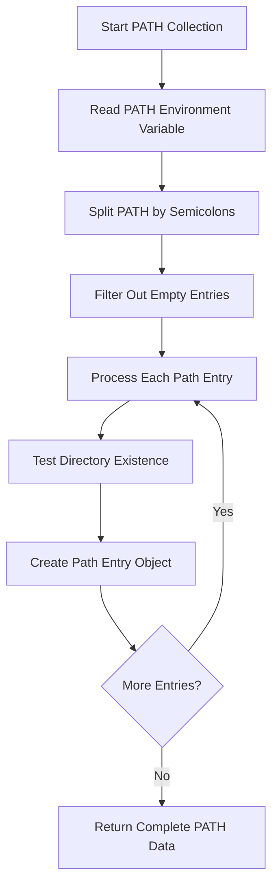
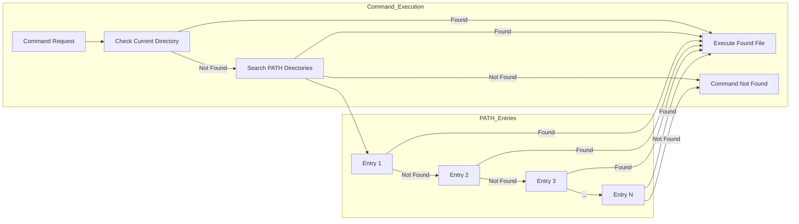
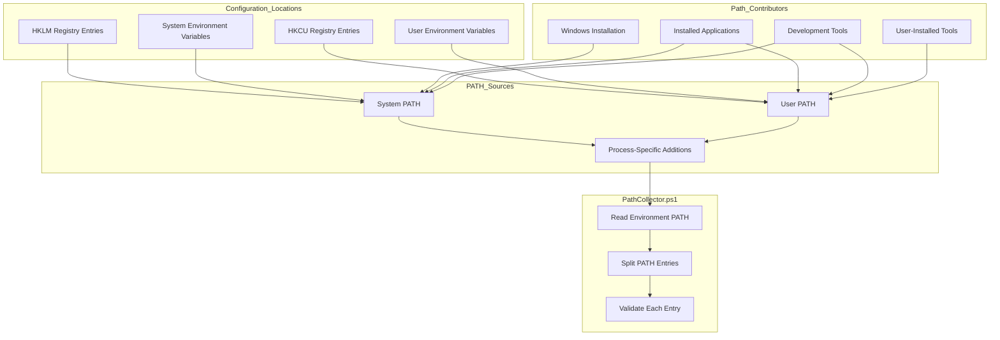

# 12. Path

## Description

The Path module collects comprehensive information about the PATH environment variable on the Windows system. The PATH variable is a critical system configuration that determines where the operating system looks for executable files when commands are issued without specifying an absolute path. This module captures each directory entry in the PATH, validates its existence, and provides a structured view of the search order for executables. This information is essential for troubleshooting command execution problems, identifying potential security risks, and understanding the system's executable search behavior.

The collection is performed by the `PathCollector.ps1` script, which parses the system's PATH environment variable and verifies the existence of each directory. By documenting the PATH configuration, the collector creates a baseline that can be compared between systems or across time to identify changes that might affect system behavior or security.

## File Generated

- **Filename**: `Path.json`
- **Location**: Within the timestamped snapshot directory (e.g., `SystemState_yyyy-MM-dd_HH-mm-ss/Path.json`)
- **Format**: UTF-8 encoded JSON without BOM (Byte Order Mark)
- **Typical Size**: 5KB - 20KB (varies based on the number of PATH entries)

## Schema

```json
{
  "Timestamp": "2025-03-10T15:30:45.0000000Z",
  "ComputerName": "HOSTNAME",
  "Data": [
    {
      "Path": "C:\\Windows\\system32",
      "Exists": true
    },
    {
      "Path": "C:\\Windows",
      "Exists": true
    },
    {
      "Path": "C:\\Windows\\System32\\Wbem",
      "Exists": true
    },
    {
      "Path": "C:\\Windows\\System32\\WindowsPowerShell\\v1.0\\",
      "Exists": true
    },
    {
      "Path": "C:\\Program Files\\PowerShell\\7\\",
      "Exists": true
    },
    {
      "Path": "C:\\Program Files\\Git\\cmd",
      "Exists": true
    },
    {
      "Path": "C:\\Users\\Username\\AppData\\Local\\Programs\\Python\\Python39\\",
      "Exists": true
    },
    {
      "Path": "C:\\Users\\Username\\AppData\\Local\\Programs\\Python\\Python39\\Scripts\\",
      "Exists": true
    },
    {
      "Path": "D:\\OldApplications\\bin",
      "Exists": false
    }
  ]
}
```

### Schema Details

#### Root Object
| Field | Type | Description |
|-------|------|-------------|
| Timestamp | string | ISO 8601 format timestamp when the data was collected |
| ComputerName | string | Name of the computer from which data was collected |
| Data | array | Array of objects containing information about each PATH entry |

#### Path Entry Object (Elements in the Data Array)
| Field | Type | Description |
|-------|------|-------------|
| Path | string | Directory path from the PATH environment variable |
| Exists | boolean | Whether the directory exists on the system at collection time |

## JSON Schema Definition

```json
{
  "$schema": "http://json-schema.org/draft-07/schema#",
  "title": "System State Collector - PATH Environment Variable Data",
  "description": "Schema for PATH environment variable data collected by the System State Collector",
  "type": "object",
  "required": ["Timestamp", "ComputerName", "Data"],
  "properties": {
    "Timestamp": {
      "type": "string",
      "format": "date-time",
      "description": "ISO 8601 format timestamp when the data was collected"
    },
    "ComputerName": {
      "type": "string",
      "description": "Name of the computer from which data was collected"
    },
    "Data": {
      "type": "array",
      "description": "Array of objects containing information about each PATH entry",
      "items": {
        "type": "object",
        "required": ["Path", "Exists"],
        "properties": {
          "Path": {
            "type": "string",
            "description": "Directory path from the PATH environment variable",
            "examples": ["C:\\Windows\\system32", "C:\\Program Files\\Git\\cmd"]
          },
          "Exists": {
            "type": "boolean",
            "description": "Whether the directory exists on the system at collection time",
            "examples": [true, false]
          }
        }
      }
    }
  }
}
```

## Key Information Captured

### PATH Structure
- **Search Order**: The PATH entries are captured in the exact order they appear in the environment variable, which determines the search precedence for executable files
- **Directory Paths**: Each individual directory path included in the PATH variable
- **Path Validation**: Each path is validated to confirm whether it actually exists on the system
- **Complete Coverage**: Both system-wide and user-specific PATH components are included

### Security Implications
The PATH variable has significant security implications:

- **Directory Existence**: Non-existent directories in the PATH can't contain malicious executables but may indicate misconfiguration
- **Search Order**: The order of entries determines which executable is found first when multiple versions exist with the same name
- **Writable Locations**: PATH directories that are writable by standard users could be used for privilege escalation
- **Invalid Paths**: Missing directories could allow for "PATH hijacking" if later created by an attacker

### System Components
Typical PATH entries include several important categories:

1. **System Directories**: Critical Windows system locations like `system32`
2. **Utility Directories**: Locations for system administration tools
3. **PowerShell Paths**: Directories containing PowerShell executables and modules
4. **Application Directories**: Paths to installed application executables
5. **Development Tool Paths**: Directories for programming languages and development tools
6. **User-Specific Directories**: Custom locations added by the user or user-specific applications

### Collection Methodology
The PATH collector:
- Splits the PATH environment variable by the semicolon delimiter
- Filters out empty entries
- Tests each path's existence using PowerShell's `Test-Path` cmdlet
- Preserves the original order of entries
- Captures the raw path strings without normalization or expansion

### Limitations
- **Point-in-Time View**: Only represents the PATH at the moment of collection
- **No Recursion**: Doesn't list the contents of each PATH directory
- **Expansion Limitation**: Doesn't expand environment variables within PATH entries
- **Permission Assessment**: Doesn't evaluate directory permissions
- **Command Execution**: Doesn't test if the directories can actually be used for command execution

## Collection Process

The PATH data collection follows this process:



## Suggested Improvements

1. **Permission Analysis**: Add information about directory permissions, identifying potentially insecure writable locations.

2. **Path Contents Summary**: Include an overview of the executable types found in each directory.

3. **Environment Variable Expansion**: Expand any environment variables embedded in PATH entries to show their resolved values.

4. **Path Origin**: Indicate whether each PATH entry comes from system-wide settings or user-specific configuration.

5. **Duplicate Detection**: Flag duplicate entries that appear multiple times in the PATH.

6. **Version Conflicts**: Identify potential version conflicts where the same executable appears in multiple locations.

7. **Missing Critical Paths**: Check for expected critical directories that should be in the PATH but are missing.

## Future Enhancements

### Path Security Auditing
Implement comprehensive security analysis of PATH entries, identifying potential vulnerabilities such as writable directories or insecure ordering.

### Command Resolution Simulation
Develop functionality to simulate how specific commands would be resolved using the current PATH, helping identify which executable would be found first when ambiguities exist.

### Application Dependency Mapping
Create mapping between applications and the PATH entries they require, helping predict the impact of PATH changes on application functionality.

### Historical Path Analysis
Implement tracking of PATH changes over time, providing insights into when and how the executable search configuration has been modified.

### Path Optimization Recommendations
Develop recommendations for optimizing the PATH, such as removing duplicate or unnecessary entries that could slow down command resolution.

### Cross-Platform Path Support
Enhance the collector to work consistently across different operating systems, standardizing PATH documentation for multi-platform environments.

## Diagram: PATH Resolution Process



## Diagram: PATH Configuration Sources



## Related Collectors

The Path module complements these other collectors:
- **Environment**: Contains all environment variables, including the complete PATH variable
- **PythonInstallations**: Python environments often add their directories to the PATH
- **InstalledPrograms**: Many applications add their directories to the PATH during installation
- **StartupPrograms**: Some startup routines modify the PATH environment variable
- **RegistrySettings**: The registry contains the persistent PATH configuration
