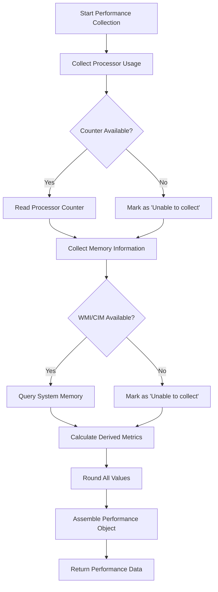
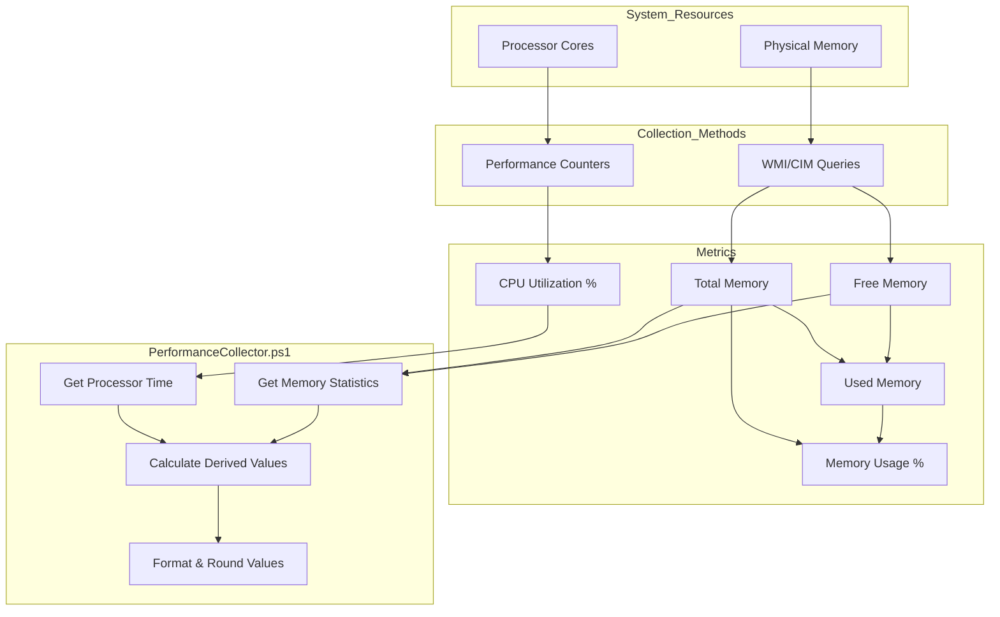
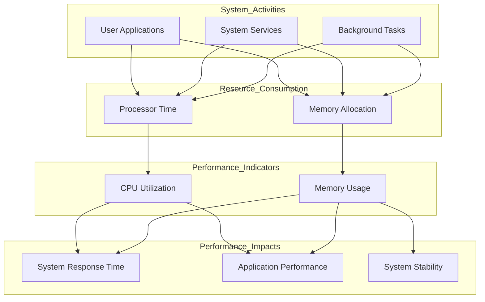

# 13. Performance Data

## Description

The Performance Data module collects critical information about system resource utilization, focusing on processor and memory usage. This module captures a point-in-time snapshot of how intensively the system's core resources are being used, providing essential metrics for performance monitoring, capacity planning, and troubleshooting system bottlenecks. Performance data serves as a vital baseline for understanding the system's operational state during the snapshot.

The collection is performed by the `PerformanceCollector.ps1` script, which uses Windows performance counters and WMI/CIM queries to gather real-time usage statistics. Unlike historical performance monitoring tools, this collector provides a precise measurement of resource utilization at the exact moment the system state is captured, allowing correlation with other collected system components.

## File Generated

- **Filename**: `PerformanceData.json`
- **Location**: Within the timestamped snapshot directory (e.g., `SystemState_yyyy-MM-dd_HH-mm-ss/PerformanceData.json`)
- **Format**: UTF-8 encoded JSON without BOM (Byte Order Mark)
- **Typical Size**: 1KB - 2KB (relatively small due to focused scope)

## Schema

```json
{
  "Timestamp": "2025-03-10T15:30:45.0000000Z",
  "ComputerName": "HOSTNAME",
  "Data": {
    "ProcessorUsage": 12.34,
    "Memory": {
      "TotalGB": 32.00,
      "FreeGB": 18.45,
      "UsedGB": 13.55,
      "PercentUsed": 42.34
    }
  }
}
```

### Schema Details

#### Root Object
| Field | Type | Description |
|-------|------|-------------|
| Timestamp | string | ISO 8601 format timestamp when the data was collected |
| ComputerName | string | Name of the computer from which data was collected |
| Data | object | Container for performance metrics |

#### Data Object
| Field | Type | Description |
|-------|------|-------------|
| ProcessorUsage | number | Current CPU usage percentage across all cores |
| Memory | object | Container for memory-related metrics |

#### Memory Object
| Field | Type | Description |
|-------|------|-------------|
| TotalGB | number | Total physical memory installed in the system in gigabytes |
| FreeGB | number | Available physical memory in gigabytes |
| UsedGB | number | Memory currently in use in gigabytes |
| PercentUsed | number | Percentage of total memory currently in use |

## JSON Schema Definition

```json
{
  "$schema": "http://json-schema.org/draft-07/schema#",
  "title": "System State Collector - Performance Data",
  "description": "Schema for system performance metrics collected by the System State Collector",
  "type": "object",
  "required": ["Timestamp", "ComputerName", "Data"],
  "properties": {
    "Timestamp": {
      "type": "string",
      "format": "date-time",
      "description": "ISO 8601 format timestamp when the data was collected"
    },
    "ComputerName": {
      "type": "string",
      "description": "Name of the computer from which data was collected"
    },
    "Data": {
      "type": "object",
      "description": "Container for performance metrics",
      "required": ["ProcessorUsage", "Memory"],
      "properties": {
        "ProcessorUsage": {
          "type": "number",
          "description": "Current CPU usage percentage across all cores",
          "minimum": 0,
          "maximum": 100,
          "examples": [12.34, 78.90]
        },
        "Memory": {
          "type": "object",
          "description": "Container for memory-related metrics",
          "required": ["TotalGB", "FreeGB", "UsedGB", "PercentUsed"],
          "properties": {
            "TotalGB": {
              "type": "number",
              "description": "Total physical memory installed in the system in gigabytes",
              "minimum": 0,
              "examples": [32.00, 16.00]
            },
            "FreeGB": {
              "type": "number",
              "description": "Available physical memory in gigabytes",
              "minimum": 0,
              "examples": [18.45, 7.32]
            },
            "UsedGB": {
              "type": "number",
              "description": "Memory currently in use in gigabytes",
              "minimum": 0,
              "examples": [13.55, 8.68]
            },
            "PercentUsed": {
              "type": "number",
              "description": "Percentage of total memory currently in use",
              "minimum": 0,
              "maximum": 100,
              "examples": [42.34, 54.25]
            }
          }
        }
      }
    }
  }
}
```

## Key Information Captured

### Processor Metrics
- **Total CPU Usage**: The collector captures the overall processor utilization across all cores and processors as a percentage
- **Measurement Method**: Uses the `\Processor(_Total)\% Processor Time` performance counter for accurate measurement
- **Aggregated View**: The collected value represents the combined usage across all available processor cores
- **Point-in-Time**: Represents a moment-in-time sample rather than an average over time
- **Rounding**: Values are rounded to two decimal places for readability

### Memory Metrics
The collector captures several key memory statistics:

- **Total Memory**: Total amount of physical RAM installed in the system in gigabytes
- **Free Memory**: Currently available physical memory in gigabytes
- **Used Memory**: Currently consumed physical memory in gigabytes
- **Usage Percentage**: Proportion of total memory currently in use, expressed as a percentage
- **Memory Precision**: All memory values are rounded to two decimal places for consistency
- **Measurement Method**: Uses CIM/WMI queries to obtain accurate memory statistics

### Collection Methodology
The performance data collector uses two primary methods:

1. **Performance Counters**: Windows performance counters are queried for processor usage statistics
2. **CIM/WMI Queries**: The Windows Management Instrumentation layer is used to gather detailed memory information

The collector employs fallback mechanisms for robustness:
- If a specific collection method fails, the collector attempts alternative approaches
- The data structure remains consistent regardless of which method succeeded
- All numeric values are validated and rounded for consistency

### Limitations
- **Sampling Nature**: The data represents a single point in time and may not reflect sustained performance patterns
- **Counter Overhead**: The act of collecting performance data itself consumes some system resources
- **Focused Scope**: Only includes processor and memory metrics, omitting disk, network, and other subsystems
- **Aggregate CPU**: Does not break down processor usage by individual cores or processes
- **Simplified Memory Model**: Does not detail memory usage by category (e.g., cache, committed, etc.)

## Collection Process

The performance data collection follows this process:



## Suggested Improvements

1. **Per-Core Metrics**: Add individual processor core utilization to identify imbalanced workloads or problematic cores.

2. **Memory Details**: Expand memory statistics to include page file usage, cache allocation, and committed memory.

3. **Disk Performance**: Add basic disk performance metrics such as read/write operations and queue length.

4. **Network Activity**: Include current network throughput statistics to provide a more complete resource usage picture.

5. **Top Processes**: Include a list of the top CPU and memory consuming processes at the time of snapshot.

6. **Historical Context**: Add minimum, maximum, and average values from a short sampling period to provide context around the point-in-time values.

7. **Resource Pressure Indicators**: Include metrics that indicate resource pressure, such as memory hard faults or processor queue length.

## Future Enhancements

### Performance Trend Analysis
Implement capabilities to collect and analyze performance trends over time, providing historical context for point-in-time measurements.

### Threshold Alerting
Develop functionality to compare performance metrics against predefined thresholds, automatically flagging potential performance issues.

### Resource Correlation
Create tools to correlate resource usage patterns with specific applications, services, or system activities.

### Subsystem Expansion
Expand collection to include detailed metrics for storage subsystems, graphics processing, network interfaces, and other critical components.

### Predictive Analysis
Implement predictive algorithms that can anticipate performance bottlenecks based on current usage patterns and growth trends.

### Performance Impact Assessment
Add functionality to estimate the performance impact of running applications and services, helping to identify opportunities for optimization.

## Diagram: Performance Data Collection



## Diagram: Performance Resource Relationships



## Related Collectors

The Performance Data module complements these other collectors:
- **RunningServices**: Identifies services that may be consuming system resources
- **StartupPrograms**: Documents programs that launch at startup and may affect system performance
- **DiskSpace**: Provides context about storage capacity alongside memory capacity
- **InstalledPrograms**: Documents applications that may be consuming resources
- **WindowsFeatures**: Some Windows features can significantly impact system performance
