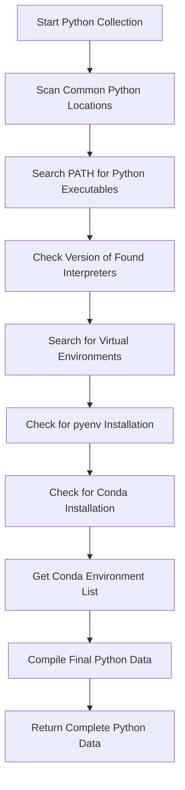
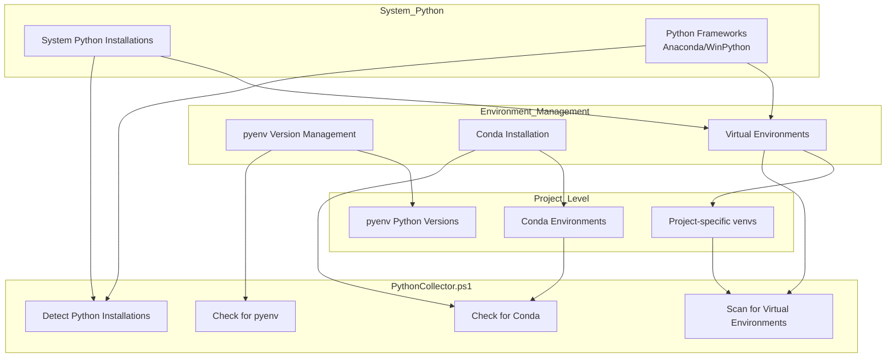
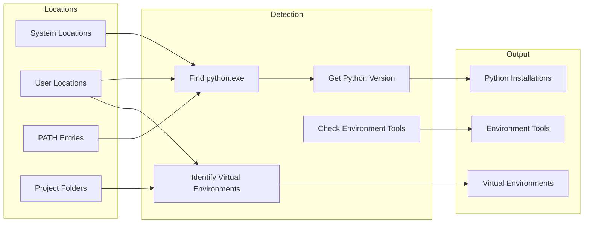

# 14. Python Installations

## Description

The Python Installations module collects comprehensive information about Python environments installed on the system, including standard installations, virtual environments, package managers like conda and pyenv, and their configurations. This data provides valuable insights for development environment management, dependency troubleshooting, and ensuring consistent Python configurations across systems.

The collection is performed by the `PythonCollector.ps1` script, which scans common Python installation locations, searches for Python executables in the system PATH, and identifies virtual environments and package management tools. This information is particularly useful for developers, system administrators managing Python-based applications, and organizations that need to maintain consistent development environments.

## File Generated

- **Filename**: `PythonInstallations.json`
- **Location**: Within the timestamped snapshot directory (e.g., `SystemState_yyyy-MM-dd_HH-mm-ss/PythonInstallations.json`)
- **Format**: UTF-8 encoded JSON without BOM (Byte Order Mark)
- **Typical Size**: 5KB - 50KB (varies based on the number of Python installations and environments)

## Schema

```json
{
  "Timestamp": "2025-03-10T15:30:45.0000000Z",
  "ComputerName": "HOSTNAME",
  "Data": {
    "Installations": [
      {
        "Path": "C:\\Program Files\\Python310",
        "Version": "3.10.8",
        "Executable": "C:\\Program Files\\Python310\\python.exe"
      },
      {
        "Path": "C:\\Users\\Username\\AppData\\Local\\Programs\\Python\\Python39",
        "Version": "3.9.13",
        "Executable": "C:\\Users\\Username\\AppData\\Local\\Programs\\Python\\Python39\\python.exe"
      }
    ],
    "VirtualEnvironments": [
      {
        "Path": "C:\\Users\\Username\\Projects\\myproject\\venv",
        "Version": "3.10.8",
        "Type": "Standard venv"
      },
      {
        "Path": "C:\\Users\\Username\\.virtualenvs\\webproject",
        "Version": "3.9.13",
        "Type": "Standard venv"
      }
    ],
    "PyenvInstallation": {
      "Path": "C:\\Users\\Username\\.pyenv",
      "Version": "Installed",
      "Type": "Standard pyenv"
    },
    "CondaInstallation": {
      "Path": "C:\\Users\\Username\\Anaconda3",
      "Version": "23.5.2",
      "Environments": [
        "C:\\Users\\Username\\Anaconda3",
        "C:\\Users\\Username\\Anaconda3\\envs\\data_science",
        "C:\\Users\\Username\\Anaconda3\\envs\\web_dev"
      ]
    }
  }
}
```

### Schema Details

#### Root Object
| Field | Type | Description |
|-------|------|-------------|
| Timestamp | string | ISO 8601 format timestamp when the data was collected |
| ComputerName | string | Name of the computer from which data was collected |
| Data | object | Container for all Python-related installation data |

#### Data Object
| Field | Type | Description |
|-------|------|-------------|
| Installations | array | Array of standard Python installations found on the system |
| VirtualEnvironments | array | Array of Python virtual environments detected |
| PyenvInstallation | object/null | Information about pyenv installation (null if not installed) |
| CondaInstallation | object/null | Information about Conda installation and environments (null if not installed) |

#### Installation Object (Elements in the Installations Array)
| Field | Type | Description |
|-------|------|-------------|
| Path | string | Directory path where Python is installed |
| Version | string | Version number of the Python installation |
| Executable | string | Full path to the Python executable |

#### VirtualEnvironment Object (Elements in the VirtualEnvironments Array)
| Field | Type | Description |
|-------|------|-------------|
| Path | string | Directory path where the virtual environment is located |
| Version | string | Python version used in the virtual environment |
| Type | string | Type of virtual environment (e.g., "Standard venv") |

#### PyenvInstallation Object
| Field | Type | Description |
|-------|------|-------------|
| Path | string | Directory path where pyenv is installed |
| Version | string | Typically "Installed" as version detection is limited |
| Type | string | Type of pyenv installation (e.g., "Standard pyenv" or "pyenv-win") |

#### CondaInstallation Object
| Field | Type | Description |
|-------|------|-------------|
| Path | string | Directory path where Conda is installed |
| Version | string | Version of the Conda installation |
| Environments | array | List of Conda environment paths |

## JSON Schema Definition

```json
{
  "$schema": "http://json-schema.org/draft-07/schema#",
  "title": "System State Collector - Python Installations Data",
  "description": "Schema for Python installations data collected by the System State Collector",
  "type": "object",
  "required": ["Timestamp", "ComputerName", "Data"],
  "properties": {
    "Timestamp": {
      "type": "string",
      "format": "date-time",
      "description": "ISO 8601 format timestamp when the data was collected"
    },
    "ComputerName": {
      "type": "string",
      "description": "Name of the computer from which data was collected"
    },
    "Data": {
      "type": "object",
      "description": "Container for all Python-related installation data",
      "required": ["Installations", "VirtualEnvironments"],
      "properties": {
        "Installations": {
          "type": "array",
          "description": "Array of standard Python installations found on the system",
          "items": {
            "type": "object",
            "required": ["Path", "Version", "Executable"],
            "properties": {
              "Path": {
                "type": "string",
                "description": "Directory path where Python is installed"
              },
              "Version": {
                "type": "string",
                "description": "Version number of the Python installation",
                "examples": ["3.10.8", "3.9.13", "Unknown"]
              },
              "Executable": {
                "type": "string",
                "description": "Full path to the Python executable"
              }
            }
          }
        },
        "VirtualEnvironments": {
          "type": "array",
          "description": "Array of Python virtual environments detected",
          "items": {
            "type": "object",
            "required": ["Path", "Version", "Type"],
            "properties": {
              "Path": {
                "type": "string",
                "description": "Directory path where the virtual environment is located"
              },
              "Version": {
                "type": "string",
                "description": "Python version used in the virtual environment",
                "examples": ["3.10.8", "Unknown"]
              },
              "Type": {
                "type": "string",
                "description": "Type of virtual environment",
                "examples": ["Standard venv"]
              }
            }
          }
        },
        "PyenvInstallation": {
          "oneOf": [
            {
              "type": "object",
              "required": ["Path", "Version", "Type"],
              "properties": {
                "Path": {
                  "type": "string",
                  "description": "Directory path where pyenv is installed"
                },
                "Version": {
                  "type": "string",
                  "description": "Typically 'Installed' as version detection is limited"
                },
                "Type": {
                  "type": "string",
                  "description": "Type of pyenv installation",
                  "examples": ["Standard pyenv", "pyenv-win"]
                }
              }
            },
            {
              "type": "null",
              "description": "Null if pyenv is not installed"
            }
          ]
        },
        "CondaInstallation": {
          "oneOf": [
            {
              "type": "object",
              "required": ["Path", "Version", "Environments"],
              "properties": {
                "Path": {
                  "type": "string",
                  "description": "Directory path where Conda is installed"
                },
                "Version": {
                  "type": "string",
                  "description": "Version of the Conda installation",
                  "examples": ["23.5.2", "Unknown"]
                },
                "Environments": {
                  "type": "array",
                  "description": "List of Conda environment paths",
                  "items": {
                    "type": "string"
                  }
                }
              }
            },
            {
              "type": "null",
              "description": "Null if Conda is not installed"
            }
          ]
        }
      }
    }
  }
}
```

## Key Information Captured

### Python Installation Details
- **Python Executables**: Paths to Python interpreters across the system
- **Version Information**: Version numbers of detected Python installations
- **Installation Locations**: Where Python is installed (standard directories, user directories, etc.)
- **Path Integration**: Identifies Python installations that are in the system PATH

### Virtual Environment Detection
The collector identifies Python virtual environments by searching for their characteristic directory structures:
- **Standard venv/virtualenv**: Detected by the presence of the `Scripts/activate.bat` or `Scripts/python.exe` files
- **Location Patterns**: Searches common locations and naming patterns for virtual environments
- **Version Information**: Attempts to determine the Python version used within each environment

### Package Management Tools
- **pyenv**: Detects both standard pyenv and pyenv-win installations
- **Conda**: Identifies Anaconda or Miniconda installations and their environments
- **Environment List**: For Conda, provides a complete list of created environments

### Search Methodology
The collector employs multiple strategies to ensure comprehensive Python detection:
1. **Standard Locations**: Checks common installation directories for Python
2. **PATH Examination**: Searches the system PATH for Python executables
3. **Pattern Matching**: Uses filename patterns to detect virtual environments
4. **Command Execution**: Calls Python executables to determine versions
5. **Tool-Specific Approaches**: Uses specialized detection for pyenv and conda

### Limitations
- **Version Detection**: May report "Unknown" if version detection fails
- **Hidden Environments**: May miss virtual environments in non-standard locations
- **Disabled Environments**: Cannot determine if a virtual environment is active
- **Package Information**: Does not enumerate installed packages within environments
- **Version Management**: Limited details on available Python versions in pyenv

## Collection Process

The Python installations data collection follows this process:



## Suggested Improvements

1. **Package Inventory**: Add collection of installed packages (via pip list or conda list) for each environment to help with dependency management and analysis.

2. **Module Search Paths**: Include the Python module search path (sys.path) for each installation to better understand import behavior.

3. **Configuration Files**: Collect information about python configuration files (pyproject.toml, requirements.txt, setup.py, etc.) to document project dependencies.

4. **Environment Activation Status**: Indicate which virtual environments are currently active or recently used.

5. **Global Packages**: Report globally installed pip packages for each Python installation.

6. **Version Conflicts**: Identify potential version conflicts between Python installations and environments.

7. **Environment Variables**: Include Python-specific environment variables (PYTHONPATH, PYTHONHOME, etc.) that affect Python behavior.

## Future Enhancements

### Python Development Tool Integration
Extend collection to include information about IDEs, code editors, and other Python development tools configured on the system (VS Code settings, PyCharm projects, etc.).

### Environment Health Check
Implement validation checks for virtual environments to identify broken or misconfigured environments, helping prevent development issues.

### Dependency Visualization
Create visualization tools to map dependencies between Python packages across different environments, aiding in understanding complex project requirements.

### Cross-Platform Support
Enhance the collector to work on Linux and macOS systems, providing consistent Python environment documentation across different platforms.

### Environment Duplication Detection
Add functionality to identify duplicate or redundant environments to help optimize disk space and maintain cleaner development setups.

### Security Scanning
Integrate with vulnerability databases to identify installed Python packages with known security issues, helping maintain secure development environments.

## Diagram: Python Environment Hierarchy



## Diagram: Python Detection Process



## Related Collectors

The Python Installations module complements these other collectors:
- **Path**: Documents PATH entries that may include Python executables
- **Environment**: Contains Python-related environment variables
- **InstalledPrograms**: May include Python and related tools installed via standard installers
- **StartupPrograms**: May include Python services or scripts configured to run at startup
- **RegistrySettings**: Contains file associations for Python scripts
