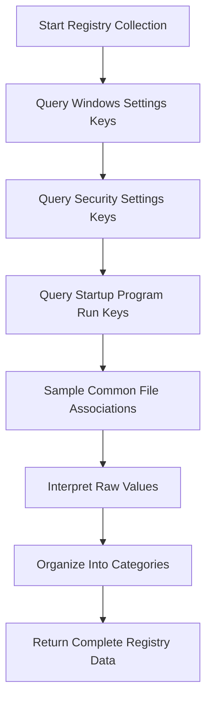
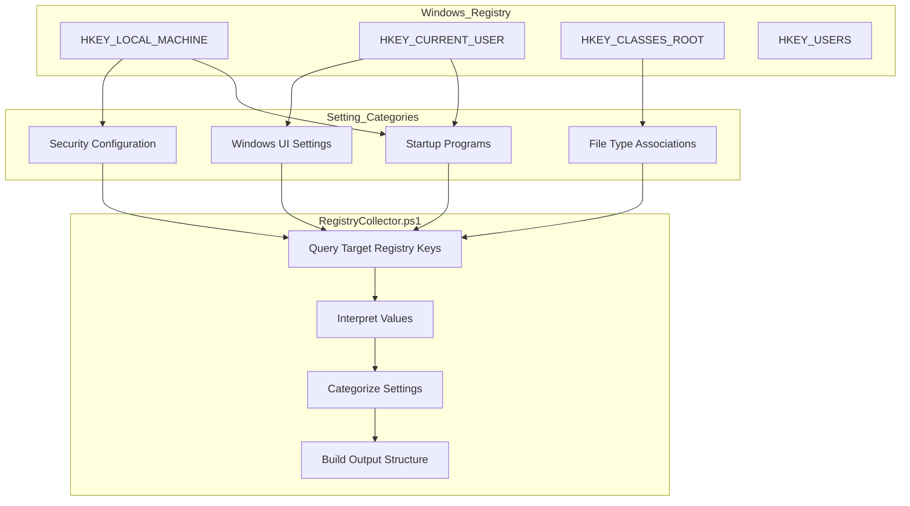
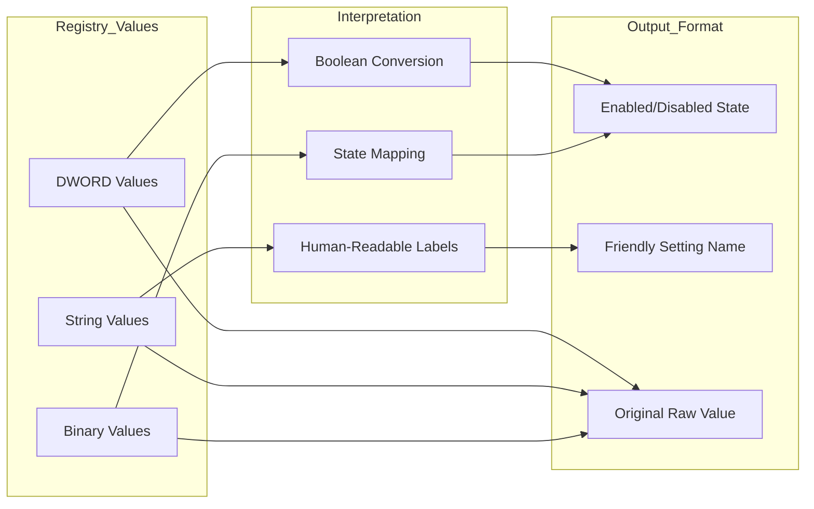

# 15. Registry Settings

## Description

The Registry Settings module collects important Windows Registry configurations that significantly impact system behavior, security posture, and user experience. The Windows Registry serves as a centralized hierarchical database that stores configuration settings for the operating system, hardware devices, applications, and user preferences. This module focuses on capturing key settings that administrators and support personnel typically need for troubleshooting, security auditing, and system documentation.

The collection is performed by the `RegistryCollector.ps1` script, which targets specific registry keys known to control critical system behaviors. Rather than attempting to capture the entire registry (which would be impractically large), the collector focuses on categorized subsets of particularly useful settings that reveal how the system is configured and secured.

## File Generated

- **Filename**: `RegistrySettings.json`
- **Location**: Within the timestamped snapshot directory (e.g., `SystemState_yyyy-MM-dd_HH-mm-ss/RegistrySettings.json`)
- **Format**: UTF-8 encoded JSON without BOM (Byte Order Mark)
- **Typical Size**: 10KB - 100KB (varies based on the number of registry settings collected)

## Schema

```json
{
  "Timestamp": "2025-03-10T15:30:45.0000000Z",
  "ComputerName": "HOSTNAME",
  "Data": {
    "WindowsSettings": [
      {
        "Name": "Show file extensions",
        "Path": "HKCU:\\Software\\Microsoft\\Windows\\CurrentVersion\\Explorer\\Advanced",
        "Value": 0,
        "Enabled": false
      },
      {
        "Name": "User Account Control (UAC) Level",
        "Path": "HKLM:\\SOFTWARE\\Microsoft\\Windows\\CurrentVersion\\Policies\\System",
        "Value": 1,
        "Enabled": true
      },
      {
        "Name": "Remote Desktop",
        "Path": "HKLM:\\SYSTEM\\CurrentControlSet\\Control\\Terminal Server",
        "Value": 0,
        "Enabled": true
      },
      {
        "Name": "Hibernation",
        "Path": "HKLM:\\SYSTEM\\CurrentControlSet\\Control\\Power",
        "Value": 1,
        "Enabled": true
      }
    ],
    "SecuritySettings": [
      {
        "Name": "Windows Firewall (Domain Profile)",
        "Path": "HKLM:\\SYSTEM\\CurrentControlSet\\Services\\SharedAccess\\Parameters\\FirewallPolicy\\DomainProfile",
        "Value": 1,
        "Enabled": true
      },
      {
        "Name": "Windows Firewall (Private Profile)",
        "Path": "HKLM:\\SYSTEM\\CurrentControlSet\\Services\\SharedAccess\\Parameters\\FirewallPolicy\\PrivateProfile",
        "Value": 1,
        "Enabled": true
      },
      {
        "Name": "Windows Firewall (Public Profile)",
        "Path": "HKLM:\\SYSTEM\\CurrentControlSet\\Services\\SharedAccess\\Parameters\\FirewallPolicy\\PublicProfile",
        "Value": 1,
        "Enabled": true
      },
      {
        "Name": "Windows Defender Real-time Protection",
        "Path": "HKLM:\\SOFTWARE\\Microsoft\\Windows Defender\\Real-Time Protection",
        "Value": 0,
        "Enabled": true
      }
    ],
    "StartupPrograms": [
      {
        "Name": "OneDrive",
        "Command": "\"C:\\Program Files\\Microsoft OneDrive\\OneDrive.exe\" /background",
        "Location": "HKCU:\\SOFTWARE\\Microsoft\\Windows\\CurrentVersion\\Run"
      },
      {
        "Name": "SecurityHealth",
        "Command": "%windir%\\system32\\SecurityHealthSystray.exe",
        "Location": "HKLM:\\SOFTWARE\\Microsoft\\Windows\\CurrentVersion\\Run"
      }
    ],
    "FileAssociations": [
      {
        "Extension": ".txt",
        "AssociatedProgram": "txtfile"
      },
      {
        "Extension": ".pdf",
        "AssociatedProgram": "AcroExch.Document.DC"
      },
      {
        "Extension": ".docx",
        "AssociatedProgram": "Word.Document.12"
      },
      {
        "Extension": ".xlsx",
        "AssociatedProgram": "Excel.Sheet.12"
      }
    ]
  }
}
```

### Schema Details

#### Root Object
| Field | Type | Description |
|-------|------|-------------|
| Timestamp | string | ISO 8601 format timestamp when the data was collected |
| ComputerName | string | Name of the computer from which data was collected |
| Data | object | Container for all registry setting categories |

#### Data Object
| Field | Type | Description |
|-------|------|-------------|
| WindowsSettings | array | Array of general Windows configuration settings |
| SecuritySettings | array | Array of security-related settings |
| StartupPrograms | array | Programs configured to start automatically via registry run keys |
| FileAssociations | array | File extension to application associations |

#### WindowsSettings and SecuritySettings Objects
| Field | Type | Description |
|-------|------|-------------|
| Name | string | Descriptive name of the setting |
| Path | string | Full registry path where the setting is stored |
| Value | any | Raw value from the registry (often numeric) |
| Enabled | boolean | Interpreted state (true/false) based on the value |

#### StartupPrograms Objects
| Field | Type | Description |
|-------|------|-------------|
| Name | string | Name of the startup entry |
| Command | string | Command line that gets executed |
| Location | string | Registry path where the startup entry is defined |

#### FileAssociations Objects
| Field | Type | Description |
|-------|------|-------------|
| Extension | string | File extension (including the dot) |
| AssociatedProgram | string | ProgID of the application associated with the extension |

## JSON Schema Definition

```json
{
  "$schema": "http://json-schema.org/draft-07/schema#",
  "title": "System State Collector - Registry Settings Data",
  "description": "Schema for Windows Registry settings data collected by the System State Collector",
  "type": "object",
  "required": ["Timestamp", "ComputerName", "Data"],
  "properties": {
    "Timestamp": {
      "type": "string",
      "format": "date-time",
      "description": "ISO 8601 format timestamp when the data was collected"
    },
    "ComputerName": {
      "type": "string",
      "description": "Name of the computer from which data was collected"
    },
    "Data": {
      "type": "object",
      "description": "Container for all registry setting categories",
      "required": ["WindowsSettings", "SecuritySettings", "StartupPrograms", "FileAssociations"],
      "properties": {
        "WindowsSettings": {
          "type": "array",
          "description": "Array of general Windows configuration settings",
          "items": {
            "type": "object",
            "required": ["Name", "Path", "Value", "Enabled"],
            "properties": {
              "Name": {
                "type": "string",
                "description": "Descriptive name of the setting",
                "examples": ["Show file extensions", "Remote Desktop"]
              },
              "Path": {
                "type": "string",
                "description": "Full registry path where the setting is stored",
                "examples": ["HKCU:\\Software\\Microsoft\\Windows\\CurrentVersion\\Explorer\\Advanced"]
              },
              "Value": {
                "description": "Raw value from the registry (often numeric)",
                "examples": [0, 1]
              },
              "Enabled": {
                "type": "boolean",
                "description": "Interpreted state (true/false) based on the value",
                "examples": [true, false]
              }
            }
          }
        },
        "SecuritySettings": {
          "type": "array",
          "description": "Array of security-related settings",
          "items": {
            "type": "object",
            "required": ["Name", "Path", "Value", "Enabled"],
            "properties": {
              "Name": {
                "type": "string",
                "description": "Descriptive name of the setting",
                "examples": ["Windows Firewall (Domain Profile)", "Windows Defender Real-time Protection"]
              },
              "Path": {
                "type": "string",
                "description": "Full registry path where the setting is stored",
                "examples": ["HKLM:\\SYSTEM\\CurrentControlSet\\Services\\SharedAccess\\Parameters\\FirewallPolicy\\DomainProfile"]
              },
              "Value": {
                "description": "Raw value from the registry (often numeric)",
                "examples": [0, 1]
              },
              "Enabled": {
                "type": "boolean",
                "description": "Interpreted state (true/false) based on the value",
                "examples": [true, false]
              }
            }
          }
        },
        "StartupPrograms": {
          "type": "array",
          "description": "Programs configured to start automatically via registry run keys",
          "items": {
            "type": "object",
            "required": ["Name", "Command", "Location"],
            "properties": {
              "Name": {
                "type": "string",
                "description": "Name of the startup entry",
                "examples": ["OneDrive", "SecurityHealth"]
              },
              "Command": {
                "type": "string",
                "description": "Command line that gets executed",
                "examples": ["\"C:\\Program Files\\Microsoft OneDrive\\OneDrive.exe\" /background"]
              },
              "Location": {
                "type": "string",
                "description": "Registry path where the startup entry is defined",
                "examples": ["HKCU:\\SOFTWARE\\Microsoft\\Windows\\CurrentVersion\\Run"]
              }
            }
          }
        },
        "FileAssociations": {
          "type": "array",
          "description": "File extension to application associations",
          "items": {
            "type": "object",
            "required": ["Extension", "AssociatedProgram"],
            "properties": {
              "Extension": {
                "type": "string",
                "description": "File extension (including the dot)",
                "examples": [".txt", ".pdf", ".docx"]
              },
              "AssociatedProgram": {
                "type": "string",
                "description": "ProgID of the application associated with the extension",
                "examples": ["txtfile", "AcroExch.Document.DC", "Word.Document.12"]
              }
            }
          }
        }
      }
    }
  }
}
```

## Key Information Captured

### Windows Settings
The module collects important user interface and system configuration settings, including:

- **File Extensions Display**: Whether file extensions are hidden or shown in Explorer
- **User Account Control (UAC)**: Security feature settings that control elevation prompts
- **Remote Desktop**: Whether remote desktop connections are allowed
- **Power Management**: Settings like hibernation that affect system power state
- **Explorer UI Preferences**: Various Windows Explorer behavior settings

These settings impact the user experience and system behavior in significant ways, and differences in these settings can explain variations in how systems operate.

### Security Settings
The module focuses on key security configurations that affect the system's security posture:

- **Windows Firewall**: Status of the built-in firewall across different network profiles (Domain, Private, Public)
- **Windows Defender**: Configuration of real-time protection and other security features
- **Authentication Settings**: Security policies related to logon and authentication
- **Network Security**: Settings that affect network security behavior

These settings are particularly important for security auditing and ensuring consistent security configurations across multiple systems.

### Startup Programs (Registry Run Keys)
The module captures programs configured to start automatically via registry run keys:

- **HKLM Run Keys**: Programs that start for all users
- **HKCU Run Keys**: Programs that start for the current user only
- **RunOnce Keys**: Programs configured to run once at next startup

This data helps identify potentially unwanted startup items, troubleshoot slow boot times, and document the expected startup configuration.

### File Associations
The module collects information about file type associations:

- **Common File Extensions**: Maps extensions like .txt, .pdf, .docx to their handling applications
- **Default Programs**: Identifies which programs are configured to open specific file types

This information is useful for troubleshooting application issues and ensuring consistent user experiences across systems.

### Collection Methodology
The registry collector uses a targeted approach:
1. **Predefined Keys**: Focuses on specific registry keys known to contain important settings
2. **Value Interpretation**: Translates raw registry values into human-readable states (enabled/disabled)
3. **Categorization**: Organizes settings into logical categories for easier analysis
4. **Sampling Approach**: For file associations, samples common extensions rather than collecting all associations

### Limitations
- **Selected Coverage**: Only collects specifically targeted registry keys, not the entire registry
- **Interpretation Limits**: May not correctly interpret all complex registry values
- **Depth Constraints**: Generally doesn't capture nested registry structures in full detail
- **File Associations Sample**: Only collects associations for a predefined list of common extensions
- **Security Restrictions**: May not access some protected registry areas without elevated privileges

## Collection Process

The registry settings collection follows this process:



## Suggested Improvements

1. **Group Policy Correlation**: Add information about whether settings are controlled by Group Policy, helping distinguish user-configured settings from centrally managed ones.

2. **Default Comparison**: Compare collected settings against Windows defaults to highlight customized configurations.

3. **Security Implications**: Add notes about security implications of specific settings, helping identify potentially risky configurations.

4. **Setting Dependencies**: Document relationships between registry settings to show how they interact with and affect each other.

5. **Expanded File Associations**: Increase the range of file extensions sampled or add an option to collect comprehensive file association data.

6. **Registry Permissions**: Include information about registry key permissions to identify potential security issues or permission problems.

7. **Historical Values**: Implement tracking of previous values to show changes over time.

## Future Enhancements

### Registry Change Monitoring
Develop capabilities to monitor registry changes in real-time between snapshots, providing insights into system modifications as they occur.

### Policy-Based Validation
Implement validation of registry settings against organizational security policies or best practice templates, automatically flagging non-compliant configurations.

### Enhanced Security Analysis
Add deeper security analysis of registry settings, identifying misconfigurations that could create security vulnerabilities.

### Application-Specific Settings
Extend collection to include application-specific registry settings for commonly used software, helping with application troubleshooting.

### Configuration Templates
Develop the ability to export settings as configuration templates that can be applied to other systems for standardization.

### Visual Registry Comparison
Create visual comparison tools that highlight differences between registry snapshots in an intuitive way.

## Diagram: Registry Settings Categories



## Diagram: Registry Value Interpretation



## Related Collectors

The Registry Settings module complements these other collectors:
- **StartupPrograms**: Provides additional methods of program autostart beyond registry run keys
- **SecuritySettings**: Offers deeper insights into Windows security configuration
- **Environment**: Environment variables are often stored in the registry
- **WindowsFeatures**: Features may have corresponding registry settings
- **InstalledPrograms**: Registry is the primary source of installed program information
- **Browsers**: Browser settings are often stored in the registry
