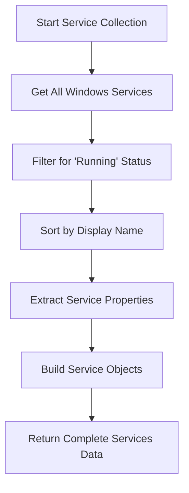
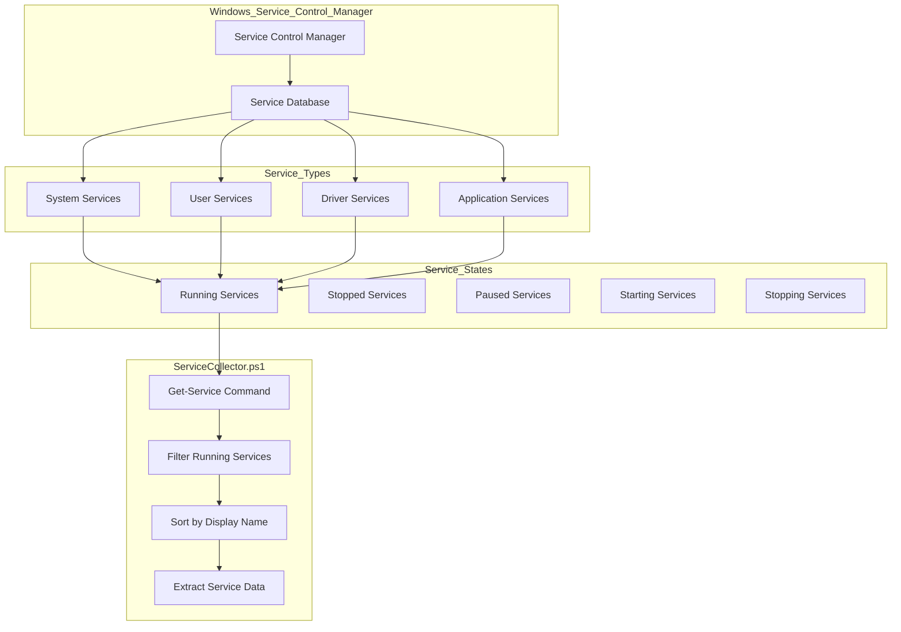
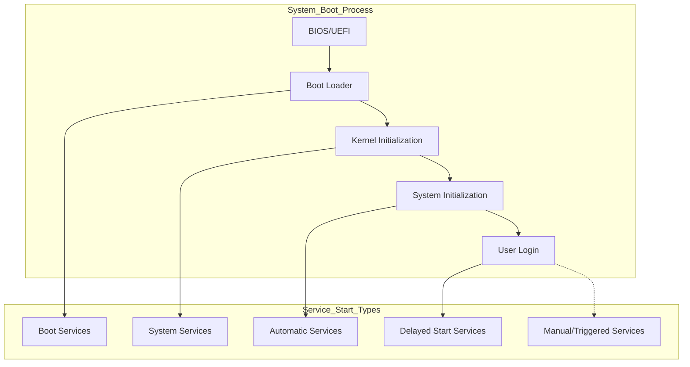

# 16. Running Services

## Description

The Running Services module collects comprehensive information about Windows services that are actively executing on the system at the time of the snapshot. Windows services are background processes that start automatically at boot time or are triggered by specific events, running independently of user logins. They perform critical system functions and support various applications, often without direct user interaction.

The collection is performed by the `ServiceCollector.ps1` script, which uses PowerShell's `Get-Service` cmdlet to identify services in the "Running" state. The module captures essential information about each service, including its name, display name, and startup type, providing a point-in-time view of the service landscape. This information is valuable for system administrators, support personnel, and security analysts who need to understand which system components are active.

## File Generated

- **Filename**: `RunningServices.json`
- **Location**: Within the timestamped snapshot directory (e.g., `SystemState_yyyy-MM-dd_HH-mm-ss/RunningServices.json`)
- **Format**: UTF-8 encoded JSON without BOM (Byte Order Mark)
- **Typical Size**: 10KB - 50KB (varies based on the number of running services)

## Schema

```json
{
  "Timestamp": "2025-03-10T15:30:45.0000000Z",
  "ComputerName": "HOSTNAME",
  "Data": [
    {
      "DisplayName": "Windows Audio",
      "Name": "Audiosrv",
      "StartType": "Automatic"
    },
    {
      "DisplayName": "Background Tasks Infrastructure Service",
      "Name": "BrokerInfrastructure",
      "StartType": "Automatic"
    },
    {
      "DisplayName": "Cryptographic Services",
      "Name": "CryptSvc",
      "StartType": "Automatic"
    },
    {
      "DisplayName": "DHCP Client",
      "Name": "Dhcp",
      "StartType": "Automatic"
    },
    {
      "DisplayName": "DNS Client",
      "Name": "Dnscache",
      "StartType": "Automatic"
    },
    {
      "DisplayName": "Windows Defender Antivirus Service",
      "Name": "WinDefend",
      "StartType": "Automatic"
    }
  ]
}
```

### Schema Details

#### Root Object
| Field | Type | Description |
|-------|------|-------------|
| Timestamp | string | ISO 8601 format timestamp when the data was collected |
| ComputerName | string | Name of the computer from which data was collected |
| Data | array | Array of objects containing information about each running service |

#### Service Object (Elements in the Data Array)
| Field | Type | Description |
|-------|------|-------------|
| DisplayName | string | User-friendly name of the service shown in the Services management console |
| Name | string | Short service name (system identifier) used internally by Windows |
| StartType | string | How the service is configured to start: "Automatic", "Manual", "Disabled", etc. |

## JSON Schema Definition

```json
{
  "$schema": "http://json-schema.org/draft-07/schema#",
  "title": "System State Collector - Running Services Data",
  "description": "Schema for running Windows services data collected by the System State Collector",
  "type": "object",
  "required": ["Timestamp", "ComputerName", "Data"],
  "properties": {
    "Timestamp": {
      "type": "string",
      "format": "date-time",
      "description": "ISO 8601 format timestamp when the data was collected"
    },
    "ComputerName": {
      "type": "string",
      "description": "Name of the computer from which data was collected"
    },
    "Data": {
      "type": "array",
      "description": "Array of objects containing information about each running service",
      "items": {
        "type": "object",
        "required": ["DisplayName", "Name", "StartType"],
        "properties": {
          "DisplayName": {
            "type": "string",
            "description": "User-friendly name of the service shown in the Services management console",
            "examples": ["Windows Audio", "DNS Client"]
          },
          "Name": {
            "type": "string",
            "description": "Short service name (system identifier) used internally by Windows",
            "examples": ["Audiosrv", "Dnscache"]
          },
          "StartType": {
            "type": "string",
            "description": "How the service is configured to start",
            "enum": ["Automatic", "AutomaticDelayedStart", "Manual", "Disabled", "Boot", "System"],
            "examples": ["Automatic", "Manual"]
          }
        }
      }
    }
  }
}
```

## Key Information Captured

### Service Identification
- **Display Name**: The user-friendly service name shown in management interfaces
- **Service Name**: The short, internal identifier used by Windows to reference the service
- **Service State**: Only services in the "Running" state are included in the collection

### Startup Configuration
- **Start Type**: How the service is configured to start:
  - **Automatic**: Starts automatically when the system boots
  - **AutomaticDelayedStart**: Starts automatically but after a delay
  - **Manual**: Only starts when explicitly requested
  - **Disabled**: Service is prevented from starting
  - **Boot**: Critical service started by the boot loader
  - **System**: Critical service started by the kernel

### Service Categories
The collected services typically include several important categories:

1. **Core Windows Services**: Essential operating system services (e.g., Windows Audio, Windows Firewall)
2. **Networking Services**: Services that enable network connectivity (e.g., DHCP Client, DNS Client)
3. **Security Services**: Services that provide security functionality (e.g., Windows Defender)
4. **Hardware Support Services**: Services that enable hardware functionality (e.g., Print Spooler)
5. **Application Services**: Services installed by third-party applications (e.g., database services, backup agents)
6. **Management Services**: Services that provide management capabilities (e.g., Remote Registry, Task Scheduler)

### Collection Approach
The service collector specifically:
- Only collects services that are currently running (ignoring stopped services)
- Sorts services by display name for easier reading
- Captures the configured startup type, which may differ from the current running status

### Limitations
- **Point-in-Time View**: Only represents services running at the moment of collection
- **Limited Service Details**: Doesn't include detailed information like service accounts, dependencies, or descriptions
- **No Status History**: Doesn't track service start/stop history or uptime
- **Binary Information**: Doesn't include details about the service executable or file paths
- **Trigger Information**: Doesn't include information about trigger-start services

## Collection Process

The running services data collection follows this process:



## Suggested Improvements

1. **Service Account Information**: Add details about the account under which each service runs, which is valuable for security auditing and troubleshooting.

2. **Service Dependencies**: Include information about service dependencies to better understand the relationships between services and potential failure points.

3. **Binary Path**: Add the executable path for each service to provide insight into what program is actually running and where it's located.

4. **Service Description**: Include the service description text to provide context about the purpose of each service.

5. **Additional States**: Expand collection to include services in other states (stopped, paused, starting, etc.) with filtering options.

6. **Service Parameters**: Include command-line parameters and additional configuration details.

7. **Last Start Time**: Add information about when the service was last started to understand service uptime.

## Future Enhancements

### Service Health Monitoring
Implement functionality to monitor service health and stability, tracking restart events and providing insights into problematic services.

### Service Baseline Comparison
Develop comparison tools that can highlight differences between a baseline service configuration and the current state, helping identify unexpected service changes.

### Security Analysis
Add security analysis of service configurations, including identification of services running with excessive privileges, potentially vulnerable service paths, or other security concerns.

### Historical Service Tracking
Implement tracking of service state changes over time, providing a historical view of service behavior and helping identify intermittent issues.

### System Impact Assessment
Develop metrics to evaluate the system resource impact of each service, helping identify resource-intensive services that might affect system performance.

### Automated Anomaly Detection
Implement anomaly detection algorithms that can identify unusual service configurations or behaviors based on comparison with best practices or historical data.

## Diagram: Windows Service Architecture



## Diagram: Service Startup Types



## Related Collectors

The Running Services module complements these other collectors:
- **StartupPrograms**: Documents additional autostart mechanisms beyond Windows services
- **RegistrySettings**: May include registry keys that control service behavior
- **WindowsFeatures**: Many Windows features install and depend on specific services
- **PerformanceData**: Service activity contributes to overall system performance metrics
- **ScheduledTasks**: Like services, tasks perform background operations, often working alongside services
