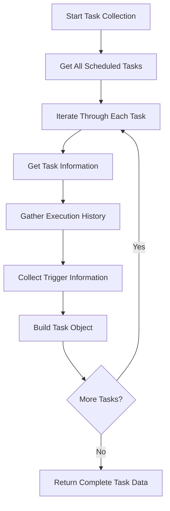
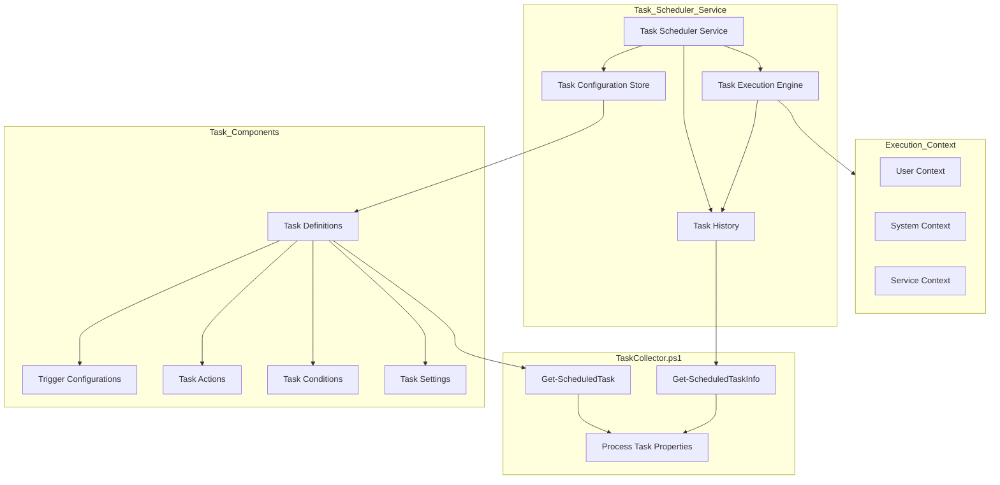
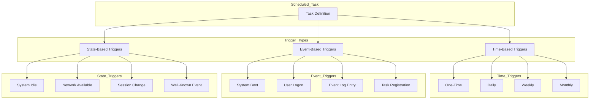

# 17. Scheduled Tasks

## Description

The Scheduled Tasks module collects comprehensive information about tasks configured in the Windows Task Scheduler. These tasks are automated jobs configured to run at specific times, intervals, or in response to particular events, often without direct user interaction. This module captures detailed information about each task, including its name, state, triggers, last execution results, and schedule information. This data is valuable for system administrators, security analysts, and support personnel who need to understand what automated processes are configured on a system.

The collection is performed by the `TaskCollector.ps1` script, which uses PowerShell's Task Scheduler cmdlets to gather information about all scheduled tasks on the system. The collector provides insights into task configurations, execution history, and upcoming schedules, creating a complete inventory of automated processes.

## File Generated

- **Filename**: `ScheduledTasks.json`
- **Location**: Within the timestamped snapshot directory (e.g., `SystemState_yyyy-MM-dd_HH-mm-ss/ScheduledTasks.json`)
- **Format**: UTF-8 encoded JSON without BOM (Byte Order Mark)
- **Typical Size**: 50KB - 500KB (varies based on the number of scheduled tasks)

## Schema

```json
{
  "Timestamp": "2025-03-10T15:30:45.0000000Z",
  "ComputerName": "HOSTNAME",
  "Data": [
    {
      "TaskName": "SoftwareUpdateTask",
      "TaskPath": "\\Microsoft\\Windows\\UpdateOrchestrator\\",
      "State": "Ready",
      "Enabled": true,
      "Author": "NT AUTHORITY\\SYSTEM",
      "LastRunTime": "2025-03-09 10:15:23",
      "LastResult": 0,
      "NextRunTime": "2025-03-11 03:00:00",
      "Triggers": [
        {
          "Type": "TimeTrigger",
          "Enabled": true,
          "StartBoundary": "2024-01-01T03:00:00",
          "EndBoundary": "Not set"
        }
      ]
    },
    {
      "TaskName": "SystemScan",
      "TaskPath": "\\Custom\\Security\\",
      "State": "Running",
      "Enabled": true,
      "Author": "DOMAIN\\Administrator",
      "LastRunTime": "2025-03-10 14:30:00",
      "LastResult": 267009,
      "NextRunTime": "2025-03-11 14:30:00",
      "Triggers": [
        {
          "Type": "DailyTrigger",
          "Enabled": true,
          "StartBoundary": "2024-06-15T14:30:00",
          "EndBoundary": "2025-06-15T00:00:00"
        },
        {
          "Type": "BootTrigger",
          "Enabled": false,
          "StartBoundary": "Not set",
          "EndBoundary": "Not set"
        }
      ]
    },
    {
      "TaskName": "UserBackup",
      "TaskPath": "\\Custom\\Maintenance\\",
      "State": "Ready",
      "Enabled": true,
      "Author": "DOMAIN\\User",
      "LastRunTime": "2025-03-09 22:00:00",
      "LastResult": 0,
      "NextRunTime": "2025-03-10 22:00:00",
      "Triggers": [
        {
          "Type": "WeeklyTrigger",
          "Enabled": true,
          "StartBoundary": "2024-01-01T22:00:00",
          "EndBoundary": "Not set"
        }
      ]
    }
  ]
}
```

### Schema Details

#### Root Object
| Field | Type | Description |
|-------|------|-------------|
| Timestamp | string | ISO 8601 format timestamp when the data was collected |
| ComputerName | string | Name of the computer from which data was collected |
| Data | array | Array of objects containing information about each scheduled task |

#### Task Object (Elements in the Data Array)
| Field | Type | Description |
|-------|------|-------------|
| TaskName | string | Name of the scheduled task |
| TaskPath | string | Path to the task in the Task Scheduler hierarchy |
| State | string | Current state of the task (Ready, Running, Disabled, etc.) |
| Enabled | boolean | Whether the task is enabled or disabled |
| Author | string | User account or service that created the task |
| LastRunTime | string | Date and time when the task last executed |
| LastResult | number | Result code from the last execution (0 typically indicates success) |
| NextRunTime | string | Date and time when the task is next scheduled to run |
| Triggers | array | Array of trigger objects that determine when the task executes |

#### Trigger Object (Elements in the Triggers Array)
| Field | Type | Description |
|-------|------|-------------|
| Type | string | Type of trigger (TimeTrigger, DailyTrigger, EventTrigger, etc.) |
| Enabled | boolean | Whether this specific trigger is enabled |
| StartBoundary | string | Start date/time or condition for the trigger |
| EndBoundary | string | End date/time or condition for the trigger, if set |

## JSON Schema Definition

```json
{
  "$schema": "http://json-schema.org/draft-07/schema#",
  "title": "System State Collector - Scheduled Tasks Data",
  "description": "Schema for Windows scheduled task data collected by the System State Collector",
  "type": "object",
  "required": ["Timestamp", "ComputerName", "Data"],
  "properties": {
    "Timestamp": {
      "type": "string",
      "format": "date-time",
      "description": "ISO 8601 format timestamp when the data was collected"
    },
    "ComputerName": {
      "type": "string",
      "description": "Name of the computer from which data was collected"
    },
    "Data": {
      "type": "array",
      "description": "Array of objects containing information about each scheduled task",
      "items": {
        "type": "object",
        "required": ["TaskName", "TaskPath", "State", "Enabled", "Author", "LastRunTime", "LastResult", "NextRunTime", "Triggers"],
        "properties": {
          "TaskName": {
            "type": "string",
            "description": "Name of the scheduled task",
            "examples": ["SoftwareUpdateTask", "SystemScan"]
          },
          "TaskPath": {
            "type": "string",
            "description": "Path to the task in the Task Scheduler hierarchy",
            "examples": ["\\Microsoft\\Windows\\UpdateOrchestrator\\", "\\Custom\\Security\\"]
          },
          "State": {
            "type": "string",
            "description": "Current state of the task",
            "examples": ["Ready", "Running", "Disabled"]
          },
          "Enabled": {
            "type": "boolean",
            "description": "Whether the task is enabled or disabled",
            "examples": [true, false]
          },
          "Author": {
            "type": "string",
            "description": "User account or service that created the task",
            "examples": ["NT AUTHORITY\\SYSTEM", "DOMAIN\\Administrator"]
          },
          "LastRunTime": {
            "type": "string",
            "description": "Date and time when the task last executed",
            "examples": ["2025-03-09 10:15:23", "Never"]
          },
          "LastResult": {
            "type": ["number", "string"],
            "description": "Result code from the last execution (0 typically indicates success)",
            "examples": [0, 267009, "Unknown"]
          },
          "NextRunTime": {
            "type": "string",
            "description": "Date and time when the task is next scheduled to run",
            "examples": ["2025-03-11 03:00:00", "Not scheduled"]
          },
          "Triggers": {
            "type": "array",
            "description": "Array of trigger objects that determine when the task executes",
            "items": {
              "type": "object",
              "required": ["Type", "Enabled", "StartBoundary", "EndBoundary"],
              "properties": {
                "Type": {
                  "type": "string",
                  "description": "Type of trigger",
                  "examples": ["TimeTrigger", "DailyTrigger", "EventTrigger", "BootTrigger"]
                },
                "Enabled": {
                  "type": "boolean",
                  "description": "Whether this specific trigger is enabled",
                  "examples": [true, false]
                },
                "StartBoundary": {
                  "type": "string",
                  "description": "Start date/time or condition for the trigger",
                  "examples": ["2024-01-01T03:00:00", "Not set"]
                },
                "EndBoundary": {
                  "type": "string",
                  "description": "End date/time or condition for the trigger, if set",
                  "examples": ["2025-06-15T00:00:00", "Not set"]
                }
              }
            }
          }
        }
      }
    }
  }
}
```

## Key Information Captured

### Task Identification
- **Task Names and Paths**: Full identification of each task including its name and location in the Task Scheduler hierarchy
- **Creation Attribution**: The user account or service that authored the task, which is valuable for security auditing
- **Organizational Structure**: The hierarchical organization of tasks, typically grouped by vendor, application, or purpose

### Task Status
- **Current State**: Whether the task is ready, running, disabled, or in another state
- **Enabled Status**: Whether the task is currently enabled for execution
- **Last Execution**: When the task last ran and the result code from that execution
- **Next Execution**: When the task is scheduled to run next, if applicable

### Trigger Information
The collector captures various types of triggers that can initiate tasks:

1. **Time-Based Triggers**:
   - **One-time Triggers**: Tasks scheduled to run once at a specific time
   - **Daily Triggers**: Tasks that run daily at specified times
   - **Weekly Triggers**: Tasks that run on specific days of the week
   - **Monthly Triggers**: Tasks that run on specific days of the month

2. **Event-Based Triggers**:
   - **Boot Triggers**: Tasks that execute when the system boots
   - **Logon Triggers**: Tasks that run when users log on
   - **Event Log Triggers**: Tasks triggered by specific event log entries
   - **Registration Triggers**: Tasks that run when registered or updated
   - **Idle Triggers**: Tasks that execute when the system becomes idle

### Security Context
- **Task Authors**: Shows which accounts have created scheduled tasks
- **Potential Persistence**: Can identify tasks that might be used for persistence by malware or attackers
- **Privileged Tasks**: Identifies tasks running with elevated privileges
- **Task Origin**: Helps distinguish between system, application, and user-created tasks

### Collection Methodology
The task collector employs PowerShell's Task Scheduler cmdlets:
1. **Get-ScheduledTask**: Retrieves the list of scheduled tasks
2. **Get-ScheduledTaskInfo**: Gathers execution history and schedule information
3. **Task Hierarchy Traversal**: Examines the full task folder structure
4. **Result Code Interpretation**: Translates numeric result codes to meaningful statuses when possible

### Limitations
- **Execution History Depth**: Only captures the most recent execution information
- **Action Details**: Doesn't include the detailed actions (commands, scripts) that tasks execute
- **Security Settings**: Limited information about task security settings and permissions
- **Remote Tasks**: Primarily focused on local task scheduler, not remote task management
- **Hidden Tasks**: May not detect some system tasks that are intentionally concealed

## Collection Process

The scheduled tasks data collection follows this process:



## Suggested Improvements

1. **Action Details**: Include information about what each task actually does (command lines, script contents, etc.).

2. **Security Context**: Add details about the security principal under which the task runs and any specified privileges.

3. **Error History**: Expand historical information to include multiple past executions and error patterns.

4. **Task Dependencies**: Document relationships between tasks that depend on each other.

5. **Task Source**: Identify the application or component that created each task for better categorization.

6. **Registry Correlation**: Link tasks to associated registry settings and startup items.

7. **Condition Information**: Include advanced conditions that determine when tasks will run or be skipped.

## Future Enhancements

### Task Security Analysis
Implement security analysis of scheduled tasks, identifying potential vulnerabilities such as tasks with elevated privileges running insecure scripts or binaries.

### Task Impact Assessment
Develop functionality to evaluate the system impact of scheduled tasks, identifying resource-intensive tasks that might affect system performance.

### Task Timeline Visualization
Create visualization tools that display task execution schedules across time, helping identify potential conflicts or busy periods.

### Task Drift Detection
Add capabilities to detect changes in task configurations between system state snapshots, highlighting modifications that might indicate compromise.

### Task Validation
Implement verification of task integrity, checking that task targets exist and validating that they appear legitimate.

### Cross-System Task Comparison
Develop tools to compare scheduled task configurations across multiple systems, helping identify inconsistencies or unique configurations.

## Diagram: Task Scheduler Architecture



## Diagram: Task Trigger Types



## Related Collectors

The Scheduled Tasks module complements these other collectors:
- **StartupPrograms**: Provides information about other methods of automatic program execution
- **RunningServices**: Many scheduled tasks interact with or manage system services
- **RegistrySettings**: Some tasks are configured or referenced in the registry
- **WindowsFeatures**: Certain Windows features rely on scheduled tasks for functionality
- **PerformanceData**: Task execution can significantly impact system performance
- **SecuritySettings**: Task configuration is an important aspect of system security
