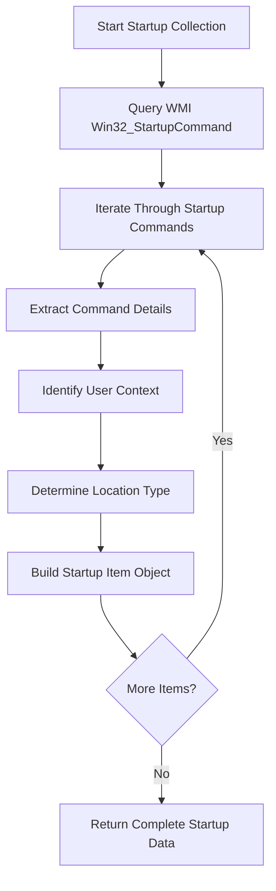
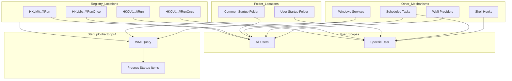
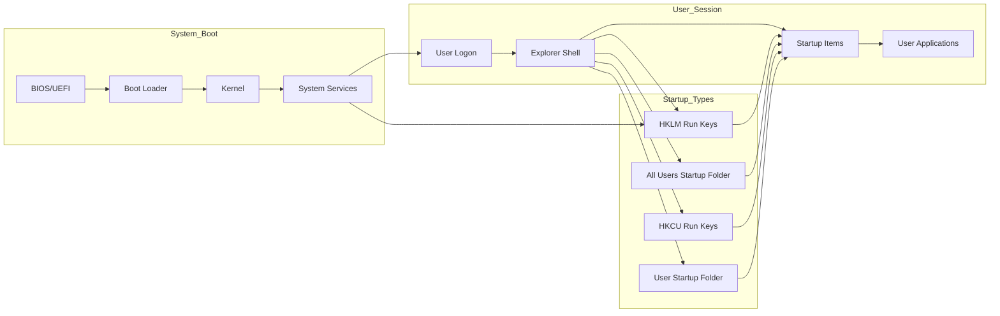

# 18. Startup Programs

## Description

The Startup Programs module collects information about applications and scripts configured to launch automatically when the system boots or a user logs in. These startup items can significantly impact system boot time, performance, and security posture. This module captures details about each startup entry, including its name, command, location, and the user context under which it runs. This information is crucial for troubleshooting slow startup issues, identifying potentially unwanted applications, and maintaining a clean system configuration.

The collection is performed by the `StartupCollector.ps1` script, which uses the Windows Management Instrumentation (WMI) to query the Win32_StartupCommand class. This approach provides a comprehensive view of startup items across various autostart mechanisms, creating a consolidated inventory of what programs are launched during system initialization and user logon.

## File Generated

- **Filename**: `StartupPrograms.json`
- **Location**: Within the timestamped snapshot directory (e.g., `SystemState_yyyy-MM-dd_HH-mm-ss/StartupPrograms.json`)
- **Format**: UTF-8 encoded JSON without BOM (Byte Order Mark)
- **Typical Size**: 5KB - 50KB (varies based on the number of startup items)

## Schema

```json
{
  "Timestamp": "2025-03-10T15:30:45.0000000Z",
  "ComputerName": "HOSTNAME",
  "Data": [
    {
      "Name": "OneDrive",
      "Command": "\"C:\\Program Files\\Microsoft OneDrive\\OneDrive.exe\" /background",
      "Location": "HKCU\\SOFTWARE\\Microsoft\\Windows\\CurrentVersion\\Run",
      "User": "DOMAIN\\Username"
    },
    {
      "Name": "SecurityHealth",
      "Command": "%windir%\\system32\\SecurityHealthSystray.exe",
      "Location": "HKLM\\SOFTWARE\\Microsoft\\Windows\\CurrentVersion\\Run",
      "User": "Public"
    },
    {
      "Name": "Dropbox",
      "Command": "\"C:\\Program Files (x86)\\Dropbox\\Client\\Dropbox.exe\" /systemstartup",
      "Location": "Common Startup",
      "User": "Public"
    },
    {
      "Name": "Teams",
      "Command": "C:\\Users\\Username\\AppData\\Local\\Microsoft\\Teams\\Update.exe --processStart \"Teams.exe\" --process-start-args \"--system-initiated\"",
      "Location": "Startup",
      "User": "DOMAIN\\Username"
    }
  ]
}
```

### Schema Details

#### Root Object
| Field | Type | Description |
|-------|------|-------------|
| Timestamp | string | ISO 8601 format timestamp when the data was collected |
| ComputerName | string | Name of the computer from which data was collected |
| Data | array | Array of objects containing information about each startup program |

#### Startup Program Object (Elements in the Data Array)
| Field | Type | Description |
|-------|------|-------------|
| Name | string | Name or identifier of the startup entry |
| Command | string | Full command line that executes when the item starts |
| Location | string | Registry key or folder where the startup item is defined |
| User | string | User context under which the startup item runs |

## JSON Schema Definition

```json
{
  "$schema": "http://json-schema.org/draft-07/schema#",
  "title": "System State Collector - Startup Programs Data",
  "description": "Schema for startup programs data collected by the System State Collector",
  "type": "object",
  "required": ["Timestamp", "ComputerName", "Data"],
  "properties": {
    "Timestamp": {
      "type": "string",
      "format": "date-time",
      "description": "ISO 8601 format timestamp when the data was collected"
    },
    "ComputerName": {
      "type": "string",
      "description": "Name of the computer from which data was collected"
    },
    "Data": {
      "type": "array",
      "description": "Array of objects containing information about each startup program",
      "items": {
        "type": "object",
        "required": ["Name", "Command", "Location", "User"],
        "properties": {
          "Name": {
            "type": "string",
            "description": "Name or identifier of the startup entry",
            "examples": ["OneDrive", "SecurityHealth"]
          },
          "Command": {
            "type": "string",
            "description": "Full command line that executes when the item starts",
            "examples": ["\"C:\\Program Files\\Microsoft OneDrive\\OneDrive.exe\" /background"]
          },
          "Location": {
            "type": "string",
            "description": "Registry key or folder where the startup item is defined",
            "examples": ["HKCU\\SOFTWARE\\Microsoft\\Windows\\CurrentVersion\\Run", "Common Startup"]
          },
          "User": {
            "type": "string",
            "description": "User context under which the startup item runs",
            "examples": ["DOMAIN\\Username", "Public"]
          }
        }
      }
    }
  }
}
```

## Key Information Captured

### Startup Entry Details
- **Entry Name**: The identifier or display name of the startup item
- **Command Line**: The full executable path and parameters that are executed
- **Location Type**: Where the startup configuration is stored (registry key or startup folder)
- **User Scope**: Whether the item starts for all users or a specific user

### Startup Locations
The collector gathers startup items from various locations:

1. **Registry Run Keys**:
   - `HKLM\SOFTWARE\Microsoft\Windows\CurrentVersion\Run`: Programs that run for all users
   - `HKLM\SOFTWARE\Microsoft\Windows\CurrentVersion\RunOnce`: Programs that run once for all users
   - `HKCU\SOFTWARE\Microsoft\Windows\CurrentVersion\Run`: Programs that run for the current user
   - `HKCU\SOFTWARE\Microsoft\Windows\CurrentVersion\RunOnce`: Programs that run once for the current user

2. **Startup Folders**:
   - Common Startup Folder (`C:\ProgramData\Microsoft\Windows\Start Menu\Programs\StartUp`): Items start for all users
   - User Startup Folder (`C:\Users\[Username]\AppData\Roaming\Microsoft\Windows\Start Menu\Programs\Startup`): Items start for specific users

3. **Additional Locations**:
   - WMI also captures startup items from other sources like the Task Scheduler and Service Control Manager
   - Startup items registered through application-specific mechanisms

### User Contexts
The collector identifies different user scopes for startup items:

- **System-wide**: Items that run for all users (typically from HKLM or Common Startup)
- **User-specific**: Items that run only for a particular user (typically from HKCU or User Startup)
- **Special accounts**: Items that run under service accounts or administrative contexts

### Collection Methodology
The startup programs collector:
- Uses WMI's Win32_StartupCommand class for comprehensive coverage
- Includes both enabled and disabled startup items
- Captures the raw command strings without normalization
- Identifies the user context associated with each item
- Organizes the data by name for easier reading

### Limitations
- **Hidden Items**: May not detect sophisticated autostart mechanisms used by malware
- **Disabled Status**: Doesn't always distinguish between enabled and disabled startup items
- **Command Expansion**: Environment variables in commands are not expanded
- **Startup Order**: Doesn't indicate the sequence in which items start
- **Success Verification**: Doesn't verify if startup items successfully execute

## Collection Process

The startup programs data collection follows this process:



## Suggested Improvements

1. **Enabled Status**: Add information about whether each startup item is currently enabled or disabled.

2. **Digital Signature**: Include digital signature information to help identify potentially malicious entries.

3. **Prevalence Statistics**: Add data about how common the startup item is across systems.

4. **Performance Impact**: Include metrics about the resource consumption and startup delay caused by each item.

5. **Historical Changes**: Track changes to startup items between snapshots to identify newly added or removed entries.

6. **File Metadata**: Include additional information about the executable such as file version, company, and creation/modification dates.

7. **Parent Application**: Identify the application that installed or created each startup entry.

## Future Enhancements

### Startup Security Risk Analysis
Implement security risk scoring for startup items based on factors like signature status, prevalence, and behavioral characteristics.

### Startup Performance Profiling
Develop capabilities to measure and report the performance impact of each startup item, helping identify problematic entries that slow down system boot.

### Startup Dependencies Mapping
Create visualization tools that show dependencies between startup items, helping understand the startup chain and identifying critical paths.

### Recommended Configuration Templates
Develop recommended startup configuration templates for different use cases, allowing easy comparison against best practices.

### Expanded Autostart Coverage
Extend collection to cover additional autostart mechanisms like shell extensions, browser helper objects, and WMI event consumers.

### Automated Cleanup Recommendations
Implement intelligent analysis to suggest startup items that could be safely removed or delayed.

## Diagram: Startup Configuration Locations



## Diagram: Startup Program Launch Sequence



## Related Collectors

The Startup Programs module complements these other collectors:
- **RunningServices**: Many startup items launch or interact with Windows services
- **RegistrySettings**: Contains registry keys for startup configuration
- **ScheduledTasks**: Tasks can be configured to run at startup or logon
- **InstalledPrograms**: Many installed applications configure startup items
- **PythonInstallations**: Python environments may include startup configuration
- **PerformanceData**: Startup programs impact system performance metrics
