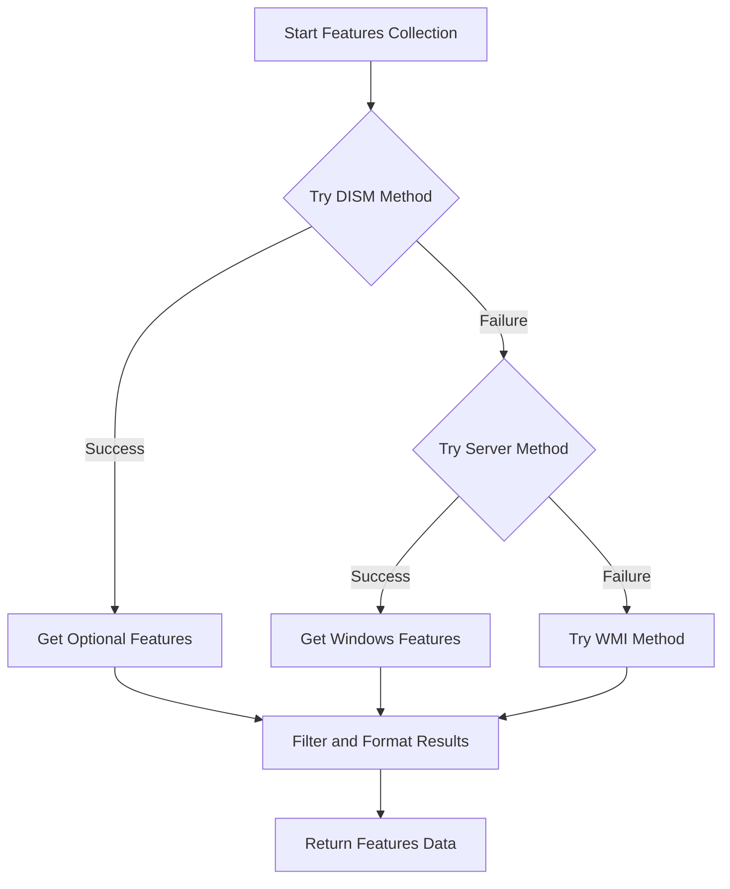
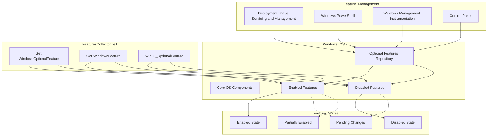
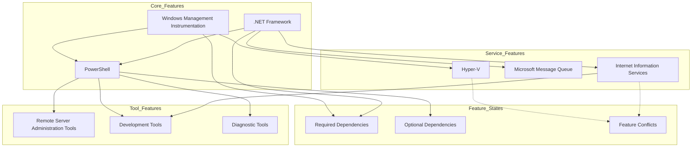

# 19. Windows Features

## Description

The Windows Features module collects comprehensive information about optional components and features installed on the Windows operating system. Windows Features are modular components that can be enabled or disabled to customize the functionality available on a system. This module captures details about each available feature, including its name, installation state, and description. This information is valuable for system administrators, support personnel, and security analysts who need to understand which capabilities are active on a system.

The collection is performed by the `FeaturesCollector.ps1` script, which employs multiple methods to gather feature information across different Windows versions and editions. The collector provides insights into the system's configured capabilities, which affect available functionality, security posture, and potential attack surface.

## File Generated

- **Filename**: `WindowsFeatures.json`
- **Location**: Within the timestamped snapshot directory (e.g., `SystemState_yyyy-MM-dd_HH-mm-ss/WindowsFeatures.json`)
- **Format**: UTF-8 encoded JSON without BOM (Byte Order Mark)
- **Typical Size**: 20KB - 200KB (varies based on the Windows edition and number of features)

## Schema

```json
{
  "Timestamp": "2025-03-10T15:30:45.0000000Z",
  "ComputerName": "HOSTNAME",
  "Data": [
    {
      "FeatureName": "Internet-Explorer-Optional-amd64",
      "State": "Enabled",
      "Description": "Internet Explorer 11"
    },
    {
      "FeatureName": "NetFx4-AdvSrvs",
      "State": "Enabled",
      "Description": "Microsoft .NET Framework 4.8 Advanced Services"
    },
    {
      "FeatureName": "WCF-TCP-PortSharing45",
      "State": "Disabled",
      "Description": "Windows Communication Foundation TCP Port Sharing"
    },
    {
      "FeatureName": "Windows-Defender",
      "State": "Enabled",
      "Description": "Windows Defender Antivirus"
    },
    {
      "FeatureName": "TFTP",
      "State": "Disabled",
      "Description": "TFTP Client"
    },
    {
      "FeatureName": "TelnetClient",
      "State": "Disabled",
      "Description": "Telnet Client"
    }
  ]
}
```

### Schema Details

#### Root Object
| Field | Type | Description |
|-------|------|-------------|
| Timestamp | string | ISO 8601 format timestamp when the data was collected |
| ComputerName | string | Name of the computer from which data was collected |
| Data | array | Array of objects containing information about each Windows feature |

#### Feature Object (Elements in the Data Array)
| Field | Type | Description |
|-------|------|-------------|
| FeatureName | string | Internal name or identifier of the Windows feature |
| State | string | Current state of the feature (Enabled, Disabled) |
| Description | string | Human-readable description of the feature |

## JSON Schema Definition

```json
{
  "$schema": "http://json-schema.org/draft-07/schema#",
  "title": "System State Collector - Windows Features Data",
  "description": "Schema for Windows Features data collected by the System State Collector",
  "type": "object",
  "required": ["Timestamp", "ComputerName", "Data"],
  "properties": {
    "Timestamp": {
      "type": "string",
      "format": "date-time",
      "description": "ISO 8601 format timestamp when the data was collected"
    },
    "ComputerName": {
      "type": "string",
      "description": "Name of the computer from which data was collected"
    },
    "Data": {
      "type": "array",
      "description": "Array of objects containing information about each Windows feature",
      "items": {
        "type": "object",
        "required": ["FeatureName", "State", "Description"],
        "properties": {
          "FeatureName": {
            "type": "string",
            "description": "Internal name or identifier of the Windows feature",
            "examples": ["Internet-Explorer-Optional-amd64", "NetFx4-AdvSrvs"]
          },
          "State": {
            "type": "string",
            "description": "Current state of the feature",
            "enum": ["Enabled", "Disabled"],
            "examples": ["Enabled", "Disabled"]
          },
          "Description": {
            "type": "string",
            "description": "Human-readable description of the feature",
            "examples": ["Internet Explorer 11", "Microsoft .NET Framework 4.8 Advanced Services"]
          }
        }
      }
    }
  }
}
```

## Key Information Captured

### Feature Categories
The collector gathers information about various categories of Windows features:

1. **Core Windows Components**: 
   - Internet Explorer
   - Windows Media Player
   - .NET Framework components
   - Windows Defender

2. **Administrative Tools**:
   - Remote Server Administration Tools
   - Windows PowerShell extensions
   - Management consoles and utilities

3. **Network Components**:
   - SMB protocol features
   - SNMP services
   - Telnet and TFTP clients
   - Network diagnostic tools

4. **Development Components**:
   - Internet Information Services (IIS)
   - Web development tools
   - Microsoft Message Queue (MSMQ)
   - Windows Communication Foundation (WCF)

5. **Virtualization Features**:
   - Hyper-V
   - Windows Subsystem for Linux
   - Containers
   - Sandbox features

6. **Legacy Components**:
   - Old protocols and services
   - Compatibility features for older applications
   - Deprecated Windows components

### Feature States
The collector identifies two primary states for features:

- **Enabled**: The feature is installed and available for use
- **Disabled**: The feature is not installed or has been deactivated

Some implementations may provide additional states depending on the Windows version and command used:

- **Partially Enabled**: Some subcomponents are enabled while others are disabled
- **Pending**: The feature state is changing but has not completed
- **Unknown**: The state could not be determined

### Collection Methodology
The feature collector employs a multi-tiered approach to ensure compatibility across different Windows versions:

1. **Primary Method**: Uses DISM PowerShell module (`Get-WindowsOptionalFeature`) on Windows 10/11
2. **Server Method**: Falls back to Windows PowerShell (`Get-WindowsFeature`) on Windows Server
3. **Legacy Method**: Uses WMI (`Win32_OptionalFeature`) for older Windows versions
4. **Comprehensive Collection**: Attempts to gather the most complete feature set available on the system

### Security Implications
The Windows Features information has several security implications:

- **Attack Surface**: Enabled features may increase the potential attack surface
- **Security Configuration**: Some features may impact system security posture
- **Compliance Requirements**: Certain features may need to be disabled to meet compliance standards
- **Legacy Vulnerabilities**: Older features might expose known vulnerabilities if enabled

### Limitations
- **Windows Edition Differences**: Not all features are available on all Windows editions
- **Server vs. Desktop**: Feature sets differ significantly between Windows Server and Desktop editions
- **Collection Method Variations**: Different collection methods may produce slightly different results
- **Missing Details**: Some features might not include complete descriptions
- **Command Execution**: Some commands require administrative privileges to execute fully

## Collection Process

The Windows features data collection follows this process:



## Suggested Improvements

1. **Feature Dependencies**: Include information about dependencies between features to understand the impact of enabling or disabling specific components.

2. **Installation Date**: Add the date when each feature was enabled to track configuration changes over time.

3. **Package Source**: Include details about where the feature binaries are sourced from when enabling.

4. **Required Reboot**: Flag features that require a system reboot after state changes.

5. **Feature Size**: Add information about the disk space consumed by each feature.

6. **Subcomponent Details**: For complex features, include a breakdown of individual subcomponents and their states.

7. **Historical Changes**: Track changes to feature states between system snapshots.

## Future Enhancements

### Feature Recommendation Engine
Develop intelligent analysis to recommend which features should be enabled or disabled based on the system's purpose, improving security and performance.

### Compliance Validation
Implement feature configuration checking against common security baselines and compliance frameworks like CIS, STIG, or HIPAA.

### Feature Usage Monitoring
Create functionality to track how frequently enabled features are actually being used, helping identify unnecessary components.

### Cross-System Comparison
Develop visualization tools to compare feature configurations across multiple systems, highlighting inconsistencies or outliers.

### Impact Analysis
Build capabilities to estimate the performance, security, and compatibility impact of enabling or disabling specific features.

### Detailed Component Information
Expand collection to include more detailed technical information about each feature, such as included files, registry modifications, and services.

## Diagram: Windows Features Architecture



## Diagram: Feature Dependency Relationships



## Related Collectors

The Windows Features module complements these other collectors:
- **InstalledPrograms**: Many features relate to installed applications
- **RunningServices**: Some features install and enable services
- **RegistrySettings**: Feature states are often reflected in registry settings
- **WindowsUpdates**: Updates may add or modify available features
- **StartupPrograms**: Some features add components to system startup
- **SecuritySettings**: Feature configuration affects overall security posture
