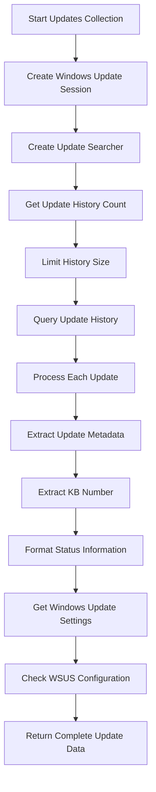
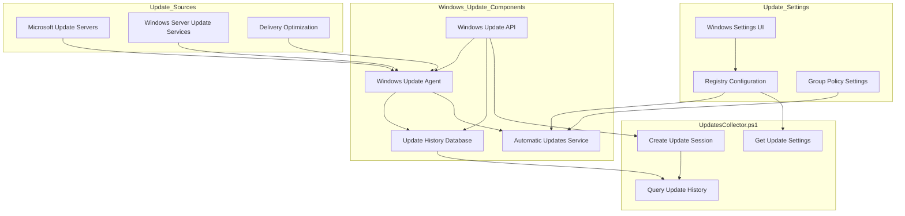

# 20. Windows Updates

## Description

The Windows Updates module collects comprehensive information about installed Windows updates and update configuration settings on the system. This module captures detailed information about update history, including successful and failed installations, as well as the system's update policy configuration. This information is valuable for security assessments, troubleshooting, and ensuring systems are properly patched against known vulnerabilities.

The collection is performed by the `UpdatesCollector.ps1` script, which uses the Windows Update API through COM objects to access the update history and configuration. The collector provides insights into the patch level of the system, recent update activities, and how Windows Update is configured to operate.

## File Generated

- **Filename**: `WindowsUpdates.json`
- **Location**: Within the timestamped snapshot directory (e.g., `SystemState_yyyy-MM-dd_HH-mm-ss/WindowsUpdates.json`)
- **Format**: UTF-8 encoded JSON without BOM (Byte Order Mark)
- **Typical Size**: 50KB - 500KB (varies based on system update history)

## Schema

```json
{
  "Timestamp": "2025-03-10T15:30:45.0000000Z",
  "ComputerName": "HOSTNAME",
  "Data": {
    "InstalledUpdates": [
      {
        "Title": "Security Update for Windows (KB5034763)",
        "Description": "A security issue has been identified in a Microsoft software product that could affect your system.",
        "Date": "2025-02-13 12:45:22",
        "Operation": "Installation",
        "Status": "Succeeded",
        "KB": "KB5034763"
      },
      {
        "Title": "2025-03 Cumulative Update for Windows 11 for x64-based Systems (KB5035853)",
        "Description": "Install this update to resolve issues in Windows.",
        "Date": "2025-03-08 03:15:42",
        "Operation": "Installation",
        "Status": "Succeeded",
        "KB": "KB5035853"
      },
      {
        "Title": "Update for Microsoft Defender Antivirus antimalware platform - KB4052623 (Version 4.18.2302.7)",
        "Description": "This update provides the latest security intelligence updates for Microsoft Defender Antivirus and Microsoft Security Essentials.",
        "Date": "2025-03-05 15:22:17",
        "Operation": "Installation",
        "Status": "Succeeded",
        "KB": "KB4052623"
      },
      {
        "Title": "Feature Update to Windows 11 22H2 via Enablement Package (KB5031455)",
        "Description": "Install this update to get the latest features and improvements for Windows 11.",
        "Date": "2025-01-22 19:05:33",
        "Operation": "Installation",
        "Status": "Succeeded",
        "KB": "KB5031455"
      }
    ],
    "UpdateSettings": {
      "NotificationLevel": "Scheduled installation",
      "IncludeRecommendedUpdates": true,
      "UseWUServer": false
    }
  }
}
```

### Schema Details

#### Root Object

| Field        | Type   | Description                                           |
| ------------ | ------ | ----------------------------------------------------- |
| Timestamp    | string | ISO 8601 format timestamp when the data was collected |
| ComputerName | string | Name of the computer from which data was collected    |
| Data         | object | Container for Windows Updates information             |

#### Data Object

| Field            | Type   | Description                                                 |
| ---------------- | ------ | ----------------------------------------------------------- |
| InstalledUpdates | array  | List of updates installed on the system (most recent first) |
| UpdateSettings   | object | Windows Update configuration settings                       |

#### InstalledUpdates Array Elements

| Field       | Type   | Description                                                      |
| ----------- | ------ | ---------------------------------------------------------------- |
| Title       | string | Title of the update as displayed in Windows Update history       |
| Description | string | Description of the update's purpose                              |
| Date        | string | Date and time when the update was installed                      |
| Operation   | string | Type of operation performed (Installation, Uninstallation, etc.) |
| Status      | string | Result of the update operation (Succeeded, Failed, etc.)         |
| KB          | string | Knowledge Base (KB) identifier for the update                    |

#### UpdateSettings Object

| Field                     | Type    | Description                                                                      |
| ------------------------- | ------- | -------------------------------------------------------------------------------- |
| NotificationLevel         | string  | How Windows Update is configured to notify and install updates                   |
| IncludeRecommendedUpdates | boolean | Whether recommended updates are included along with important updates            |
| UseWUServer               | boolean | Whether updates are obtained from a Windows Server Update Services (WSUS) server |

## JSON Schema Definition

```json
{
  "$schema": "http://json-schema.org/draft-07/schema#",
  "title": "System State Collector - Windows Updates Data",
  "description": "Schema for Windows Updates data collected by the System State Collector",
  "type": "object",
  "required": ["Timestamp", "ComputerName", "Data"],
  "properties": {
    "Timestamp": {
      "type": "string",
      "format": "date-time",
      "description": "ISO 8601 format timestamp when the data was collected"
    },
    "ComputerName": {
      "type": "string",
      "description": "Name of the computer from which data was collected"
    },
    "Data": {
      "type": "object",
      "description": "Container for Windows Updates information",
      "required": ["InstalledUpdates", "UpdateSettings"],
      "properties": {
        "InstalledUpdates": {
          "type": "array",
          "description": "List of updates installed on the system (most recent first)",
          "items": {
            "type": "object",
            "required": [
              "Title",
              "Description",
              "Date",
              "Operation",
              "Status",
              "KB"
            ],
            "properties": {
              "Title": {
                "type": "string",
                "description": "Title of the update as displayed in Windows Update history",
                "examples": ["Security Update for Windows (KB5034763)"]
              },
              "Description": {
                "type": "string",
                "description": "Description of the update's purpose",
                "examples": ["A security issue has been identified..."]
              },
              "Date": {
                "type": "string",
                "description": "Date and time when the update was installed",
                "examples": ["2025-02-13 12:45:22"]
              },
              "Operation": {
                "type": "string",
                "description": "Type of operation performed",
                "enum": ["Installation", "Uninstallation", "Other"],
                "examples": ["Installation"]
              },
              "Status": {
                "type": "string",
                "description": "Result of the update operation",
                "enum": [
                  "Succeeded",
                  "Succeeded With Errors",
                  "Failed",
                  "Aborted",
                  "In Progress",
                  "Not Started"
                ],
                "examples": ["Succeeded", "Failed"]
              },
              "KB": {
                "type": "string",
                "description": "Knowledge Base (KB) identifier for the update",
                "examples": ["KB5034763", "KB5035853"]
              }
            }
          }
        },
        "UpdateSettings": {
          "type": "object",
          "description": "Windows Update configuration settings",
          "required": [
            "NotificationLevel",
            "IncludeRecommendedUpdates",
            "UseWUServer"
          ],
          "properties": {
            "NotificationLevel": {
              "type": "string",
              "description": "How Windows Update is configured to notify and install updates",
              "enum": [
                "Not configured",
                "Disabled",
                "Notify before download",
                "Notify before installation",
                "Scheduled installation"
              ],
              "examples": ["Scheduled installation"]
            },
            "IncludeRecommendedUpdates": {
              "type": "boolean",
              "description": "Whether recommended updates are included along with important updates"
            },
            "UseWUServer": {
              "type": "boolean",
              "description": "Whether updates are obtained from a Windows Server Update Services (WSUS) server"
            }
          }
        }
      }
    }
  }
}
```

## Key Information Captured

### Update History

The collector gathers detailed information about recently installed updates:

- **Security Updates**: Critical patches addressing security vulnerabilities
- **Cumulative Updates**: Monthly rollup updates that include multiple fixes
- **Feature Updates**: Major updates that add new features to Windows
- **Driver Updates**: Updates to hardware drivers delivered through Windows Update
- **Application Updates**: Updates to Microsoft applications like Office or Defender

### Update Metadata

For each update, the collector captures:

- **KB Number**: The Knowledge Base identifier that uniquely identifies the update
- **Installation Date**: When the update was applied to the system
- **Success/Failure**: Whether the update was successfully installed
- **Description**: What the update addresses (security issues, features, etc.)
- **Operation Type**: What action was performed (installation, uninstallation)

### Update Configuration

The collector documents how Windows Update is configured:

- **Notification Settings**: How the system handles update notifications and installations
- **Update Sources**: Whether updates come from Microsoft or a local WSUS server
- **Update Types**: Which categories of updates are included (recommended, important)

### Security Implications

This data has important security implications:

- **Patch Compliance**: Shows whether critical security updates have been applied
- **Failure Analysis**: Identifies updates that failed to install properly
- **Update Cadence**: Reveals patterns in update frequency and timing
- **Configuration Assessment**: Shows if updates are configured according to policy

### Collection Methodology

The updates collector uses several approaches:

1. **Windows Update API**: Uses COM interfaces to the Windows Update Agent
2. **Update History**: Queries the update history database
3. **Registry Settings**: Checks registry for Windows Update configuration
4. **Result Processing**: Translates numeric result codes into human-readable statuses

### Limitations

- **History Limit**: Only retrieves the most recent 100 updates to avoid performance issues
- **Network Dependency**: Some API calls may require network access
- **Enterprise Features**: Some settings may be unavailable in non-enterprise environments
- **Group Policy Impact**: Does not always show which settings are controlled by Group Policy
- **Offline Systems**: Some information may be unavailable on systems without internet access

## Collection Process

The Windows updates data collection follows this process:



## Suggested Improvements

1. **Update Categories**: Add categorization of updates by type (security, feature, quality, driver, etc.) to better understand the system's update profile.

2. **Failed Update Analysis**: Include more detailed analysis of failed updates, including error codes and potential remediation steps.

3. **Update Size**: Add information about the size of each update to understand their bandwidth and storage impact.

4. **Download Status**: Include information about updates that have been downloaded but not yet installed.

5. **Pending Reboot**: Flag whether the system has pending update-related reboots required.

6. **Update Sources**: Expand information about update sources, including URLs for Microsoft Update vs. WSUS.

7. **Update Windows**: Add details about configured active hours and maintenance windows for updates.

## Future Enhancements

### Update Compliance Analysis

Implement functionality to compare installed updates against Microsoft's latest security recommendations, flagging missing critical patches.

### Vulnerability Correlation

Develop capabilities to correlate installed updates with CVE (Common Vulnerabilities and Exposures) entries to assess the system's vulnerability status.

### Update Impact Assessment

Create analysis tools to evaluate the potential impact of pending updates based on historical data and Microsoft advisories.

### Rollback Capability Detection

Add detection of whether updates can be rolled back or uninstalled if problems occur after installation.

### Update Bandwidth Monitoring

Implement tracking of update download sizes and network impact over time to help with bandwidth planning.

### Extended Update History

Develop methods to access complete update history beyond the API limitations, possibly using event logs or other data sources.

## Diagram: Windows Update Architecture



## Diagram: Windows Update Types

```mermaid
graph TD
    subgraph Update_Categories
        SecurityUpdates[Security Updates]
        QualityUpdates[Quality Updates]
        FeatureUpdates[Feature Updates]
        DriverUpdates[Driver Updates]
        DefinitionUpdates[Definition Updates]
    end

    subgraph Update_Cadence
        PatchTuesday[Monthly "Patch Tuesday"]
        OutOfBand[Out-of-Band Updates]
        AnnualFeatures[Annual Feature Updates]
        DailyDefinitions[Daily Definition Updates]
    end

    SecurityUpdates --> PatchTuesday
    SecurityUpdates --> OutOfBand
    QualityUpdates --> PatchTuesday
    FeatureUpdates --> AnnualFeatures
    DefinitionUpdates --> DailyDefinitions

    subgraph Update_Impact
        SystemRestart[Requires Restart]
        NoRestart[No Restart Required]
        HighImpact[High System Impact]
        LowImpact[Low System Impact]
    end

    SecurityUpdates --> SystemRestart
    QualityUpdates --> SystemRestart
    FeatureUpdates --> SystemRestart
    FeatureUpdates --> HighImpact
    DriverUpdates -.-> SystemRestart
    DriverUpdates -.-> NoRestart
    DefinitionUpdates --> NoRestart
    DefinitionUpdates --> LowImpact
```

## Related Collectors

The Windows Updates module complements these other collectors:

- **WindowsFeatures**: Updates often add or modify available features
- **RunningServices**: Update services may appear in the running services list
- **RegistrySettings**: Contains update-related registry settings
- **ScheduledTasks**: Windows Update uses scheduled tasks for operation
- **SecuritySettings**: Updates directly impact security posture and configuration
- **DriversData**: Some updates install or update device drivers
