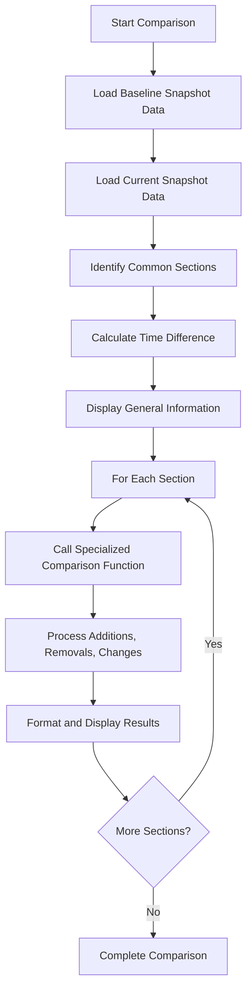
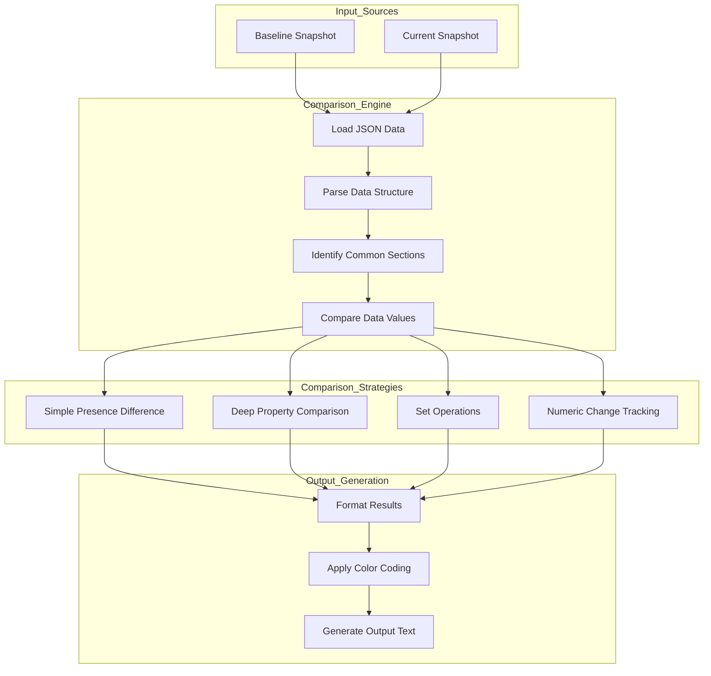
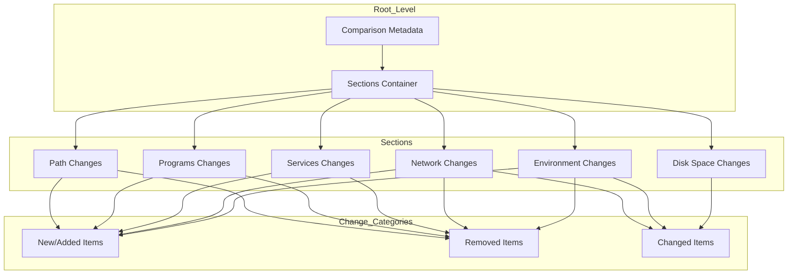

# 21. Comparison Output

## Description

The Comparison Output module generates detailed reports on the differences between two system state snapshots. Unlike the collector modules that gather data, this module processes and presents changes in a structured, human-readable format. It highlights additions, removals, and modifications to system components, helping administrators identify exactly what changed between snapshots. This information is crucial for troubleshooting, change validation, and understanding system evolution over time.

The comparison is performed by the `ComparisonUtil.ps1` and `ExtendedComparisonUtil.ps1` scripts, which contain specialized comparison functions for different types of system data. These utilities work with the structured JSON data from existing snapshots to generate meaningful difference reports that emphasize relevant changes while filtering out inconsequential variations.

## Output Generated

- **Format**: Console output with color-coding for easy visual identification
- **Optional File Output**: Can be redirected to text files for documentation
- **Structure**: Organized by system component category with clear section headers
- **Highlighting**: Uses color conventions (Green for additions, Yellow for removals, Cyan for changes)
- **Detail Level**: Customizable through section selection and filtering options

## Sample Output

```
Comparing system states:
- Baseline: 2025-01-15 09:30:45
- Current:  2025-03-10 15:30:45
- Time difference: 54 days, 6 hours, 0 minutes

Path Changes:
- New PATH entries (2):
  * C:\Program Files\Python310\Scripts
  * C:\Users\Username\AppData\Roaming\npm

- Removed PATH entries (1):
  * C:\Program Files\Python39\Scripts

InstalledPrograms Changes:
- New programs (3):
  * Python 3.10.8
  * Node.js 18.15.0
  * Visual Studio Code 1.86.0

- Removed programs (1):
  * Python 3.9.13

RunningServices Changes:
- Newly running services (2):
  * Node.js Service
  * VSS (Volume Shadow Copy)

- No longer running services (1):
  * Print Spooler

DiskSpace Changes:
- Drive C:: Free space has decreased by 12.45 GB
- Drive D:: Free space has increased by 5.32 GB

Network Changes:
- Network adapters changes:
  New adapters (1):
    * VPN - NordVPN

  Changed adapters (1):
    * Wi-Fi:
      Status changed: Down -> Up
      Link speed changed: 0 Mbps -> 866.7 Mbps

- IP configuration changes:
  Changed IP configurations (1):
    * Wi-Fi:
      IP address changed: Not configured -> 192.168.1.105
      Gateway changed: Not configured -> 192.168.1.1

Environment Changes:
- User environment variables changes:
  New user variables (2):
    * NODE_PATH = C:\Users\Username\AppData\Roaming\npm\node_modules
    * PYTHON_HOME = C:\Program Files\Python310

  Removed user variables (1):
    * PYTHON_HOME = C:\Program Files\Python39
```

## Key Features

### Component-Specific Comparison

The comparison engine includes specialized functions for different types of system components:

1. **Path Comparison**: Identifies added and removed directories in the PATH environment variable
2. **Programs Comparison**: Shows newly installed and uninstalled software
3. **Services Comparison**: Highlights changes in running services
4. **Disk Space Comparison**: Tracks changes in free space across volumes
5. **Network Comparison**: Details changes to adapters, IP configurations, and connections
6. **Environment Comparison**: Identifies changes to environment variables

### Comparison Methodology

The comparison utilities employ several strategies to produce meaningful results:

1. **Differential Analysis**: Compares before and after states to identify changes
2. **Set Operations**: Uses set theory to identify additions and removals
3. **Deep Comparison**: Examines nested properties for changed values
4. **Human-Friendly Output**: Formats results for readability and highlighting
5. **Selective Comparison**: Allows focusing on specific sections of interest

### Output Formatting

The comparison results use several formatting techniques for clarity:

1. **Color Coding**:

   - Green: Added items or positive changes
   - Yellow: Removed items or potentially concerning changes
   - Cyan: Modified items or neutral information
   - White: Summary information

2. **Hierarchical Structure**:

   - Major section headers for each component type
   - Subsections for different change categories
   - Indentation to show item relationships

3. **Summary Statistics**:
   - Counts of added, removed, and changed items
   - Overall time span between snapshots
   - Brief descriptions of significant changes

### Comparison Options

The comparison system provides several customization options:

1. **Section Selection**: Compare only specified components (e.g., just Path and Services)
2. **File vs. Directory**: Work with individual files or complete snapshot directories
3. **Output Redirection**: Send results to console or capture to file
4. **Detail Level**: Control the verbosity of change descriptions

## Comparison Process

The comparison process follows this general workflow:



## Implementation Details

### Main Comparison Function

The core `Compare-SystemStates` function handles the overall comparison workflow:

```powershell
function Compare-SystemStates {
    [CmdletBinding()]
    param (
        [Parameter(Mandatory=$true)]
        [string]$BaselinePath,

        [Parameter(Mandatory=$true)]
        [string]$CurrentPath,

        [Parameter()]
        [string[]]$Sections = @('Path', 'InstalledPrograms', 'RunningServices', 'DiskSpace')
    )

    # Determine if we're working with folders or single files
    $baselineIsFolder = (Test-Path $BaselinePath) -and (Get-Item $BaselinePath).PSIsContainer
    $currentIsFolder = (Test-Path $CurrentPath) -and (Get-Item $CurrentPath).PSIsContainer

    if (-not (Test-Path $BaselinePath)) {
        Write-Host "Baseline path not found: $BaselinePath" -ForegroundColor Red
        return
    }

    # Load metadata and calculate time difference
    # [Code to load timestamps and calculate difference]

    Write-Host "`nComparing system states:" -ForegroundColor Cyan
    Write-Host "- Baseline: $($baselineTime.ToString('yyyy-MM-dd HH:mm:ss'))" -ForegroundColor White
    Write-Host "- Current:  $($currentTime.ToString('yyyy-MM-dd HH:mm:ss'))" -ForegroundColor White
    Write-Host "- Time difference: $($timeSpan.Days) days, $($timeSpan.Hours) hours, $($timeSpan.Minutes) minutes" -ForegroundColor White

    # Process each requested section
    foreach ($section in $Sections) {
        Write-Host "`n$section Changes:" -ForegroundColor Cyan

        $baselineData = Get-SectionData -Path $BaselinePath -IsFolder $baselineIsFolder -SectionName $section
        $currentData = Get-SectionData -Path $CurrentPath -IsFolder $currentIsFolder -SectionName $section

        if ($null -eq $baselineData -or $null -eq $currentData) {
            Write-Host "  Unable to compare $section - missing data" -ForegroundColor Yellow
            continue
        }

        # Call the appropriate comparison function based on section name
        switch ($section) {
            'Path' { Compare-Paths -Baseline $baselineData -Current $currentData }
            'InstalledPrograms' { Compare-Programs -Baseline $baselineData -Current $currentData }
            'RunningServices' { Compare-Services -Baseline $baselineData -Current $currentData }
            'DiskSpace' { Compare-DiskSpace -Baseline $baselineData -Current $currentData }
            'Network' {
                if (Get-Command -Name Compare-NetworkSettings -ErrorAction SilentlyContinue) {
                    Compare-NetworkSettings -Baseline $baselineData -Current $currentData
                } else {
                    Write-Host "  Network comparison function not available" -ForegroundColor Yellow
                }
            }
            # [Additional section handlers]
            default {
                Write-Host "  No specific comparison function for $section section" -ForegroundColor Yellow
            }
        }
    }
}
```

### Component-Specific Comparison Functions

Each component type has a specialized comparison function that understands its data structure:

#### Program Comparison Example

```powershell
function Compare-Programs {
    [CmdletBinding()]
    param (
        $Baseline,
        $Current
    )

    $baselinePrograms = $Baseline | ForEach-Object { $_.Name }
    $currentPrograms = $Current | ForEach-Object { $_.Name }

    $newPrograms = $currentPrograms | Where-Object { $baselinePrograms -notcontains $_ }
    $removedPrograms = $baselinePrograms | Where-Object { $currentPrograms -notcontains $_ }

    Write-Host "- New programs ($($newPrograms.Count)):" -ForegroundColor Green
    $newPrograms | ForEach-Object { Write-Host "  * $_" -ForegroundColor Green }

    Write-Host "- Removed programs ($($removedPrograms.Count)):" -ForegroundColor Yellow
    $removedPrograms | ForEach-Object { Write-Host "  * $_" -ForegroundColor Yellow }
}
```

#### Network Comparison Example (Extended)

```powershell
function Compare-NetworkSettings {
    [CmdletBinding()]
    param (
        $Baseline,
        $Current
    )

    # Compare network adapters
    Write-Host "- Network adapters changes:" -ForegroundColor Cyan

    $baselineAdapters = @{}
    foreach ($adapter in $Baseline.Adapters) {
        $baselineAdapters[$adapter.Name] = $adapter
    }

    $currentAdapters = @{}
    foreach ($adapter in $Current.Adapters) {
        $currentAdapters[$adapter.Name] = $adapter
    }

    $newAdapters = $currentAdapters.Keys | Where-Object { $baselineAdapters.Keys -notcontains $_ }
    $removedAdapters = $baselineAdapters.Keys | Where-Object { $currentAdapters.Keys -notcontains $_ }
    $changedAdapters = $currentAdapters.Keys | Where-Object {
        $baselineAdapters.Keys -contains $_ -and
        ($currentAdapters[$_].Status -ne $baselineAdapters[$_].Status -or
         $currentAdapters[$_].LinkSpeed -ne $baselineAdapters[$_].LinkSpeed)
    }

    Write-Host "  New adapters ($($newAdapters.Count)):" -ForegroundColor Green
    $newAdapters | ForEach-Object { Write-Host "    * $($_)" -ForegroundColor Green }

    # [Additional comparison logic for removed and changed adapters]

    # Compare IP configuration
    Write-Host "- IP configuration changes:" -ForegroundColor Cyan

    # [IP configuration comparison logic]
}
```

## Usage Examples

The comparison functionality can be used in several ways:

### 1. Direct Comparison of Two Snapshots

```powershell
# Dot-source the script to load functions
. .\Collector.ps1

# Compare two snapshots
Compare-SystemStates -BaselinePath "SystemState_2025-01-15_09-30-45" -CurrentPath "SystemState_2025-03-10_15-30-45"
```

### 2. Compare Specific Sections Only

```powershell
# Compare only specific sections of interest
Compare-SystemStates -BaselinePath "SystemState_2025-01-15_09-30-45" -CurrentPath "SystemState_2025-03-10_15-30-45" -Sections "InstalledPrograms","Network","EnvironmentVariables"
```

### 3. Automatic Comparison with Latest Snapshot

```powershell
# Create a new snapshot and automatically compare with the latest previous one
.\Collector.ps1 -CompareWithLatest
```

### 4. Save Comparison Results to a File

```powershell
# Capture comparison output to a file for documentation
Compare-SystemStates -BaselinePath "SystemState_2025-01-15_09-30-45" -CurrentPath "SystemState_2025-03-10_15-30-45" | Out-File "SystemChanges.txt"
```

## Suggested Improvements

1. **Diff Visualization**: Add richer visualization of differences, possibly with HTML output including formatted tables and color-coding.

2. **Change Severity Classification**: Implement a system to classify changes by severity or potential impact (Critical, Major, Minor).

3. **Ignore Filter**: Add capability to ignore specific types of changes that are expected or irrelevant.

4. **Multi-Snapshot Trends**: Enhance to compare across multiple snapshots to identify trends over time.

5. **Change Verification**: Add functionality to verify that changes match expected modifications after planned system updates.

6. **Context Addition**: Include more contextual information about changes, such as when programs were installed or why services changed state.

7. **Aggregated Views**: Create summarized views that show high-level changes without overwhelming detail.

## Future Enhancements

### Graphical Comparison Interface

Develop a GUI tool that allows visual inspection and navigation of differences between snapshots.

### Intelligent Change Analysis

Implement machine learning to identify normal vs. suspicious changes based on patterns and known-good configurations.

### Automated Reporting

Create scheduled comparison reports that document system changes over specified time periods.

### Policy Compliance Checking

Enhance comparison to flag changes that violate organizational policies or security best practices.

### Multi-System Comparison

Expand to compare state across multiple systems, identifying configuration drift or inconsistencies.

### Change Explanation Generation

Develop functionality to automatically generate explanations for observed changes by correlating with system events and logs.

## Diagram: Comparison Process Flow



## Diagram: Comparison Output Organization



## Related Components

The Comparison Output module is closely related to these other components:

- **All Collector Modules**: Provides the data that is being compared
- **Main Collector Script**: Orchestrates the comparison process when using `-CompareWithLatest`
- **Summary Module**: Complements comparison by providing high-level system state information
- **Metadata Module**: Uses metadata to identify snapshot timing and system identity
- **Index Module**: Helps identify available sections for comparison
