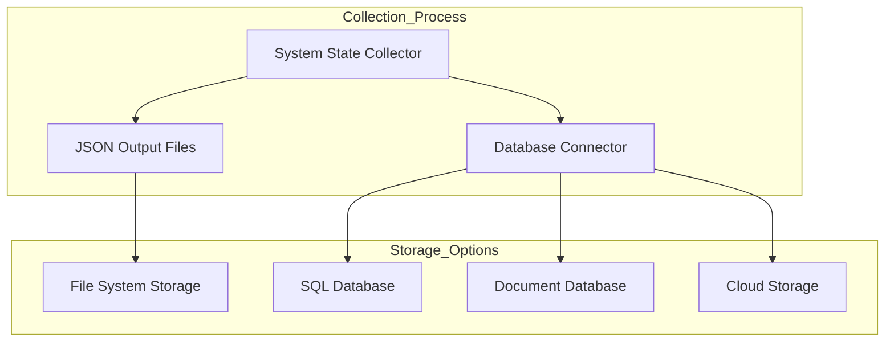
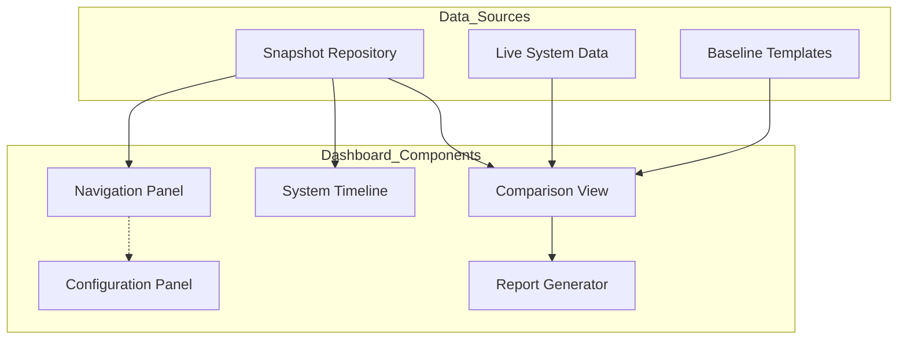
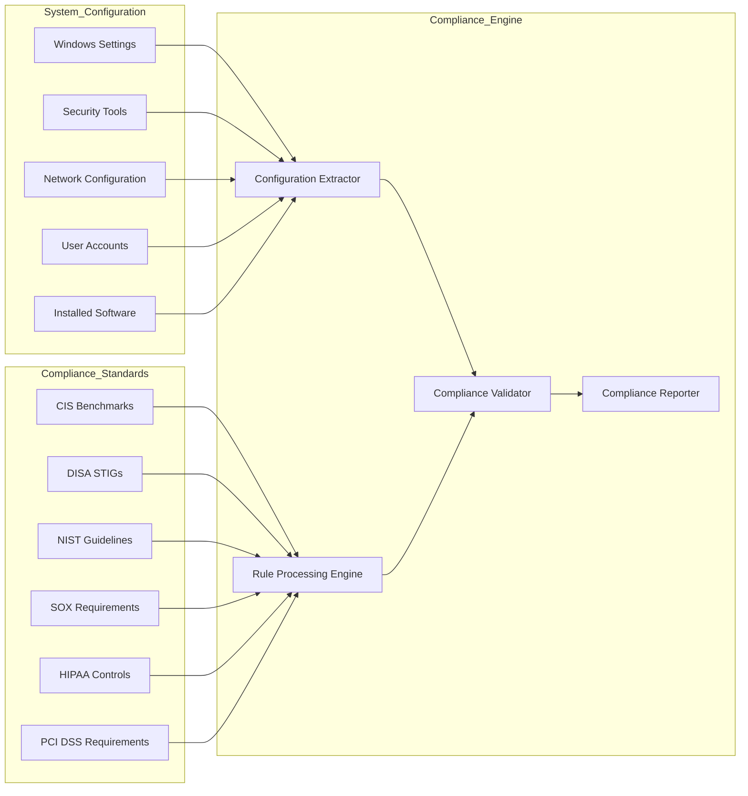
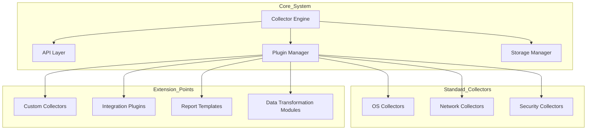
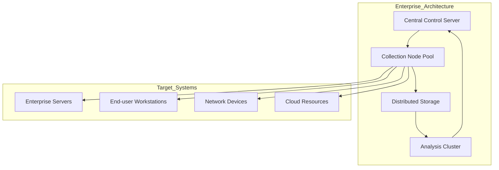

# 22. Future Enhancements

## Overview

The System State Collector project has been designed with a focus on extensibility and modular architecture, enabling a clear path for future development and enhancement. This section outlines potential improvements and new capabilities that could be implemented to expand the project's functionality, improve user experience, and provide even greater value for system administrators, support personnel, and security analysts.

## Core System Enhancements

### 1. Remote Collection Capabilities

**Current Limitation**: The System State Collector primarily operates on the local system where it's executed.

**Enhancement**: Develop robust remote collection capabilities to enable:

- Collection from multiple remote systems simultaneously
- Secure credential management for remote access
- Parallel processing for efficient large-scale collection
- Support for various remote access methods (WinRM, PSRemoting, SSH)

```powershell
# Example of potential remote collection syntax
.\Collector.ps1 -ComputerNames "Server1,Server2,Server3" -Credential $cred -OutputPath "C:\MultiSystemSnapshots"
```

### 2. Database Integration

**Current Limitation**: System snapshots are stored as individual JSON files in directory structures.

**Enhancement**: Implement database backend support to:

- Store snapshots in relational or document databases
- Enable more sophisticated querying and filtering
- Support long-term historical data retention
- Improve performance for large-scale deployments



### 3. Scheduling and Automation

**Current Limitation**: Collection must be manually initiated or scheduled through external tools.

**Enhancement**: Build integrated scheduling features to:

- Configure periodic collection at defined intervals
- Set up conditional collection triggered by system events
- Provide a self-contained scheduling system without requiring Task Scheduler
- Support execution as a background service

```powershell
# Example configuration for integrated scheduling
$scheduleConfig = @{
    Interval = "Daily"
    TimeOfDay = "03:00"
    RetentionDays = 30
    TriggerEvents = @("SystemStartup", "UserLogon", "NetworkChange")
}

Install-CollectorSchedule -Configuration $scheduleConfig
```

### 4. Compression and Archiving

**Current Limitation**: Snapshots can grow large over time, consuming significant disk space.

**Enhancement**: Implement intelligent archiving features to:

- Automatically compress older snapshots
- Implement data deduplication for repeated elements
- Create multi-snapshot archives for efficient storage
- Support various compression formats (ZIP, 7z, etc.)

## User Experience Improvements

### 1. Interactive Dashboard

**Current Limitation**: Analysis primarily relies on PowerShell commands and console output.

**Enhancement**: Develop a web-based or GUI dashboard to:

- Visualize system state changes over time
- Enable point-and-click comparison between snapshots
- Provide interactive filtering and searching
- Create customizable reports and visualizations



### 2. Reporting System

**Current Limitation**: Limited built-in reporting capabilities beyond comparison output.

**Enhancement**: Create a comprehensive reporting system to:

- Generate scheduled reports in various formats (PDF, HTML, DOCX)
- Create executive summaries for management
- Support customizable report templates
- Include visualization and charts of system trends

### 3. Alerting and Notification

**Current Limitation**: No built-in monitoring or alerting based on detected changes.

**Enhancement**: Implement alerting mechanisms to:

- Send notifications when critical changes are detected
- Support multiple notification channels (email, Slack, Teams)
- Configure thresholds and rules for alert generation
- Create escalation workflows for significant changes

```powershell
# Example alert configuration
$alertConfig = @{
    WatchedSections = @("SecuritySettings", "RunningServices", "NetworkConfiguration")
    SeverityRules = @{
        Critical = @("WindowsDefenderDisabled", "FirewallDisabled", "AdminAccountAdded")
        Warning = @("UnknownServiceStarted", "UnexpectedNetworkChange")
    }
    Notifications = @{
        Email = "admin@example.com"
        Teams = "https://webhook.office.com/webhookb2/..."
        Slack = "https://hooks.slack.com/services/..."
    }
}

Set-CollectorAlerts -Configuration $alertConfig
```

## Analysis Capabilities

### 1. Intelligent Analysis Engine

**Current Limitation**: Current analysis is primarily comparison-based without deeper interpretation.

**Enhancement**: Develop an intelligent analysis engine to:

- Automatically identify significant or suspicious changes
- Use machine learning to detect anomalous patterns
- Provide context and explanations for observed changes
- Correlate changes with known events (updates, installations)

### 2. Security and Compliance Assessment

**Current Limitation**: Limited security-focused analysis of collected data.

**Enhancement**: Implement security assessment capabilities to:

- Compare configurations against security baselines (CIS, STIG, etc.)
- Generate compliance reports for various standards
- Identify potential security vulnerabilities
- Provide remediation recommendations



### 3. Historical Trend Analysis

**Current Limitation**: Primarily focused on point-in-time snapshots and direct comparisons.

**Enhancement**: Build trend analysis capabilities to:

- Track system changes over extended periods
- Identify gradual shifts in configuration or performance
- Provide predictive analysis for capacity planning
- Visualize system evolution through timelines

## New Data Collection Areas

### 1. Application-Specific Collectors

**Current Limitation**: Focus is primarily on operating system configuration rather than applications.

**Enhancement**: Develop specialized collectors for common enterprise applications:

- SQL Server configuration and performance
- Exchange Server settings
- SharePoint farm configuration
- Active Directory domain services
- IIS web server configuration
- Custom LOB application settings

### 2. Cloud Integration

**Current Limitation**: Limited to on-premises Windows systems without cloud awareness.

**Enhancement**: Extend data collection to cloud environments:

- Azure resource configuration and compliance
- AWS resource management
- Hybrid environment documentation
- Cloud-to-on-premises consistency checking
- SaaS application configuration

```powershell
# Example of cloud integration collector
$azureCollectorConfig = @{
    SubscriptionId = "00000000-0000-0000-0000-000000000000"
    ResourceGroups = @("Production", "Development")
    ResourceTypes = @("VirtualMachines", "StorageAccounts", "NetworkSecurityGroups")
    IncludeIdentity = $true
}

Invoke-AzureStateCollection -Configuration $azureCollectorConfig -OutputPath "C:\CloudSnapshots"
```

### 3. Enhanced Security Telemetry

**Current Limitation**: Basic security configuration collection without deep security analysis.

**Enhancement**: Implement advanced security data collection:

- Windows Event Log security event analysis
- Endpoint protection status and findings
- Vulnerability scanning integration
- User and permission auditing
- Trust relationship documentation

## Integration and Extensibility

### 1. API and Service Integration

**Current Limitation**: Standalone tool with limited external integration capabilities.

**Enhancement**: Develop comprehensive API and service integrations:

- REST API for programmatic access to collector functions
- Integration with ITSM platforms (ServiceNow, Jira)
- Connectors for security information and event management (SIEM) systems
- Webhooks for event-driven automation

### 2. Plugin Architecture

**Current Limitation**: Extension requires direct modification of collector code.

**Enhancement**: Implement a formal plugin architecture to:

- Allow third-party development of custom collectors
- Enable organization-specific extensions
- Provide a marketplace or repository for sharing collectors
- Support dynamic loading of collectors without core code changes



### 3. Multi-Platform Support

**Current Limitation**: Focused specifically on Windows systems.

**Enhancement**: Extend to support multiple operating system platforms:

- Linux system configuration collection
- macOS system state documentation
- Cross-platform comparison capabilities
- Consistent output format across platforms

```powershell
# Example of cross-platform collection
$systemTypes = @("Windows", "Linux", "MacOS")
foreach ($system in $computerInventory) {
    $platform = Get-SystemPlatform -ComputerName $system.Name
    if ($systemTypes -contains $platform) {
        Invoke-PlatformCollection -ComputerName $system.Name -Platform $platform -OutputPath "C:\CrossPlatformSnapshots"
    }
}
```

## Performance and Scalability

### 1. Optimized Collection

**Current Limitation**: Sequential collection that can be time-consuming on complex systems.

**Enhancement**: Implement performance optimizations to:

- Parallelize collection of independent components
- Implement incremental collection for unchanged elements
- Optimize WMI/CIM queries for faster execution
- Reduce memory footprint during collection

### 2. Enterprise Scale Support

**Current Limitation**: Designed primarily for individual system analysis.

**Enhancement**: Enhance for large-scale enterprise deployment:

- Centralized management of collection policies
- Distributed processing architecture
- Load balancing for large-scale collections
- Throttling and scheduling to minimize impact



## Data Visualization and Exploration

### 1. Interactive Visualizations

**Current Limitation**: Text-based output with limited visualization.

**Enhancement**: Create rich interactive visualizations:

- Network topology maps that show connectivity
- Timeline views of system changes
- Heat maps of system activity and resource usage
- Relationship graphs between system components

### 2. Exploratory Analysis Tools

**Current Limitation**: Predefined comparison and analysis paths.

**Enhancement**: Develop tools for exploratory data analysis:

- Ad-hoc query capabilities against snapshot data
- Filtering and pivoting on any collected attribute
- Custom view definitions for specific analysis needs
- Export capabilities to data analysis platforms

### 3. 3D and VR Visualization

**Current Limitation**: Traditional 2D representation of system state.

**Enhancement**: Implement cutting-edge visualization techniques:

- 3D representation of complex system relationships
- Virtual reality navigation of system architecture
- Augmented reality overlay for physical systems
- Immersive exploration of large system landscapes

## Implementation Roadmap

To prioritize these enhancements, the following implementation roadmap is recommended:

### Phase 1: Foundation Improvements

- Remote Collection Capabilities
- Compression and Archiving
- Scheduling and Automation
- Plugin Architecture

### Phase 2: Analysis and Reporting

- Reporting System
- Intelligent Analysis Engine
- Historical Trend Analysis
- Interactive Dashboard

### Phase 3: Integration and Security

- Database Integration
- Security and Compliance Assessment
- API and Service Integration
- Enhanced Security Telemetry

### Phase 4: Scale and Extensibility

- Enterprise Scale Support
- Application-Specific Collectors
- Multi-Platform Support
- Cloud Integration

### Phase 5: Advanced Capabilities

- Alerting and Notification
- Interactive Visualizations
- Exploratory Analysis Tools
- 3D and VR Visualization

## Conclusion

The System State Collector has been designed with extensibility as a core principle, and these proposed enhancements represent a natural evolution of its capabilities. By implementing these features in a phased approach, the project can grow to meet the increasing demands of modern IT environments while maintaining its core value proposition of comprehensive system state documentation and analysis.

These enhancements will transform the System State Collector from a powerful documentation tool into an enterprise-grade platform for system management, security compliance, and operational intelligence.
