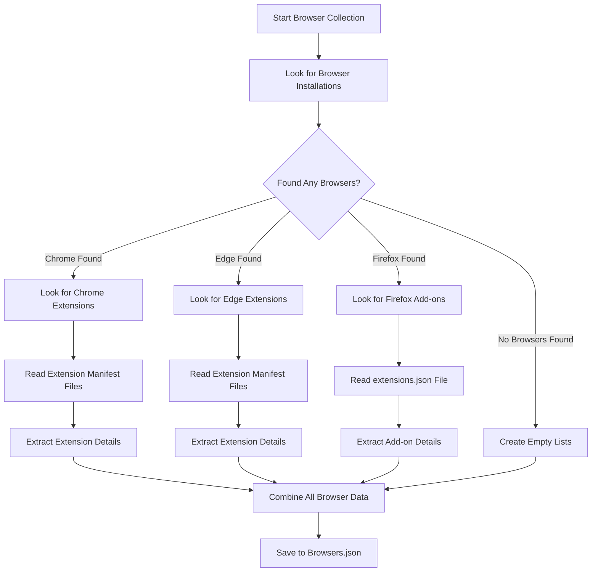
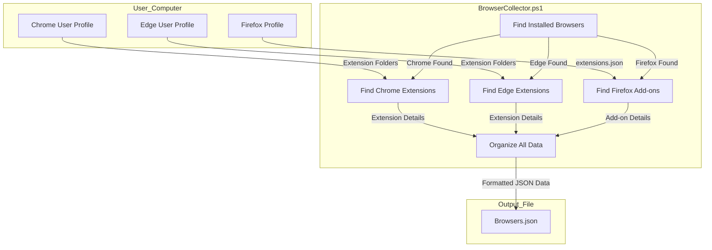

# 5. Browsers

## Description

The Browsers module is one of the most interesting components of the System State Collector project. Think of it as a detective that carefully examines your computer to find out which web browsers you have installed, where they're located, what versions they are, and what extensions or add-ons you've added to them.

Why is this information valuable? For several important reasons:

First, it helps IT administrators keep track of what software is installed across multiple computers in an organization. If you need to update all Chrome browsers to address a security vulnerability, you'd first need to know which computers have Chrome installed.

Second, browser extensions can be security risks. Some extensions might have too many permissions or could even be malicious. Having a complete inventory helps security teams audit what extensions are installed and identify any potential problems.

Third, when troubleshooting browser-related issues, knowing the exact versions and extensions can be tremendously helpful. For example, if a website isn't working properly, it might be because of a conflicting extension or an outdated browser version.

The collection happens through a specialized script called `BrowserCollector.ps1`. This script works by checking common installation locations for browsers, and when it finds one, it digs deeper to find the extensions or add-ons associated with that browser.

## File Generated

When the script runs, it creates a single JSON file with a straightforward name:

- **Filename**: `Browsers.json`

This file gets stored in the snapshot directory, which has a timestamp in its name (for example: `SystemState_2025-03-10_15-30-45/Browsers.json`). This naming convention makes it easy to identify when the snapshot was taken.

The file is saved in UTF-8 format without a BOM (Byte Order Mark), which is a technical detail that ensures the file can be read properly by various applications. The size of the file varies depending on how many browsers and extensions you have installed, but typically ranges from about 10KB (for minimal browser installations) to 5MB (for systems with many browsers and dozens of extensions).

## Schema

The structure of the data in the Browsers.json file follows a consistent pattern. Let's break it down piece by piece to understand exactly what information gets captured:

```json
{
  "Timestamp": "2025-03-10T15:30:45.0000000Z",
  "ComputerName": "HOSTNAME",
  "Data": {
    "InstalledBrowsers": [
      {
        "Name": "Google Chrome",
        "Path": "C:\\Program Files\\Google\\Chrome\\Application\\chrome.exe",
        "Version": "122.0.6261.112"
      }
    ],
    "ChromeExtensions": [
      {
        "ID": "aapbdbdomjkkjkaonfhkkikfgjllcleb",
        "Name": "Google Translate",
        "Version": "2.0.13",
        "Description": "View translations easily as you browse the web..."
      }
    ],
    "EdgeExtensions": [
      {
        "ID": "jmjflgjpcpepeafmmgdpfkogkghcpiha",
        "Name": "Microsoft Editor",
        "Version": "1.0.7.1",
        "Description": "Grammar checking and writing suggestions..."
      }
    ],
    "FirefoxAddons": [
      {
        "ID": "uBlock0@raymondhill.net",
        "Name": "uBlock Origin",
        "Version": "1.46.0",
        "Description": "Finally, an efficient blocker...",
        "Active": true
      }
    ]
  }
}
```

At the top level, you'll always find three key pieces of information:

- **Timestamp**: This tells you exactly when the data was collected, down to the millisecond
- **ComputerName**: This identifies which computer the data came from
- **Data**: This contains all the actual browser information, organized into sections

Inside the Data section, there are four main categories:

1. **InstalledBrowsers**: This lists all the browsers that were found on your system. For each browser, you get the name (like "Google Chrome"), the full path to where the program is installed, and its version number.

2. **ChromeExtensions**: This lists all the extensions installed in Google Chrome. Each extension entry includes its unique ID (a long string that uniquely identifies the extension in the Chrome Web Store), its name, version, and a short description of what it does.

3. **EdgeExtensions**: Similar to ChromeExtensions, this lists all the extensions installed in Microsoft Edge.

4. **FirefoxAddons**: This lists all the add-ons installed in Mozilla Firefox. Firefox add-ons have a slightly different structure, so they also include an "Active" field that tells you whether the add-on is currently enabled or disabled.

## Key Information Captured

Let's look more closely at what the Browsers module collects and how it collects it:

### Browser Detection

The module searches for three major browsers: Google Chrome, Mozilla Firefox, and Microsoft Edge. For each browser it finds, it records:

- The exact name of the browser
- Where the browser's executable file is located on your computer
- What version of the browser you have installed

The script looks in the standard installation locations for each browser. For example, Chrome is typically installed in "C:\Program Files\Google\Chrome\Application\" or "C:\Program Files (x86)\Google\Chrome\Application\" on 64-bit systems.

It's worth noting that if you've installed a browser in a non-standard location (like a portable version on a USB drive), the script might not detect it.

### Extension Information

For each browser, the module looks for extensions or add-ons in different ways:

For **Chrome**, it looks in the user profile folder (typically something like "C:\Users\[username]\AppData\Local\Google\Chrome\User Data\Default\Extensions"). Each extension is stored in its own folder with a unique ID, and inside that folder is a manifest.json file that contains details about the extension.

**Edge** extensions are handled similarly to Chrome extensions, since both browsers are based on the Chromium engine. The module looks in the Edge profile folder for extensions.

For **Firefox**, the approach is different. Firefox stores information about add-ons in a file called extensions.json within the Firefox profile folder. The module reads this file to extract add-on details.

From each extension or add-on, the module collects:

- The unique identifier
- The display name
- The version number
- A brief description (limited to the first 50 characters to keep the file size reasonable)

Firefox add-ons also include information about whether they're currently active (enabled) or not.

### Limitations

There are a few limitations to be aware of:

1. The module only detects browsers installed in standard locations. If you've installed a browser somewhere unusual, it might be missed.

2. It only looks for the three most common browsers: Chrome, Firefox, and Edge. Other browsers like Opera, Brave, or Vivaldi aren't included.

3. Extension descriptions are truncated to 50 characters, so you only see the beginning of the description.

4. The module doesn't capture browser settings, just the installations and extensions.

5. For Firefox add-ons, the module requires that you have a Firefox profile set up. If Firefox is installed but never launched, there might not be any add-on information.

## Collection Process

To help you understand how the browser data collection works, here's a step-by-step explanation of the process:

1. **Initial Detection**: The script first looks for browser executables in standard installation locations.

2. **Browser Analysis**: For each browser it finds, it gets the version information by examining the file properties.

3. **Extension Location**: The script then determines where to look for extensions based on which browser was found:

   - For Chrome, it looks in the Chrome user profile Extensions folder
   - For Edge, it looks in the Edge user profile Extensions folder
   - For Firefox, it looks for the extensions.json file in the Firefox profile

4. **Extension Processing**: For each extension location, the script:

   - For Chrome/Edge: Reads the manifest.json file in each extension folder
   - For Firefox: Parses the extensions.json file to extract add-on details

5. **Data Compilation**: All the collected information is organized into the structured format described in the schema section.

6. **Output Generation**: Finally, the data is converted to JSON format and saved to the Browsers.json file.

This process is visualized in the diagram below, which shows how data flows from the browser installations, through the collector script, and into the final JSON file:



## Suggested Improvements

While the current Browsers module is useful, there are several ways it could be enhanced to provide even more valuable information:

1. **Support for More Browsers**: Currently, the module only looks for Chrome, Firefox, and Edge. Adding support for other popular browsers like Opera, Brave, Vivaldi, and Safari (for cross-platform systems) would make the module more comprehensive. This would involve adding new detection logic for each browser and understanding how each one stores its extensions.

2. **More Extension Details**: Right now, the module only captures basic information about extensions. It could be improved to include:

   - Complete descriptions instead of truncated ones
   - What permissions each extension has (which can be important for security)
   - When the extension was installed or last updated
   - Whether the extension is potentially unsafe based on its permissions or behavior

3. **Browser Settings**: The module could be expanded to capture important browser settings like:

   - Privacy and security settings
   - Cookie policies
   - JavaScript settings
   - Default search engine configuration
   - Proxy settings

4. **Performance Information**: Adding details about browser performance could be valuable, such as:

   - How much disk space the browser and its cache are using
   - The size of browser profiles
   - Startup impact (how much the browser affects system boot time)

5. **Installation History**: Information about when browsers and extensions were installed could help track changes over time:
   - Browser installation dates
   - Extension installation and update dates

## Future Enhancements

Looking ahead, there are several more advanced features that could be added to the Browsers module:

### Cross-browser Settings Comparison

Imagine being able to automatically compare settings across different browsers on the same system. This could help identify inconsistencies in security settings or user preferences that might cause confusion or security risks.

### Browser Storage Analysis

Browsers store a lot of data locally, including cookies, local storage, IndexedDB data, and more. A future enhancement could analyze how much storage each website is using and what type of data is being stored.

### Extension Security Analysis

By connecting to online databases of known malicious or vulnerable extensions, the module could automatically flag extensions that might pose security risks. This would turn the module from a simple inventory tool into a security analysis tool.

### Update Checker

An enhancement could check the installed browser versions against the latest available versions to identify outdated browsers that might have security vulnerabilities.

### Web App Inventory

Many people use Progressive Web Apps (PWAs) that are installed through browsers. A future enhancement could identify and document these installed web applications.

### Better Data Format Compatibility

Adding version information to the data format would make it easier to update the schema in the future while maintaining backward compatibility with older snapshots.

## Diagram: How Browser Data is Collected

Here's a visual representation of how the browser data collection process works:



This diagram helps visualize how the module collects data from different browser profiles, processes it through the collector script, and produces the final JSON output file.

## Related Collectors

The Browsers module doesn't work in isolation. It's part of a larger system of collectors that work together to provide a complete picture of your system:

- **InstalledPrograms**: This collector provides information about all installed software, not just browsers. The Browsers module complements this by providing more detailed information specifically about browsers and their extensions.

- **StartupPrograms**: Some browser components or extensions might be configured to start automatically when you boot your computer. The StartupPrograms collector would identify these, while the Browsers module provides details about what those components are.

- **NetworkCollector**: Browsers establish network connections when you use them. The NetworkCollector might show active connections, while the Browsers module helps you identify which browser is making those connections.

- **RegistrySettings**: This collector captures information about file type associations in the Windows Registry. Some of these associations might point to browsers (like .html files opening in Chrome), so the Browsers module helps you understand which browsers are configured as default handlers for various file types.

By understanding how the Browsers module fits into the larger System State Collector project, you can make better use of the collected data for troubleshooting, security analysis, and system management.
