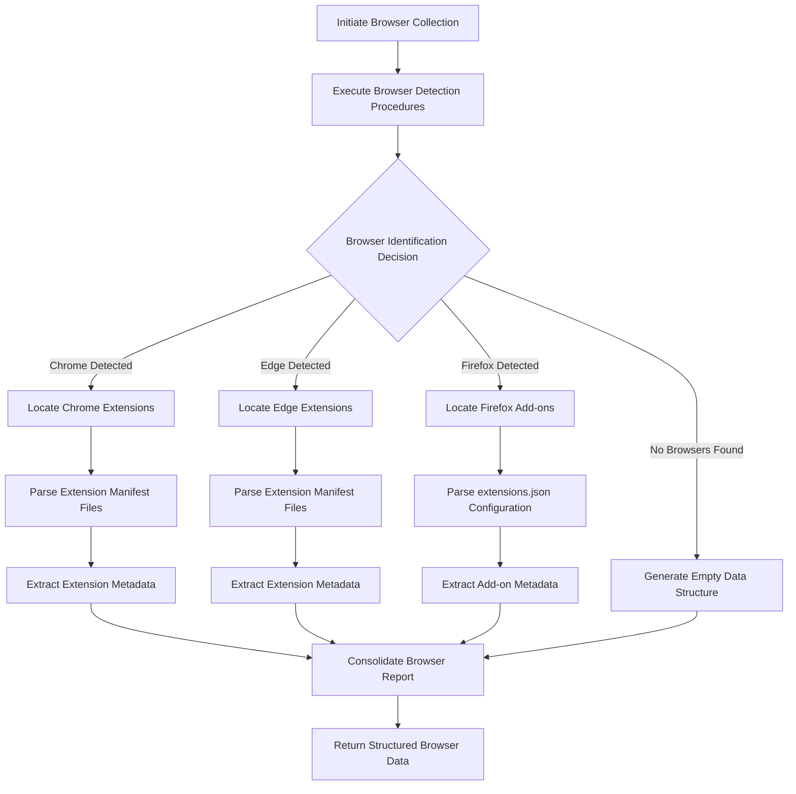
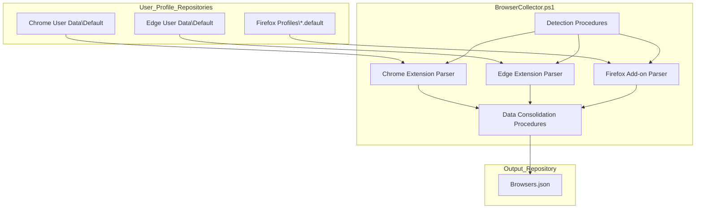

# 5. Browsers

## Description

The Browsers module constitutes an integral component of the System State Collector framework, providing comprehensive documentation of web browser configurations present on the system. This module systematically captures installation details, version information, and extension configurations for major web browsers. The collected data serves multiple organizational purposes, including security compliance verification, configuration management, troubleshooting activities, and comprehensive system documentation.

The module operates through the execution of the `BrowserCollector.ps1` script, which employs standardized detection methods to identify browser installations in common locations. Upon detection, the script performs detailed examination of browser-specific storage locations to enumerate installed extensions and their respective configurations.

## File Generated

The module generates a standardized output file with the following specifications:

- **Filename**: `Browsers.json`
- **Location**: Within the designated timestamp-based directory structure (format: `SystemState_yyyy-MM-dd_HH-mm-ss/Browsers.json`)
- **Format**: UTF-8 encoded JavaScript Object Notation (JSON) without Byte Order Mark (BOM)
- **Typical Size Range**: 10 kilobytes to 5 megabytes, contingent upon the quantity and complexity of browser installations and extensions present

## Schema

The output file adheres to a structured schema designed to represent hierarchical browser data in a consistent format:

```json
{
  "Timestamp": "2025-03-10T15:30:45.0000000Z",
  "ComputerName": "HOSTNAME",
  "Data": {
    "InstalledBrowsers": [
      {
        "Name": "Google Chrome",
        "Path": "C:\\Program Files\\Google\\Chrome\\Application\\chrome.exe",
        "Version": "122.0.6261.112"
      },
      {
        "Name": "Microsoft Edge",
        "Path": "C:\\Program Files (x86)\\Microsoft\\Edge\\Application\\msedge.exe",
        "Version": "121.0.2277.128"
      },
      {
        "Name": "Mozilla Firefox",
        "Path": "C:\\Program Files\\Mozilla Firefox\\firefox.exe",
        "Version": "123.0.1"
      }
    ],
    "ChromeExtensions": [
      {
        "ID": "aapbdbdomjkkjkaonfhkkikfgjllcleb",
        "Name": "Google Translate",
        "Version": "2.0.13",
        "Description": "View translations easily as you browse the web..."
      }
    ],
    "EdgeExtensions": [
      {
        "ID": "jmjflgjpcpepeafmmgdpfkogkghcpiha",
        "Name": "Microsoft Editor",
        "Version": "1.0.7.1",
        "Description": "Grammar checking and writing suggestions..."
      }
    ],
    "FirefoxAddons": [
      {
        "ID": "uBlock0@raymondhill.net",
        "Name": "uBlock Origin",
        "Version": "1.46.0",
        "Description": "Finally, an efficient blocker...",
        "Active": true
      }
    ]
  }
}
```

### Schema Specification

The schema comprises several hierarchical components, each representing specific aspects of browser configuration:

#### Root Object Properties

| Field | Type | Description |
|-------|------|-------------|
| Timestamp | string | ISO 8601 format datetime record indicating the precise moment of data collection |
| ComputerName | string | System hostname identifier from which the data was collected |
| Data | object | Container object encapsulating all browser-related configuration data |

#### InstalledBrowsers Array Elements

| Field | Type | Description |
|-------|------|-------------|
| Name | string | Official product name of the browser application |
| Path | string | Absolute filesystem path to the browser executable |
| Version | string | Version identifier of the browser installation |

#### ChromeExtensions and EdgeExtensions Array Elements

| Field | Type | Description |
|-------|------|-------------|
| ID | string | Unique identifier code for the extension |
| Name | string | Display name of the extension (potentially localized) |
| Version | string | Version identifier of the extension |
| Description | string | Abbreviated functional description of the extension (limited to 50 characters) |

#### FirefoxAddons Array Elements

| Field | Type | Description |
|-------|------|-------------|
| ID | string | Unique identifier code for the Firefox add-on |
| Name | string | Display name of the add-on |
| Version | string | Version identifier of the add-on |
| Description | string | Abbreviated functional description of the add-on (limited to 50 characters) |
| Active | boolean | Activation status indicator for the add-on |

## Key Information Captured

The Browsers module captures several categories of information critical for system management:

### Browser Installation Data

The module performs systematic detection of browser software installed in standard locations. This detection process identifies installations of Google Chrome, Mozilla Firefox, and Microsoft Edge. For each detected browser, the module records the absolute path to the executable and the precise version identifier. It should be noted that the detection is limited to standard installation locations within system and user directories.

### Extension Configuration

For each detected browser, the module performs a targeted examination of browser-specific extension repositories:

- For Google Chrome, the module examines the Extensions directory within the user profile structure
- For Microsoft Edge, the module follows a similar approach, examining the Edge-specific extensions directory
- For Mozilla Firefox, the module performs analysis of the extensions.json configuration file within Firefox profiles

From each extension, the module extracts identifying information including:
- The unique identifier assigned to the extension
- The human-readable display name (with accommodation for localized naming conventions)
- The version identifier of the extension
- An abbreviated description of the extension's functionality

### Implementation Constraints

The module operates under several constraints that affect its data collection capabilities:

- The detection process is limited to standard installation locations and may not identify non-standard or portable browser installations
- The collection scope is restricted to the three major browser platforms (Chrome, Firefox, Edge)
- Extension descriptions are deliberately truncated to 50 characters to maintain reasonable output file sizes
- The module cannot access detailed extension settings or usage statistics
- Firefox add-on detection requires the presence of an established Firefox profile

## Collection Process

The browser data collection follows a systematic process as illustrated in the following diagram:



## Suggested Improvements

The following enhancements would increase the utility and comprehensiveness of the Browsers module:

1. **Expanded Browser Support**: Extend the detection capabilities to encompass additional browser platforms, including Opera, Brave, Vivaldi, and Safari. This enhancement would provide more comprehensive coverage of diverse browsing environments.

2. **Enhanced Extension Documentation**: Implement expanded extension information capture, including:
   - Complete extension descriptions rather than truncated text
   - Security-relevant permission information to facilitate security assessment
   - Temporal metadata including installation and update timestamps
   - Security classification flags for potentially problematic extensions

3. **Configuration Capture Enhancement**: Expand the module to document critical browser settings, including:
   - Security configuration parameters (cookie policies, JavaScript permissions)
   - Network configuration settings including proxy configurations
   - Default search engine specifications and customizations

4. **Performance Metric Documentation**: Incorporate performance-relevant metrics including:
   - Cache size allocation and utilization
   - Profile size metrics
   - System impact measurements related to browser operations

5. **Temporal Metadata Enhancement**: Add chronological documentation including:
   - Browser installation timestamp information
   - Extension installation and modification timestamps

## Future Enhancements

### Cross-browser Configuration Analysis
Implementation of analytical capabilities to compare configuration parameters across multiple browser platforms could identify security policy inconsistencies or user experience disparities between browsers.

### Storage Utilization Analysis
Enhancement of the module to analyze and document browser storage utilization patterns, including Local Storage allocation, IndexedDB utilization, and cookie storage metrics.

### Security Posture Assessment
Integration with extension reputation databases would enable automated flagging of potentially malicious or vulnerable extensions, incorporating security intelligence directly into the collection output.

### Update Compliance Verification
Addition of functionality to automatically compare installed browser versions against current release information would enable identification of outdated browsers with potential security vulnerabilities.

### Web Application Inventory
Extension of collection capabilities to identify and document installed Progressive Web Applications (PWAs) and their configuration parameters.

### Schema Version Control
Implementation of a schema versioning system would facilitate future format enhancements while maintaining backward compatibility with existing snapshot repositories.

## Diagram: Browser Data Collection Architecture



## Related Collectors

The Browsers module maintains functional relationships with several other collection modules:

- **InstalledPrograms**: Provides contextual software inventory information
- **StartupPrograms**: Identifies browser components with system initialization configurations
- **NetworkCollector**: Documents network connections potentially associated with browser activities
- **RegistrySettings**: Contains file association configurations that may reference browser applications
